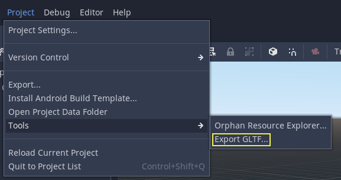

.. _doc_exporting_3d_scenes:

Exporting 3D scenes
===================

Overview
--------

In Godot, it is possible to export 3D scenes as a glTF 2.0 file. You can
export as a glTF binary (``.glb`` file) or glTF embedded with textures
(``gltf`` + ``.bin`` + textures). This allows you to create scenes in Godot,
such as a CSG mesh blockout for a level, export it to clean it up in a
program such as Blender, and then bring it back into Godot.

.. note::

    Only Blender 2.83 and newer can import glTF files exported by Godot.

To export a scene in the editor go to **Scene > Export As... > glTF 2.0 Scene...**

Limitations
-----------

There are several limitations with glTF export.

* No support for exporting particles since their implementation varies across engines.
* ShaderMaterials cannot be exported.
* No support for exporting 2D scenes.

.. seealso::

    3D scenes can be saved at runtime using
    :ref:`runtime file loading and saving <doc_runtime_file_loading_and_saving_3d_scenes>`,
    including from an exported project.
