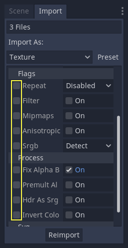
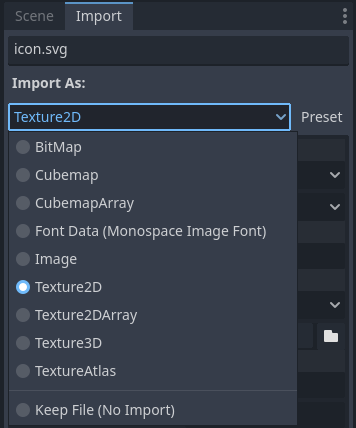
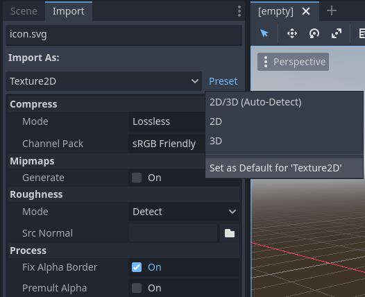

.. _doc_import_process:

Import process
==============

Importing assets in Godot
-------------------------

To import assets in Godot, place your assets (image files, scenes, audio
files, fonts, etc) directly in the project folder. There are 2 ways to achieve this:

- **For any file type:** Copy files manually with your operating system's file manager.
- **For file types that can be imported by Godot:**
  Drag-and-drop files from the operating system's file manager to the editor's FileSystem dock.
  This only works with *resource* file types (i.e. file types that Godot can import).

Godot will automatically import these files internally and keep the imported
resources hidden in a ``res://.godot/imported/`` folder.

This means that when trying to access imported assets through code, you
need to use the :ref:`Resource Loader<class_ResourceLoader>` as it will
automatically take into account where the internal files are saved. If you
try and access an imported asset using the :ref:`FileAccess <class_FileAccess>` class,
it will work in the editor, but **it will break in the exported project**.

However, the :ref:`Resource Loader<class_ResourceLoader>` cannot access
non-imported files. Only the :ref:`FileAccess <class_FileAccess>` class can.

Changing import parameters
--------------------------

.. note::

    Import parameters are only present in *non-native* Godot resource types.
    This means Godot's own scene and resource file formats (``.tscn``, ``.scn``,
    ``.tres``, ``.res``) don't have import options you can select in the Import
    dock.

To change the import parameters of an asset in Godot, select the relevant
resource in the FileSystem dock:

.. image:: img/import_process_example.webp

After adjusting the parameters, click **Reimport**. Be careful: if you select
another file in the FileSystem dock before clicking **Reimport**, changes will
be discarded. After clicking **Reimport**, the chosen parameters will only be
used for this asset and on future reimports.

Changing the import parameters of several assets at the same time is also
possible. Simply select all of them together in the resources dock and the
exposed parameters will apply to all of them when reimporting.

Reimporting multiple assets
---------------------------

While working on a project you may find that several assets need to have
the same parameters changed, such as enabling mipmaps, but you only want
those specific parameters changed. To do this, select every asset you want
to reimport in the file system. In the import tab there will now be a
checkbox to the left of every import parameter.

Select the checkbox of the parameters you want to change on your imported
assets, then change the parameters normally. Finally, click the reimport
button and every selected asset will be reimported with only those
parameters changed.

Automatic reimport
------------------

When the MD5 checksum of the source asset changes, Godot will perform an
automatic reimport of it, applying the preset configured for that specific
asset.

Files generated
---------------

Importing will add an extra ``<asset>.import`` file next to the source file,
containing the import configuration.

**Make sure to commit these files to your version control system**, as these
files contain important metadata.

::

    $ ls
    example.png
    example.png.import
    project.godot

Additionally, extra assets will be present in the hidden
``res://.godot/imported/`` folder:

::

    $ ls .godot/imported
    example.png-218a8f2b3041327d8a5756f3a245f83b.ctex
    example.png-218a8f2b3041327d8a5756f3a245f83b.md5

If any of the files present in this folder is erased (or the whole folder), the
asset or assets will be reimported automatically. As such, committing the
``.godot/`` folder to the version control system is not recommended. While
committing this folder can shorten reimporting time when checking out on another
computer, it requires considerably more space and bandwidth.

The default version control metadata that can be generated on project creation
will automatically ignore the ``.godot/`` folder.

Changing import resource type
-----------------------------

Some source assets can be imported as different types of resources. For this,
select the relevant type of resource desired then click **Reimport**:

Select ``Keep File (exported as is)`` as resource type to skip file import, files
with this resource type will be preserved as is during project export.

Select ``Skip File (not exported)`` as resource type to skip file import and ignore
file during project export.

Changing default import parameters
----------------------------------

Different types of projects might require different defaults. Changing the import
options to a predefined set of options can be achieved by using the
**Preset...** Menu. Besides some resource types offering presets, the default
settings can be saved and cleared too:

The default import parameters for a given resource type can be changed
project-wide using the **Import Defaults** tab of the Project Settings dialog:

.. image:: img/import_process_import_defaults.webp

Further reading
---------------

This workflow takes a little time to get used to, but it enforces a more correct
way to deal with resources.

There are many types of assets available for import. Continue reading to
understand how to work with all of them:

- :ref:`doc_importing_images`
- :ref:`doc_importing_audio_samples`
- :ref:`doc_importing_3d_scenes`
- :ref:`doc_importing_translations`
