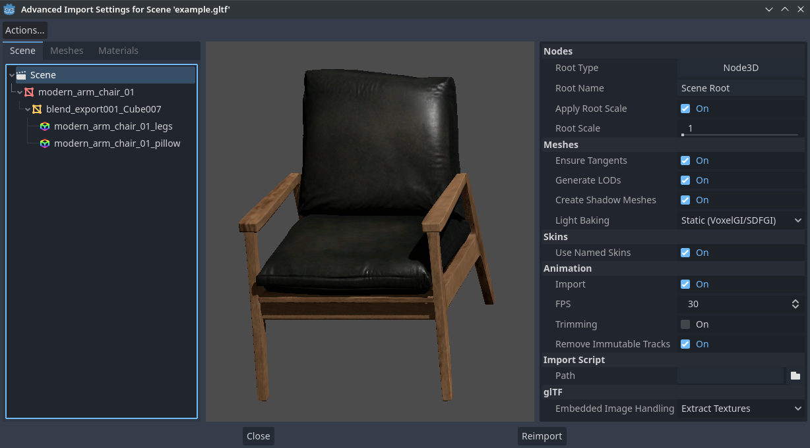
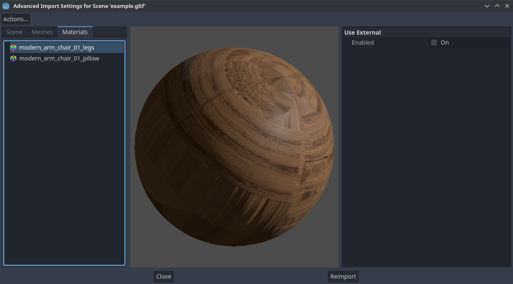
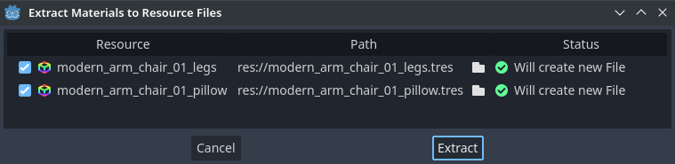

.. _doc_advanced_import_settings:

Advanced Import Settings
========================

While the regular import panel provides many essential options for imported 3D
models, the advanced import settings provides per object options, model previews,
and animation previews. To open it select the :button:`Advanced...` button at the
bottom of the import dock.

This is available for 3D models imported as scenes, as well as animation libraries.

.. note::

    This page does not go over options also available in the import dock, or anything
    outside of the advanced import settings. For information on those please read the
    :ref:`doc_importing_3d_scenes_import_configuration` page.

Using the Advanced Import Settings dialog
-----------------------------------------

The first tab you'll see is the **Scene** tab. The options available in the
panel on the right are identical to the Import dock, but you have access to a 3D
preview. The 3D preview can be rotated by holding down the left mouse button
then dragging the mouse. Zoom can be adjusted using the mouse wheel.

   Advanced Import Settings dialog (Scene tab).
   Credit: `Modern Arm Chair 01 - Poly Haven <https://polyhaven.com/a/modern_arm_chair_01>`__

Configuring node import options
~~~~~~~~~~~~~~~~~~~~~~~~~~~~~~~

You can select individual nodes that compose the scene while in the **Scene**
tab using the tree view at the left:

.. figure:: img/importing_3d_scenes_advanced_import_settings_node.webp
   :align: center
   :alt: Selecting a node in the Advanced Import Settings dialog (Scene tab)

   Selecting a node in the Advanced Import Settings dialog (Materials tab)

This exposes several per-node import options:

- **Skip Import:** If checked, the node will not be present in the final
  imported scene. Enabling this disables all other options.
- **Generate > Physics:** If checked, generates a PhysicsBody3D *parent* node
  with collision shapes that are *siblings* to the MeshInstance3D node.
- **Generate > NavMesh:** If checked, generates a NavigationRegion3D *child*
  node for :ref:`navigation <doc_navigation_overview_3d>`. **Mesh + NavMesh**
  will keep the original mesh visible, while **NavMesh Only** will only import
  the navigation mesh (without a visual representation). **NavMesh Only** is
  meant to be used when you've manually authored a simplified mesh for navigation.
- **Generate > Occluder:** If checked, generates an OccluderInstance3D *sibling*
  node for :ref:`occlusion culling <doc_occlusion_culling>` using the mesh's
  geometry as a basis for the occluder's shape. **Mesh + Occluder** will keep
  the original mesh visible, while **Occluder Only** will only import the
  occluder (without a visual representation). **Occluder Only** is meant to be
  used when you've manually authored a simplified mesh for occlusion culling.

These options are only visible if some of the above options are enabled:

- **Physics > Body Type:** Only visible if **Generate > Physics** is enabled.
  Controls the PhysicsBody3D that should be created. **Static** creates a
  StaticBody3D, **Dynamic** creates a RigidBody3D, **Area** creates an Area3D.
- **Physics > Shape Type:** Only visible if **Generate > Physics** is enabled.
  **Trimesh** allows for precise per-triangle collision, but it can only be used
  with a **Static** body type. Other types are less precise and may require
  manual configuration, but can be used with any body type. For static level
  geometry, use **Trimesh**. For dynamic geometry, use primitive shapes if
  possible for better performance, or use one of the convex decomposition modes
  if the shape is large and complex.
- **Decomposition > Advanced:** Only visible if **Physics > Shape Type** is
  **Decompose Convex**. If checked, allows adjusting advanced decomposition
  options. If disabled, only a preset **Precision** can be adjusted (which is
  usually sufficient).
- **Decomposition > Precision:** Only visible if **Physics > Shape Type** is
  **Decompose Convex**. Controls the precision to use for convex decomposition.
  Higher values result in more detailed collision, at the cost of slower
  generation and increased CPU usage during physics simulation. To improve
  performance, it's recommended to keep this value as low as possible for your
  use cases.
- **Occluder > Simplification Distance:** Only visible if **Generate >
  Occluder** is set to **Mesh + Occluder** or **Occluder Only**. Higher values
  result in an occluder mesh with fewer vertices (resulting in decreased CPU
  utilization), at the cost of more occlusion culling issues (such as false
  positives or false negatives). If you run into objects disappearing when they
  shouldn't when the camera is near a certain mesh, try decreasing this value.

Configuring mesh and material import options
~~~~~~~~~~~~~~~~~~~~~~~~~~~~~~~~~~~~~~~~~~~~

In the Advanced Import Settings dialog, there are 2 ways to select individual
meshes or materials:

- Switch to the **Meshes** or **Materials** tab in the top-left corner of the dialog.
- Stay in the **Scene** tab, but unfold the options on the tree view on the
  left. After choosing a mesh or material, this presents the same information as
  the **Meshes** and **Materials** tabs, but in a tree view instead of a list.

If you select a mesh, different options will appear in the panel on the right:

.. figure:: img/importing_3d_scenes_advanced_import_settings_meshes.webp
   :align: center
   :alt: Advanced Import Settings dialog (Meshes tab)

   Advanced Import Settings dialog (Meshes tab)

The options are as follows:

- **Save to File:** Saves the :ref:`class_Mesh` *resource* to an external file
  (this isn't a scene file). You generally don't need to use this for placing
  the mesh in a 3D scene – instead, you should instance the 3D scene directly.
  However, having direct access to the Mesh resource is useful for specific
  nodes, such as :ref:`class_MeshInstance3D`, :ref:`class_MultiMeshInstance3D`,
  :ref:`class_GPUParticles3D` or :ref:`class_CPUParticles3D`.
  - You will also need to specify an output file path using the option that
  appears after enabling **Save to File**. It's recommended to use the ``.res``
  output file extension for smaller file sizes and faster loading speeds, as
  ``.tres`` is inefficient for writing large amounts of data.
- **Generate > Shadow Meshes:** Per-mesh override for the **Meshes > Create
  Shadow Meshes** scene-wide import option described in
  :ref:`doc_importing_3d_scenes_using_the_import_dock`. **Default** will use the
  scene-wide import option, while **Enable** or **Disable** can forcibly enable
  or disable this behavior on a specific mesh.
- **Generate > Lightmap UV:** Per-mesh override for the **Meshes > Light
  Baking** scene-wide import option described in
  :ref:`doc_importing_3d_scenes_using_the_import_dock`. **Default** will use the
  scene-wide import option, while **Enable** or **Disable** can forcibly enable
  or disable this behavior on a specific mesh.
  - Setting this to **Enable** on a scene with the **Static** light baking mode
  is equivalent to configuring this mesh to use **Static Lightmaps**. Setting this
  to **Disable** on a scene with the **Static Lightmaps** light baking mode is
  equivalent to configuring this mesh to use **Static** instead.
- **Generate > LODs:** Per-mesh override for the **Meshes > Generate LODs**
  scene-wide import option described in
  :ref:`doc_importing_3d_scenes_using_the_import_dock`. **Default** will use the
  scene-wide import option, while **Enable** or **Disable** can forcibly enable
  or disable this behavior on a specific mesh.
- **LODs > Normal Merge Angle:** The minimum angle difference between two
  vertices required to preserve a geometry edge in mesh LOD generation. If
  running into visual issues with LOD generation, decreasing this value may help
  (at the cost of less efficient LOD generation).

If you select a material, only one option will appear in the panel on the right:

   Advanced Import Settings dialog (Materials tab)

When **Use External** is checked and an output path is specified, this lets you
use an external material instead of the material that is included in the
original 3D scene file; see the section below.

Extracting materials to separate files
--------------------------------------

While Godot can import materials authored in 3D modeling software, the default
configuration may not be suitable for your needs. For example:

- You want to configure material features not supported by your 3D application.
- You want to use a different texture filtering mode, as this option is
  configured in the material since Godot 4.0 (and not in the image).
- You want to replace one of the materials with an entirely different material,
  such as a custom shader.

To be able to modify the 3D scene's materials in the Godot editor, you need to
use *external* material resources.

In the top-left corner of the Advanced Import Settings dialog, choose
**Actions… > Extract Materials**:

.. figure:: img/importing_3d_scenes_advanced_import_settings_extract_materials.webp
   :align: center
   :alt: Extracting all built-in materials to external resources in the Advanced Import Settings dialog

   Extracting all built-in materials to external resources in the Advanced Import Settings dialog

After choosing this option, select a folder to extract material ``.tres`` files
to, then confirm the extraction:

   Confirming material extraction in the Advanced Import Settings subdialog

.. note::

    After extracting materials, the 3D scene will automatically be configured to
    use external material references. As a result, you don't need to manually
    enable **Use External** on every material to make the external ``.tres``
    material effective.

When **Use External** is enabled, remember that the Advanced Import Settings
dialog will keep displaying the mesh's original materials (the ones designed in
the 3D modeling software). This means your customizations to the materials won't
be visible within this dialog. To preview your modified materials, you need to
place the imported 3D scene in another scene using the editor.

Godot will not overwrite changes made to extracted materials when the source 3D
scene is reimported. However, if the material name is changed in the source 3D
file, the link between the original material and the extracted material will be
lost. As a result, you'll need to use the Advanced Import Settings dialog to
associate the renamed material to the existing extracted material.

The above can be done in the dialog's **Materials** tab by selecting the
material, enabling **Save to File**, then specifying the save path using the
**Path** option that appears after enabling **Save to File**.

Animation options
-----------------

Several extra options are available for the generated :ref:`class_AnimationPlayer`
nodes, as well as their individual animations when they're selected in the
**Scene** tab.

Optimizer
~~~~~~~~~

When animations are imported, an optimizer is run, which reduces the size of the
animation considerably. In general, this should always be turned on unless you
suspect that an animation might be broken due to it being enabled.

Save to file
~~~~~~~~~~~~

By default, animations are saved as built-in. It is possible to save them to a
file instead. This allows adding custom tracks to the animations and keeping
them after a reimport.

Slices
~~~~~~

It is possible to specify multiple animations from a single timeline as slices.
For this to work, the model must have only one animation that is named
``default``. To create slices, change the slice amount to something greater than
zero. You can then name a slice, specify which frames it starts and stops on, and
choose whether the animation loops or not.
