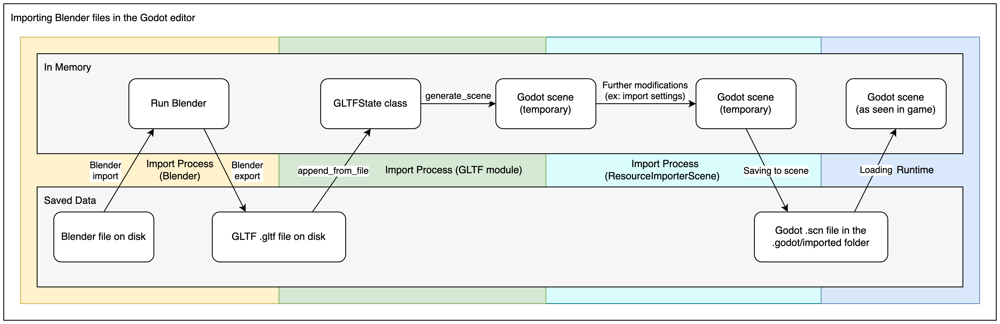

.. _doc_importing_3d_scenes_available_formats:

Available 3D formats
====================

When dealing with 3D assets, Godot has a flexible and configurable importer.

Godot works with *scenes*. This means that the entire scene being worked on in
your favorite 3D modeling software will be transferred as close as possible.

Godot supports the following 3D *scene file formats*:

- glTF 2.0 **(recommended)**. Godot has support for both text (``.gltf``)
  and binary (``.glb``) formats.
- ``.blend`` (Blender). This works by calling Blender to export to glTF in a
  transparent manner (requires Blender to be installed).
- DAE (COLLADA), an older format that is supported.
- OBJ (Wavefront) format + their MTL material files. This is also
  supported, but pretty limited given the format's limitations (no support for
  pivots, skeletons, animations, UV2, PBR materials, ...).
- FBX, supported via the `ufbx <https://github.com/ufbx/ufbx>`__ library. The
  previous import workflow used `FBX2glTF <https://github.com/godotengine/FBX2glTF>`__
  integration. This requires installing an external program that links against the
  proprietary FBX SDK, so we recommend using the default ufbx method or other formats
  listed above (if suitable for your workflow).

Copy the scene file together with the textures and mesh data (if separate) to
the project repository, then Godot will do a full import when focusing the
editor window.

Exporting glTF 2.0 files from Blender (recommended)
---------------------------------------------------

There are 3 ways to export glTF files from Blender:

- As a glTF binary file (``.glb``).
- As a glTF text-based file with separate binary data and textures (``.gltf``
  file + ``.bin`` file + textures).

glTF binary files (``.glb``) are the smaller option. They include the mesh and
textures set up in Blender. When brought into Godot the textures are part of the
object's material file.

There are two reasons to use glTF with the textures separate. One is to have the
scene description in a text based format and the binary data in a separate
binary file. This can be useful for version control if you want to review
changes in a text-based format. The second is you need the texture files
separate from the material file. If you don't need either of those, glTF binary
files are fine.

The glTF import process first loads the glTF file's data into an in-memory
GLTFState class. This data is then used to generate a Godot scene.
When importing files at runtime, this scene can be directly added to the tree.
The export process is the reverse of this, a Godot scene is converted to a
GLTFState class, then the glTF file is generated from that.

When importing glTF files in the editor, there are two more steps.
After generating the Godot scene, the ResourceImporterScene class is used to
apply additional import settings, including settings you set through the
Import dock and the Advanced Import Settings dialog. This is then saved as
a Godot scene file, which is what gets used when you run/export your game.

.. warning::

    If your model contains blend shapes (also known as "shape keys" and "morph
    targets"), your glTF export setting **Data > Armature > Export Deformation
    Bones Only** needs to be configured to **Enabled**.

    Exporting non-deforming bones anyway will lead to incorrect shading.

.. note::

    Blender versions older than 3.2 do not export emissive textures with the
    glTF file. If your model uses one and you're using an older version of
    Blender, it must be brought in separately.

    By default, Blender has backface culling disabled on materials and will
    export materials to match how they render in Blender. This means that
    materials in Godot will have their cull mode set to **Disabled**. This can
    decrease performance since backfaces will be rendered, even when they are
    being culled by other faces. To resolve this, enable **Backface Culling** in
    Blender's Materials tab, then export the scene to glTF again.

Importing ``.blend`` files directly within Godot
------------------------------------------------

.. note::

    This functionality requires Blender 3.0 or later. For best results, we
    recommend using Blender 3.5 or later, as it includes many fixes to the glTF
    exporter.

    It is **strongly** recommended to use an official Blender release downloaded
    from blender.org, as opposed to a Linux distribution package or Flatpak.
    This avoids any issues related to packaging, such as different library
    versions that can cause incompatibilities or sandboxing restrictions.

The editor can directly import ``.blend`` files by calling `Blender <https://www.blender.org/>`__'s
glTF export functionality in a transparent manner.

This allows you to iterate on your 3D scenes faster, as you can save the scene
in Blender, alt-tab back to Godot then see your changes immediately. When
working with version control, this is also more efficient as you no longer need
to commit a copy of the exported glTF file to version control.

To use ``.blend`` import, you must install Blender before opening the Godot
editor (if opening a project that already contains ``.blend`` files). If you
keep Blender installed at its default location, Godot should be able to detect
its path automatically. If this isn't the case, configure the path to the
Blender executable in the Editor Settings
(**Filesystem > Import > Blender > Blender Path**).

If you keep ``.blend`` files within your project folder but don't want them to
be imported by Godot, disable **Filesystem > Import > Blender > Enabled** in the
advanced Project Settings.

The ``.blend`` import process converts to glTF first, so it still uses
Godot's glTF import code. Therefore, the ``.blend`` import process is the same
as the glTF import process, but with an extra step at the beginning.

.. note::

    When working in a team, keep in mind using ``.blend`` files in your project
    will require *all* team members to have Blender installed. While Blender is
    a free download, this may add friction when working on the project.
    ``.blend`` import is also not available on the Android and web editors, as
    these platforms can't call external programs.

    If this is problematic, consider using glTF scenes exported from Blender
    instead.

Exporting DAE files from Blender
--------------------------------

Blender has built-in COLLADA support, but it does not work properly for the
needs of game engines and shouldn't be used as-is. However, scenes exported with
the built-in Collada support may still work for simple scenes without animation.

For complex scenes or scenes that contain animations it is highly recommend to use
glTF instead.

Importing OBJ files in Godot
----------------------------

OBJ is one of the simplest 3D formats out there, so Godot should be able to
import most OBJ files successfully. However, OBJ is also a very limited format:
it doesn't support skinning, animation, UV2 or PBR materials.

There are 2 ways to use OBJ meshes in Godot:

- Load them directly in a MeshInstance3D node, or any other property that
  expects as mesh (such as GPUParticles3D). This is the default mode.
- Change their import mode to **OBJ as Scene** in the Import dock then restart
  the editor. This allows you to use the same import options as glTF or Collada
  scenes, such as unwrapping UV2 on import (for :ref:`doc_using_lightmap_gi`).

.. note::

    Blender 3.4 and later can export RGB vertex colors in OBJ files (this is a
    nonstandard extension of the OBJ format). Godot is able to import those
    vertex colors, but they will not be displayed on the
    material unless you enable **Vertex Color > Use As Albedo** on the material.

    Vertex colors from OBJ meshes keep their original color space once imported
    (sRGB/linear), but their brightness is clamped to 1.0 (they can't be
    overbright).

Importing FBX files in Godot
----------------------------

By default any FBX file added to a Godot project in Godot 4.3 or later will
use the ufbx import method. Any file that was was added to a project in a
previous version, such as 4.2, will continue to be imported via the FBX2glTF
method unless you go into that files import settings, and change the importer
to  ``ufbx``.

If you keep ``.fbx`` files within your project folder but don't want them to
be imported by Godot, disable **Filesystem > Import > FBX > Enabled** in the
advanced Project Settings.

If you want to setup the FBX2glTF workflow, which is generally not recommend
unless you have a specific reason to use it, you need to download the `FBX2glTF <https://github.com/godotengine/FBX2glTF>`__
executable, then specify the path to that executable in the editor settings under
**Filesystem > Import > FBX > FBX2glTFPath**

The FBX2glTF import process converts to glTF first, so it still uses
Godot's glTF import code. Therefore, the FBX import process is the same
as the glTF import process, but with an extra step at the beginning.

.. seealso::

    The full installation process for using FBX2glTF in Godot is described on the
    `FBX import page of the Godot website <https://godotengine.org/fbx-import>`__.
