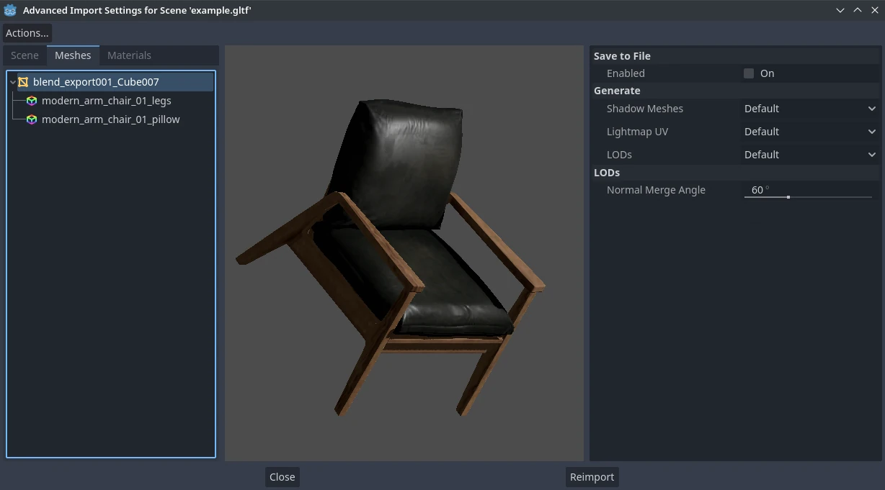

.. _doc_importing_3d_scenes_import_configuration:

Import configuration
====================

Godot provides several ways to customize the imported data, such as the
import dock, the advanced import setting dialog, and inherited scenes.
This can be used to make further changes to the imported scene, such
as adjusting meshes, adding physics information, and adding new nodes.
You can also write a script that runs code at the end of the import
process to perform arbitrary customization.

Note that, when applicable, modifying the original data should be preferred
to configuring the scene after import. This helps minimize the differences
between the 3D modeling application and the imported scene. See the
:ref:`doc_importing_3d_scenes_model_export_considerations` and
:ref:`doc_importing_3d_scenes_node_type_customization` articles
for more information.

Import workflows
----------------

Since Godot can only save its own scene format (``.tscn``/``.scn``), Godot
cannot save over the original 3D scene file (which uses a different format).
This is also a safer approach as it avoids making accidental changes to the
source file.

To allow customizing the scene and its materials, Godot's scene importer allows
for different workflows regarding how data is imported.

.. figure:: img/importing_3d_scenes_import_dock.webp
   :align: center
   :alt: Import dock after selecting a 3D scene in the FileSystem dock

   Import dock after selecting a 3D scene in the FileSystem dock

This import process is customizable using 3 separate interfaces, depending on your needs:

- The **Import** dock, after selecting the 3D scene by clicking it once in the
  FileSystem dock.
- The **Advanced Import Settings** dialog, which can be accessed by double-clicking
  the 3D scene in the FileSystem dock or by clicking the **Advanced…** button in
  the Import dock. This allows you to customize per-object options in Godot.
- :ref:`Import hints <doc_importing_3d_scenes_import_hints>`, which are special
  suffixes added to object names in the 3D modeling software. This allows you to
  customize per-object options in the 3D modeling software.

For basic customization, using the Import dock suffices. However, for more
complex operations such as defining material overrides on a per-material basis,
you'll need to use the Advanced Import Settings dialog, import hints, or possibly both.

.. _doc_importing_3d_scenes_using_the_import_dock:

Using the Import dock
^^^^^^^^^^^^^^^^^^^^^

The following options can be adjusted in the Import dock after selecting a 3D
scene in the FileSystem dock:

- **Root Type:** The node type to use as a root node. Using node types that
  inherit from Node3D is recommended. Otherwise, you'll lose the ability to
  position the node directly in the 3D editor.
- **Root Name:** The name of the root node in the imported scene. This is
  generally not noticeable when instancing the scene in the editor (or
  drag-and-dropping from the FileSystem dock), as the root node is renamed to
  match the filename in this case.
- **Apply Root Scale:** If enabled, **Root Scale** will be *applied* on the
  meshes and animations directly, while keeping the root node's scale to the
  default `(1, 1, 1)`. This means that if you add a child node later on within
  the imported scene, it won't be scaled. If disabled, **Root Scale** will
  multiply the scale of the root node instead.

**Meshes**

- **Ensure Tangents:** If checked, generate vertex tangents using
  `Mikktspace <http://www.mikktspace.com/>`__ if the input meshes don't have
  tangent data. When possible, it's recommended to let the 3D modeling software
  generate tangents on export instead on relying on this option. Tangents are
  required for correct display of normal and height maps, along with any
  material/shader features that require tangents. If you don't need material
  features that require tangents, disabling this can reduce output file size and
  speed up importing if the source 3D file doesn't contain tangents.
- **Generate LODs:** If checked, generates lower detail variants of the
  mesh which will be displayed in the distance to improve rendering performance.
  Not all meshes benefit from LOD, especially if they are never rendered from
  far away. Disabling this can reduce output file size and speed up importing.
  See :ref:`doc_mesh_lod` for more information.
- **Create Shadow Meshes:** If checked, enables the generation of
  shadow meshes on import. This optimizes shadow rendering without reducing
  quality by welding vertices together when possible. This in turn reduces the
  memory bandwidth required to render shadows. Shadow mesh generation currently
  doesn't support using a lower detail level than the source mesh (but shadow
  rendering will make use of LODs when relevant).
- **Light Baking:** Configures the meshes'
  :ref:`global illumination mode <class_GeometryInstance3D_property_gi_mode>`
  in the 3D scene. If set to **Static Lightmaps**, sets the meshes' GI mode to
  **Static** and generates UV2 on import for :ref:`lightmap baking <doc_using_lightmap_gi>`.
- **Lightmap Texel Size:** Only visible if **Light Baking** is set to **Static
  Lightmaps**. Controls the size of each texel on the baked lightmap. A smaller
  value results in more precise lightmaps, at the cost of larger lightmap sizes
  and longer bake times.

**Skins**

- **Use Named Skins:** If checked, use named :ref:`Skins <class_Skin>` for animation.
  The :ref:`class_MeshInstance3D` node contains 3 properties of relevance here: a skeleton
  NodePath pointing to the Skeleton3D node (usually ``..``), a mesh, and a skin:

  - The :ref:`class_Skeleton3D` node contains a list of bones with names, their pose and rest,
    a name and a parent bone.
  - The mesh is all of the raw vertex data needed to display a mesh. In terms of the mesh,
    it knows how vertices are weight-painted and uses some internal numbering
    often imported from 3D modeling software.
  - The skin contains the information necessary to bind this mesh onto this Skeleton3D.
    For every one of the internal bone IDs chosen by the 3D modeling software, it contains two things.
    Firstly, a Matrix known as the Bind Pose Matrix, Inverse Bind Matrix, or IBM for short.
    Secondly, the Skin contains each bone's name (if **Use Named Skins** is enabled),
    or the bone's index within the Skeleton3D list (if **Use Named Skins** is disabled).

Together, this information is enough to tell Godot how to use the bone poses in
the Skeleton3D node to render the mesh from each MeshInstance3D. Note that each
MeshInstance3D may share binds, as is common in models exported from Blender, or
each MeshInstance3D may use a separate Skin object, as is common in models
exported from other tools such as Maya.

**Animation**

- **Import:** If checked, import animations from the 3D scene.
- **FPS:** The number of frames per second to use for baking animation curves to
  a series of points with linear interpolation. It's recommended to configure
  this value to match the value you're using as a baseline in your 3D modeling
  software. Higher values result in more precise animation with fast movement
  changes, at the cost of higher file sizes and memory usage. Thanks to
  interpolation, there is usually not much benefit in going above 30 FPS (as the
  animation will still appear smooth at higher rendering framerates).
- **Trimming:** Trim the beginning and end of animations if there are no
  keyframe changes. This can reduce output file size and memory usage with
  certain 3D scenes, depending on the contents of their animation tracks.
- **Remove Immutable Tracks:** Remove animation tracks that only contain default
  values. This can reduce output file size and memory usage with certain 3D
  scenes, depending on the contents of their animation tracks.

**Import Script**

- **Path:** Path to an import script, which can run code *after*
  the import process has completed for custom processing.
  See :ref:`doc_importing_3d_scenes_import_script` for more information.

**glTF**

- **Embedded Texture Handling:** Controls how textures embedded within glTF
  scenes should be handled. **Discard All Textures** will not import any
  textures, which is useful if you wish to manually set up materials in Godot
  instead. **Extract Textures** extracts textures to external images, resulting
  in smaller file sizes and more control over import options. **Embed as Basis
  Universal** and **Embed as Uncompressed** keeps the textures embedded in the
  imported scene, with and without VRAM compression respectively.

Using the Advanced Import Settings dialog
^^^^^^^^^^^^^^^^^^^^^^^^^^^^^^^^^^^^^^^^^

The first tab you'll see is the **Scene** tab. The options available in the
panel on the right are identical to the Import dock, but you have access to a 3D
preview. The 3D preview can be rotated by holding down the left mouse button
then dragging the mouse. Zoom can be adjusted using the mouse wheel.

.. figure:: img/importing_3d_scenes_advanced_import_settings_scene.webp
   :align: center
   :alt: Advanced Import Settings dialog (Scene tab)

   Advanced Import Settings dialog (Scene tab).
   Credit: `Modern Arm Chair 01 - Poly Haven <https://polyhaven.com/a/modern_arm_chair_01>`__

**Configuring node import options**

You can select individual nodes that compose the scene while in the **Scene**
tab using the tree view at the left:

   Selecting a node in the Advanced Import Settings dialog (Materials tab)

This exposes several per-node import options:

- **Skip Import:** If checked, the node will not be present in the final
  imported scene. Enabling this disables all other options.
- **Generate > Physics:** If checked, generates a PhysicsBody3D *parent* node
  with collision shapes that are *siblings* to the MeshInstance3D node.
- **Generate > NavMesh:** If checked, generates a NavigationRegion3D *child*
  node for :ref:`navigation <doc_navigation_overview_3d>`. **Mesh + NavMesh**
  will keep the original mesh visible, while **NavMesh Only** will only import
  the navigation mesh (without a visual representation). **NavMesh Only** is
  meant to be used when you've manually authored a simplified mesh for navigation.
- **Generate > Occluder:** If checked, generates an OccluderInstance3D *sibling*
  node for :ref:`occlusion culling <doc_occlusion_culling>` using the mesh's
  geometry as a basis for the occluder's shape. **Mesh + Occluder** will keep
  the original mesh visible, while **Occluder Only** will only import the
  occluder (without a visual representation). **Occluder Only** is meant to be
  used when you've manually authored a simplified mesh for occlusion culling.

These options are only visible if some of the above options are enabled:

- **Physics > Body Type:** Only visible if **Generate > Physics** is enabled.
  Controls the PhysicsBody3D that should be created. **Static** creates a
  StaticBody3D, **Dynamic** creates a RigidBody3D, **Area** creates an Area3D.
- **Physics > Shape Type:** Only visible if **Generate > Physics** is enabled.
  **Trimesh** allows for precise per-triangle collision, but it can only be used
  with a **Static** body type. Other types are less precise and may require
  manual configuration, but can be used with any body type. For static level
  geometry, use **Trimesh**. For dynamic geometry, use primitive shapes if
  possible for better performance, or use one of the convex decomposition modes
  if the shape is large and complex.
- **Decomposition > Advanced:** Only visible if **Physics > Shape Type** is
  **Decompose Convex**. If checked, allows adjusting advanced decomposition
  options. If disabled, only a preset **Precision** can be adjusted (which is
  usually sufficient).
- **Decomposition > Precision:** Only visible if **Physics > Shape Type** is
  **Decompose Convex**. Controls the precision to use for convex decomposition.
  Higher values result in more detailed collision, at the cost of slower
  generation and increased CPU usage during physics simulation. To improve
  performance, it's recommended to keep this value as low as possible for your
  use cases.
- **Occluder > Simplification Distance:** Only visible if **Generate >
  Occluder** is set to **Mesh + Occluder** or **Occluder Only**. Higher values
  result in a occluder mesh with fewer vertices (resulting in decreased CPU
  utilization), at the cost of more occlusion culling issues (such as false
  positives or false negatives). If you run into objects disappearing when they
  shouldn't when the camera is near a certain mesh, try decreasing this value.

**Configuring mesh and material import options**

In the Advanced Import Settings dialog, there are 2 ways to select individual
meshes or materials:

- Switch to the **Meshes** or **Materials** tab in the top-left corner of the dialog.
- Stay in the **Scene** tab, but unfold the options on the tree view on the
  left. After choosing a mesh or material, this presents the same information as
  the **Meshes** and **Materials** tabs, but in a tree view instead of a list.

If you select a mesh, different options will appear in the panel on the right:

   Advanced Import Settings dialog (Meshes tab)

The options are as follows:

- **Save to File:** Saves the :ref:`class_Mesh` *resource* to an external file
  (this isn't a scene file). You generally don't need to use this for placing
  the mesh in a 3D scene – instead, you should instance the 3D scene directly.
  However, having direct access to the Mesh resource is useful for specific
  nodes, such as :ref:`class_MeshInstance3D`, :ref:`class_MultiMeshInstance3D`,
  :ref:`class_GPUParticles3D` or :ref:`class_CPUParticles3D`.
  - You will also need to specify an output file path using the option that
  appears after enabling **Save to File**. It's recommended to use the ``.res``
  output file extension for smaller file sizes and faster loading speeds, as
  ``.tres`` is inefficient for writing large amounts of data.
- **Generate > Shadow Meshes:** Per-mesh override for the **Meshes > Create
  Shadow Meshes** scene-wide import option described in
  :ref:`doc_importing_3d_scenes_using_the_import_dock`. **Default** will use the
  scene-wide import option, while **Enable** or **Disable** can forcibly enable
  or disable this behavior on a specific mesh.
- **Generate > Lightmap UV:** Per-mesh override for the **Meshes > Light
  Baking** scene-wide import option described in
  :ref:`doc_importing_3d_scenes_using_the_import_dock`. **Default** will use the
  scene-wide import option, while **Enable** or **Disable** can forcibly enable
  or disable this behavior on a specific mesh.
  - Setting this to **Enable** on a scene with the **Static** light baking mode
  is equivalent to configuring this mesh to use **Static Lightmaps**. Setting this
  to **Disable** on a scene with the **Static Lightmaps** light baking mode is
  equivalent to configuring this mesh to use **Static** instead.
- **Generate > LODs:** Per-mesh override for the **Meshes > Generate LODs**
  scene-wide import option described in
  :ref:`doc_importing_3d_scenes_using_the_import_dock`. **Default** will use the
  scene-wide import option, while **Enable** or **Disable** can forcibly enable
  or disable this behavior on a specific mesh.
- **LODs > Normal Split Angle:** The minimum angle difference between two
  vertices required to preserve a geometry edge in mesh LOD generation. If
  running into visual issues with LOD generation, decreasing this value may help
  (at the cost of less efficient LOD generation).
- **LODs > Normal Merge Angle:** The minimum angle difference between two
  vertices required to preserve a geometry edge in mesh LOD generation. If
  running into visual issues with LOD generation, decreasing this value may help
  (at the cost of less efficient LOD generation).

If you select a material, only one option will appear in the panel on the right:

.. figure:: img/importing_3d_scenes_advanced_import_settings_materials.webp
   :align: center
   :alt: Advanced Import Settings dialog (Materials tab)

   Advanced Import Settings dialog (Materials tab)

When **Use External** is checked and an output path is specified, this lets you
use an external material instead of the material that is included in the
original 3D scene file; see the section below.

Extracting materials to separate files
^^^^^^^^^^^^^^^^^^^^^^^^^^^^^^^^^^^^^^

While Godot can import materials authored in 3D modeling software, the default
configuration may not be suitable for your needs. For example:

- You want to configure material features not supported by your 3D application.
- You want to use a different texture filtering mode, as this option is
  configured in the material since Godot 4.0 (and not in the image).
- You want to replace one of the materials with an entirely different material,
  such as a custom shader.

To be able to modify the 3D scene's materials in the Godot editor, you need to
use *external* material resources.

In the top-left corner of the Advanced Import Settings dialog, choose
**Actions… > Extract Materials**:

   Extracting all built-in materials to external resources in the Advanced Import Settings dialog

After choosing this option, select a folder to extract material ``.tres`` files
to, then confirm the extraction:

.. figure:: img/importing_3d_scenes_advanced_import_settings_extract_materials_confirm.webp
   :align: center
   :alt: Confirming material extraction in the Advanced Import Settings subdialog

   Confirming material extraction in the Advanced Import Settings subdialog

.. note::

    After extracting materials, the 3D scene will automatically be configured to
    use external material references. As a result, you don't need to manually
    enable **Use External** on every material to make the external ``.tres``
    material effective.

When **Use External** is enabled, remember that the Advanced Import Settings
dialog will keep displaying the mesh's original materials (the ones designed in
the 3D modeling software). This means your customizations to the materials won't
be visible within this dialog. To preview your modified materials, you need to
place the imported 3D scene in another scene using the editor.

Godot will not overwrite changes made to extracted materials when the source 3D
scene is reimported. However, if the material name is changed in the source 3D
file, the link between the original material and the extracted material will be
lost. As a result, you'll need to use the Advanced Import Settings dialog to
associate the renamed material to the existing extracted material.

The above can be done in the dialog's **Materials** tab by selecting the
material, enabling **Save to File**, then specifying the save path using the
**Path** option that appears after enabling **Save to File**.

.. _doc_importing_3d_scenes_import_script:

Using import scripts for automation
^^^^^^^^^^^^^^^^^^^^^^^^^^^^^^^^^^^

A special script to process the whole scene after import can be provided.
This is great for post-processing, changing materials, doing funny stuff with
the geometry, and more.

Create a script that is not attached to any node by right-clicking in the
FileSystem dock and choosing **New > Script…**. In the script editor, write the
following:

::

    @tool # Needed so it runs in editor.
    extends EditorScenePostImport

    # This sample changes all node names.
    # Called right after the scene is imported and gets the root node.
    func _post_import(scene):
        # Change all node names to "modified_[oldnodename]"
        iterate(scene)
        return scene # Remember to return the imported scene

    # Recursive function that is called on every node
    # (for demonstration purposes; EditorScenePostImport only requires a `_post_import(scene)` function).
    func iterate(node):
        if node != null:
            print_rich("Post-import: [b]%s[/b] -> [b]%s[/b]" % [node.name, "modified_" + node.name])
            node.name = "modified_" + node.name
            for child in node.get_children():
                iterate(child)

The ``_post_import(scene: Node)`` function takes the imported scene as argument
(the parameter is actually the root node of the scene). The scene that will
finally be used **must** be returned (even if the scene can be entirely different).

Using animation libraries
^^^^^^^^^^^^^^^^^^^^^^^^^

As of Godot 4.0, you can choose to import **only** animations from a glTF file and
nothing else. This is used in some asset pipelines to distribute animations
separately from models. For example, this allows you to use one set of
animations for several characters, without having to duplicate animation data in
every character.

To do so, select the glTF file in the FileSystem dock, then change the import
mode to Animation Library in the Import dock:

.. figure:: img/importing_3d_scenes_changing_import_type.webp
   :align: center
   :alt: Changing the import type to Animation Library in the Import dock

   Changing the import type to Animation Library in the Import dock

Click **Reimport** and restart the editor when prompted. After restarting, the
glTF file will be imported as an :ref:`class_AnimationLibrary` instead of a
:ref:`class_PackedScene`. This animation library can then be referenced in an
:ref:`class_AnimationPlayer` node.

The import options that are visible after changing the import mode to Animation
Library act the same as when using the Scene import mode. See
:ref:`doc_importing_3d_scenes_using_the_import_dock` for more information.

Filter script
^^^^^^^^^^^^^

It is possible to specify a filter script in a special syntax to decide which
tracks from which animations should be kept.

The filter script is executed against each imported animation. The syntax
consists of two types of statements, the first for choosing which animations to
filter, and the second for filtering individual tracks within the matched
animation. All name patterns are performed using a case-insensitive expression
match, with support for ``?`` and ``*`` wildcards (using
:ref:`String.matchn() <class_String_method_matchn>` under the hood).

The script must start with an animation filter statement (as denoted by the line
beginning with an ``@``). For example, if we would like to apply filters to all
imported animations which have a name ending in ``"_Loop"``::

    @+*_Loop

Similarly, additional patterns can be added to the same line, separated by
commas. Here is a modified example to additionally *include* all animations with
names that begin with ``"Arm_Left"``, but also *exclude* all animations which
have names ending in ``"Attack"``::

    @+*_Loop, +Arm_Left*, -*Attack

Following the animation selection filter statement, we add track filtering
patterns to indicate which animation tracks should be kept or discarded. If no
track filter patterns are specified, then all tracks within the matched
animations will be discarded!

It's important to note that track filter statements are applied in order for
each track within the animation, this means that one line may include a track, a
later rule can still discard it. Similarly, a track excluded by an early rule
may then be re-included once again by a filter rule further down in the filter
script.

For example: include all tracks in animations with names ending in ``"_Loop"``,
but discard any tracks affecting a ``"Skeleton"`` which end in ``"Control"``,
unless they have ``"Arm"`` in their name::

    @+*_Loop
    +*
    -Skeleton:*Control
    +*Arm*

In the above example, tracks like ``"Skeleton:Leg_Control"`` would be discarded,
while tracks such as ``"Skeleton:Head"`` or ``"Skeleton:Arm_Left_Control"``
would be retained.

Any track filter lines that do not begin with a ``+`` or ``-`` are ignored.

Storage
^^^^^^^

By default, animations are saved as built-in. It is possible to save them to a
file instead. This allows adding custom tracks to the animations and keeping
them after a reimport.

Optimizer
^^^^^^^^^

When animations are imported, an optimizer is run, which reduces the size of the
animation considerably. In general, this should always be turned on unless you
suspect that an animation might be broken due to it being enabled.

Clips
^^^^^

It is possible to specify multiple animations from a single timeline as clips.
For this to work, the model must have only one animation that is named
``default``. To create clips, change the clip amount to something greater than
zero. You can then name a clip, specify which frames it starts and stops on, and
choose whether the animation loops or not.

Scene inheritance
-----------------

In many cases, it may be desired to make manual modifications to the imported
scene. By default, this is not possible because if the source 3D asset changes,
Godot will re-import the *whole* scene.

However, it is possible to make local modifications by using *scene
inheritance*. If you try to open the imported scene using **Scene > Open
Scene…** or **Scene > Quick Open Scene…**, the following dialog will appear:

.. figure:: img/importing_3d_scenes_create_inherited_scene_dialog.webp
   :align: center
   :alt: Dialog when opening an imported 3D scene in the editor

   Dialog when opening an imported 3D scene in the editor

In inherited scenes, the only limitations for modification are:

- Nodes from the base scene can't be removed, but additional nodes can be added
  anywhere.
- Subresources can't be edited. Instead, you need to save them externally as
  described above.

Other than that, everything is allowed.

.. _doc_importing_3d_scenes_import_hints:
