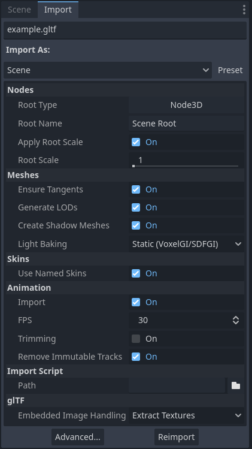
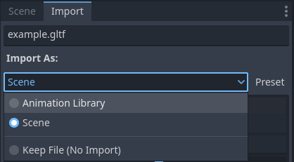
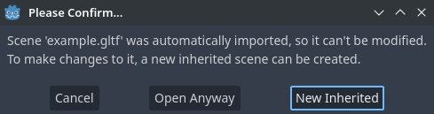

.. _doc_importing_3d_scenes_import_configuration:

Import configuration
====================

Godot provides several ways to customize the imported data, such as the
import dock, the advanced import setting dialog, and inherited scenes.
This can be used to make further changes to the imported scene, such
as adjusting meshes, adding physics information, and adding new nodes.
You can also write a script that runs code at the end of the import
process to perform arbitrary customization.

Note that, when applicable, modifying the original data should be preferred
to configuring the scene after import. This helps minimize the differences
between the 3D modeling application and the imported scene. See the
:ref:`doc_importing_3d_scenes_model_export_considerations` and
:ref:`doc_importing_3d_scenes_node_type_customization` articles
for more information.

Import workflows
----------------

Since Godot can only save its own scene format (``.tscn``/``.scn``), Godot
cannot save over the original 3D scene file (which uses a different format).
This is also a safer approach as it avoids making accidental changes to the
source file.

To allow customizing the scene and its materials, Godot's scene importer allows
for different workflows regarding how data is imported.

   Import dock after selecting a 3D scene in the FileSystem dock

This import process is customizable using 3 separate interfaces, depending on your needs:

- The **Import** dock, after selecting the 3D scene by clicking it once in the
  FileSystem dock.
- The **Advanced Import Settings** dialog, which can be accessed by double-clicking
  the 3D scene in the FileSystem dock or by clicking the **Advanced…** button in
  the Import dock. This allows you to customize per-object options in Godot, and
  preview models and animations. please see the :ref:`doc_advanced_import_settings`
  page for more information.
- :ref:`Import hints <doc_importing_3d_scenes_node_type_customization>`, which are special
  suffixes added to object names in the 3D modeling software. This allows you to
  customize per-object options in the 3D modeling software.

For basic customization, using the Import dock suffices. However, for more
complex operations such as defining material overrides on a per-material basis,
you'll need to use the Advanced Import Settings dialog, import hints, or possibly both.

.. _doc_importing_3d_scenes_using_the_import_dock:

Using the Import dock
~~~~~~~~~~~~~~~~~~~~~

The following options can be adjusted in the Import dock after selecting a 3D
scene in the FileSystem dock:

- **Root Type:** The node type to use as a root node. Using node types that
  inherit from Node3D is recommended. Otherwise, you'll lose the ability to
  position the node directly in the 3D editor.
- **Root Name:** The name of the root node in the imported scene. This is
  generally not noticeable when instancing the scene in the editor (or
  drag-and-dropping from the FileSystem dock), as the root node is renamed to
  match the filename in this case.
- **Apply Root Scale:** If enabled, **Root Scale** will be *applied* on the
  meshes and animations directly, while keeping the root node's scale to the
  default `(1, 1, 1)`. This means that if you add a child node later on within
  the imported scene, it won't be scaled. If disabled, **Root Scale** will
  multiply the scale of the root node instead.

**Meshes**

- **Ensure Tangents:** If checked, generate vertex tangents using
  `Mikktspace <http://www.mikktspace.com/>`__ if the input meshes don't have
  tangent data. When possible, it's recommended to let the 3D modeling software
  generate tangents on export instead on relying on this option. Tangents are
  required for correct display of normal and height maps, along with any
  material/shader features that require tangents. If you don't need material
  features that require tangents, disabling this can reduce output file size and
  speed up importing if the source 3D file doesn't contain tangents.
- **Generate LODs:** If checked, generates lower detail variants of the
  mesh which will be displayed in the distance to improve rendering performance.
  Not all meshes benefit from LOD, especially if they are never rendered from
  far away. Disabling this can reduce output file size and speed up importing.
  See :ref:`doc_mesh_lod` for more information.
- **Create Shadow Meshes:** If checked, enables the generation of
  shadow meshes on import. This optimizes shadow rendering without reducing
  quality by welding vertices together when possible. This in turn reduces the
  memory bandwidth required to render shadows. Shadow mesh generation currently
  doesn't support using a lower detail level than the source mesh (but shadow
  rendering will make use of LODs when relevant).
- **Light Baking:** Configures the meshes'
  :ref:`global illumination mode <class_GeometryInstance3D_property_gi_mode>`
  in the 3D scene. If set to **Static Lightmaps**, sets the meshes' GI mode to
  **Static** and generates UV2 on import for :ref:`lightmap baking <doc_using_lightmap_gi>`.
- **Lightmap Texel Size:** Only visible if **Light Baking** is set to **Static
  Lightmaps**. Controls the size of each texel on the baked lightmap. A smaller
  value results in more precise lightmaps, at the cost of larger lightmap sizes
  and longer bake times.

**Skins**

- **Use Named Skins:** If checked, use named :ref:`Skins <class_Skin>` for animation.
  The :ref:`class_MeshInstance3D` node contains 3 properties of relevance here: a skeleton
  NodePath pointing to the Skeleton3D node (usually ``..``), a mesh, and a skin:

  - The :ref:`class_Skeleton3D` node contains a list of bones with names, their pose and rest,
    a name and a parent bone.
  - The mesh is all of the raw vertex data needed to display a mesh. In terms of the mesh,
    it knows how vertices are weight-painted and uses some internal numbering
    often imported from 3D modeling software.
  - The skin contains the information necessary to bind this mesh onto this Skeleton3D.
    For every one of the internal bone IDs chosen by the 3D modeling software, it contains two things.
    Firstly, a Matrix known as the Bind Pose Matrix, Inverse Bind Matrix, or IBM for short.
    Secondly, the Skin contains each bone's name (if **Use Named Skins** is enabled),
    or the bone's index within the Skeleton3D list (if **Use Named Skins** is disabled).

Together, this information is enough to tell Godot how to use the bone poses in
the Skeleton3D node to render the mesh from each MeshInstance3D. Note that each
MeshInstance3D may share binds, as is common in models exported from Blender, or
each MeshInstance3D may use a separate Skin object, as is common in models
exported from other tools such as Maya.

**Animation**

- **Import:** If checked, import animations from the 3D scene.
- **FPS:** The number of frames per second to use for baking animation curves to
  a series of points with linear interpolation. It's recommended to configure
  this value to match the value you're using as a baseline in your 3D modeling
  software. Higher values result in more precise animation with fast movement
  changes, at the cost of higher file sizes and memory usage. Thanks to
  interpolation, there is usually not much benefit in going above 30 FPS (as the
  animation will still appear smooth at higher rendering framerates).
- **Trimming:** Trim the beginning and end of animations if there are no
  keyframe changes. This can reduce output file size and memory usage with
  certain 3D scenes, depending on the contents of their animation tracks.
- **Remove Immutable Tracks:** Remove animation tracks that only contain default
  values. This can reduce output file size and memory usage with certain 3D
  scenes, depending on the contents of their animation tracks.

**Import Script**

- **Path:** Path to an import script, which can run code *after*
  the import process has completed for custom processing.
  See :ref:`doc_importing_3d_scenes_import_script` for more information.

**glTF**

- **Embedded Texture Handling:** Controls how textures embedded within glTF
  scenes should be handled. **Discard All Textures** will not import any
  textures, which is useful if you wish to manually set up materials in Godot
  instead. **Extract Textures** extracts textures to external images, resulting
  in smaller file sizes and more control over import options. **Embed as Basis
  Universal** and **Embed as Uncompressed** keeps the textures embedded in the
  imported scene, with and without VRAM compression respectively.

**FBX**

- **Importer** Which import method is used. ubfx handles fbx files as fbx files.
  FBX2glTF converts FBX files to glTF on import and requires additional setup.
  FBX2glTF is not recommended unless you have a specific rason to use it over
  ufbx or working with a different file format.
- **Allow Geometry Helper Nodes** enables or disables geometry helper nodes
- **Embedded Texture Handling:** Controls how textures embedded within fbx
  scenes should be handled. **Discard All Textures** will not import any
  textures, which is useful if you wish to manually set up materials in Godot
  instead. **Extract Textures** extracts textures to external images, resulting
  in smaller file sizes and more control over import options. **Embed as Basis
  Universal** and **Embed as Uncompressed** keeps the textures embedded in the
  imported scene, with and without VRAM compression respectively.

**Blender-specific options**

Only visible for ``.blend`` files.

**Nodes**

- **Visible:** **All** imports everything, even invisible objects. **Visible Only**
  only imports visible objects. **Renderable** only imports objects that are marked
  as renderable in Blender, regardless of whether they are actually visible.
  In Blender, renderability is toggled by clicking the camera icon next to each object
  in the Outliner, while visibility is toggled by the eye icon.
- **Active Collection Only:** If checked, only imports nodes that are in the active collection
  in Blender.
- **Punctual Lights:** If checked, imports lights (directional, omni, and spot) from Blender.
  "Punctual" is not to be confused with "positional", which is why directional lights
  are also included.
- **Cameras:** If checked, imports cameras from Blender.
- **Custom Properties:** If checked, imports custom properties from Blender as glTF extras.
  This data can then be used from an editor plugin that uses
  :ref:`GLTFDocument.register_gltf_document_extension() <class_GLTFDocument_method_register_gltf_document_extension>`,
  which can set node metadata on import (among other use cases).
- **Modifiers:** If set to **No Modifiers**, object modifiers are ignored on import.
  If set to **All Modifiers**, applies modifiers to objects on import.

**Meshes**

- **Colors:** If checked, imports vertex colors from Blender.
- **UVs:** If checked, imports vertex UV1 and UV2 from Blender.
- **Normals:** If checked, imports vertex normals from Blender.
- **Export Geometry Nodes Instances:** If checked, imports
  `geometry node <https://docs.blender.org/manual/en/latest/modeling/geometry_nodes/introduction.html>`__
  instances from Blender.
- **Tangents:** If checked, imports vertex tangents from Blender.
- **Skins:** **None** skips skeleton skin data import from Blender. **4 Influences (Compatible)**
  imports skin data to be compatible with all renderers, at the cost of lower precision
  for certain rigs. **All Influences** imports skin data with all influences
  (up to 8 in Godot), which is more precise but may not be compatible with all renderers.
- **Export Bones Deforming Mesh Only:** If checked, only imports bones that deform the mesh
  from Blender.

**Materials**

- **Unpack Enabled:** If checked, unpacks the original images to the Godot filesystem
  and uses them. This allows changing image import settings like VRAM compression.
  If unchecked, allows Blender to convert the original images, such as repacking
  roughness and metallic into one roughness + metallic texture. In most cases,
  this option should be left checked, but if the ``.blend`` file's images
  aren't in the correct format, this must be disabled for correct behavior.
- **Export Materials:** If set to **Placeholder**, does not import materials,
  but keeps surface slots so that separate materials can be assigned to different surfaces.
  If set to **Export**, imports materials as-is (note that procedural Blender materials
  may not work correctly). If set to **Named Placeholder**, imports materials,
  but doesn't import images that are packed into the ``.blend`` file.
  Textures will have to be reassigned manually in the imported materials.

**Animation**

- **Limit Playback:** If checked, limits animation import to the playback range
  defined in Blender (the **Start** and **End** options at the right of the animation timeline
  in Blender). This can avoid including unused animation data, making the imported scene smaller
  and faster to load. However, this can also result in missing animation data if the playback range
  is not set correctly in Blender.
- **Always Sample:** If checked, forces animation sampling on import to ensure consistency
  between how Blender and glTF perform animation interpolation, at the cost of larger file sizes.
  If unchecked, there may be differences in how animations are interpolated between what you see
  in Blender and the imported scene in Godot, due to different interpolation semantics
  between both.
- **Group Tracks:** If checked, imports animations (actives and on NLA tracks) as
  separate tracks. If unchecked, all the currently assigned actions become one glTF animation.

.. _doc_importing_3d_scenes_import_script:

Using import scripts for automation
~~~~~~~~~~~~~~~~~~~~~~~~~~~~~~~~~~~

A special script to process the whole scene after import can be provided.
This is great for post-processing, changing materials, doing funny stuff with
the geometry, and more.

Create a script that is not attached to any node by right-clicking in the
FileSystem dock and choosing **New > Script…**. In the script editor, write the
following:

::

    @tool # Needed so it runs in editor.
    extends EditorScenePostImport

    # This sample changes all node names.
    # Called right after the scene is imported and gets the root node.
    func _post_import(scene):
        # Change all node names to "modified_[oldnodename]"
        iterate(scene)
        return scene # Remember to return the imported scene

    # Recursive function that is called on every node
    # (for demonstration purposes; EditorScenePostImport only requires a `_post_import(scene)` function).
    func iterate(node):
        if node != null:
            print_rich("Post-import: [b]%s[/b] -> [b]%s[/b]" % [node.name, "modified_" + node.name])
            node.name = "modified_" + node.name
            for child in node.get_children():
                iterate(child)

The ``_post_import(scene: Node)`` function takes the imported scene as argument
(the parameter is actually the root node of the scene). The scene that will
finally be used **must** be returned (even if the scene can be entirely different).

To use your script, locate the script in the import tab's "Path" option under the "Import Script" category.

Using animation libraries
~~~~~~~~~~~~~~~~~~~~~~~~~

As of Godot 4.0, you can choose to import **only** animations from a glTF file and
nothing else. This is used in some asset pipelines to distribute animations
separately from models. For example, this allows you to use one set of
animations for several characters, without having to duplicate animation data in
every character.

To do so, select the glTF file in the FileSystem dock, then change the import
mode to Animation Library in the Import dock:

   Changing the import type to Animation Library in the Import dock

Click **Reimport** and restart the editor when prompted. After restarting, the
glTF file will be imported as an :ref:`class_AnimationLibrary` instead of a
:ref:`class_PackedScene`. This animation library can then be referenced in an
:ref:`class_AnimationPlayer` node.

The import options that are visible after changing the import mode to Animation
Library act the same as when using the Scene import mode. See
:ref:`doc_importing_3d_scenes_using_the_import_dock` for more information.

Filter script
~~~~~~~~~~~~~

It is possible to specify a filter script in a special syntax to decide which
tracks from which animations should be kept.

The filter script is executed against each imported animation. The syntax
consists of two types of statements, the first for choosing which animations to
filter, and the second for filtering individual tracks within the matched
animation. All name patterns are performed using a case-insensitive expression
match, with support for ``?`` and ``*`` wildcards (using
:ref:`String.matchn() <class_String_method_matchn>` under the hood).

The script must start with an animation filter statement (as denoted by the line
beginning with an ``@``). For example, if we would like to apply filters to all
imported animations which have a name ending in ``"_Loop"``:

.. code:: text

    @+*_Loop

Similarly, additional patterns can be added to the same line, separated by
commas. Here is a modified example to additionally *include* all animations with
names that begin with ``"Arm_Left"``, but also *exclude* all animations which
have names ending in ``"Attack"``:

.. code:: text

    @+*_Loop, +Arm_Left*, -*Attack

Following the animation selection filter statement, we add track filtering
patterns to indicate which animation tracks should be kept or discarded. If no
track filter patterns are specified, then all tracks within the matched
animations will be discarded!

It's important to note that track filter statements are applied in order for
each track within the animation, this means that one line may include a track, a
later rule can still discard it. Similarly, a track excluded by an early rule
may then be re-included once again by a filter rule further down in the filter
script.

For example: include all tracks in animations with names ending in ``"_Loop"``,
but discard any tracks affecting a ``"Skeleton"`` which end in ``"Control"``,
unless they have ``"Arm"`` in their name:

::

    @+*_Loop
    +*
    -Skeleton:*Control
    +*Arm*

In the above example, tracks like ``"Skeleton:Leg_Control"`` would be discarded,
while tracks such as ``"Skeleton:Head"`` or ``"Skeleton:Arm_Left_Control"``
would be retained.

Any track filter lines that do not begin with a ``+`` or ``-`` are ignored.

Scene inheritance
-----------------

In many cases, it may be desired to make manual modifications to the imported
scene. By default, this is not possible because if the source 3D asset changes,
Godot will re-import the *whole* scene.

However, it is possible to make local modifications by using *scene
inheritance*. If you try to open the imported scene using **Scene > Open
Scene…** or **Scene > Quick Open Scene…**, the following dialog will appear:

   Dialog when opening an imported 3D scene in the editor

In inherited scenes, the only limitations for modification are:

- Nodes from the base scene can't be removed, but additional nodes can be added
  anywhere.
- Subresources can't be edited. Instead, you need to save them externally as
  described above.

Other than that, everything is allowed.
