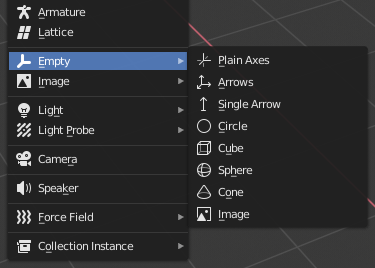

.. _doc_importing_3d_scenes_node_type_customization:

Node type customization using name suffixes
===========================================

Many times, when editing a scene, there are common tasks that need to be done
after exporting:

- Adding collision detection to objects.
- Setting objects as navigation meshes.
- Deleting nodes that are not used in the game engine (like specific lights used
  for modeling).

To simplify this workflow, Godot offers several suffixes that can be added to
the names of the objects in your 3D modeling software. When imported, Godot
will detect suffixes in object names and will perform actions automatically.

.. warning::

    All the suffixes described below can be used with ``-``, ``$``, and ``_`` and are
    **case-insensitive**.

Opting out
----------

If you do not want Godot to perform any of the actions described below, you
can set the ``nodes/use_node_type_suffixes`` import option to ``false``.
This will disable all node type suffixes, which keeps nodes the same type
as the original file indicated. However, the ``-noimp`` suffix will still
be respected, as well as non-node suffixes like ``-vcol`` or ``-loop``.

Alternatively, you can completely opt out of all name suffixes by setting
the ``nodes/use_name_suffixes`` import option to ``false``. This will
completely stop the general scene import code from looking at name suffixes.
However, the format-specific import code may still look at name suffixes,
such as the glTF importer checking for the ``-loop`` suffix.

Disabling these options makes editor-imported files more similar to the
original files, and more similar to importing files at runtime.
For an import workflow that works at runtime, gives more predictable
results, and only has explicitly defined behavior, consider setting these
options to ``false`` and using :ref:`class_GLTFDocumentExtension` instead.

Remove nodes and animations (-noimp)
------------------------------------

Nodes and animations that have the ``-noimp`` suffix will be removed at
import time no matter what their type is. They will not appear in the
imported scene.

This is equivalent to enabling **Skip Import** for a node in the Advanced Import
Settings dialog.

Create collisions (-col, -convcol, -colonly, -convcolonly)
----------------------------------------------------------

The option ``-col`` will work only for Mesh objects. If it is detected, a child
static collision node will be added, using the same geometry as the mesh. This
will create a triangle mesh collision shape, which is a slow, but accurate
option for collision detection. This option is usually what you want for level
geometry (but see also ``-colonly`` below).

The option ``-convcol`` will create a :ref:`class_ConvexPolygonShape3D` instead of
a :ref:`class_ConcavePolygonShape3D`. Unlike triangle meshes which can be concave,
a convex shape can only accurately represent a shape that doesn't have any
concave angles (a pyramid is convex, but a hollow box is concave). Due to this,
convex collision shapes are generally not suited for level geometry. When
representing simple enough meshes, convex collision shapes can result in better
performance compared to a triangle collision shape. This option is ideal for
simple or dynamic objects that require mostly-accurate collision detection.

However, in both cases, the visual geometry may be too complex or not smooth
enough for collisions. This can create physics glitches and slow down the engine
unnecessarily.

To solve this, the ``-colonly`` modifier exists. It will remove the mesh upon
importing and will create a :ref:`class_StaticBody3D` collision instead.
This helps the visual mesh and actual collision to be separated.

The option ``-convcolonly`` works in a similar way, but will create a
:ref:`class_ConvexPolygonShape3D` instead using convex decomposition.

With Collada files, the option ``-colonly`` can also be used with Blender's
empty objects. On import, it will create a :ref:`class_StaticBody3D` with a
collision node as a child. The collision node will have one of a number of
predefined shapes, depending on Blender's empty draw type:

   Choosing a draw type for an Empty on creation in Blender

- Single arrow will create a :ref:`class_SeparationRayShape3D`.
- Cube will create a :ref:`class_BoxShape3D`.
- Image will create a :ref:`class_WorldBoundaryShape3D`.
- Sphere (and the others not listed) will create a :ref:`class_SphereShape3D`.

When possible, **try to use a few primitive collision shapes** instead of triangle
mesh or convex shapes. Primitive shapes often have the best performance and
reliability.

.. note::

    For better visibility on Blender's editor, you can set the "X-Ray" option
    on collision empties and set some distinct color for them by changing
    **Edit > Preferences > Themes > 3D Viewport > Empty**.

    If using Blender 2.79 or older, follow these steps instead:
    **User Preferences > Themes > 3D View > Empty**.

.. seealso::

    See :ref:`doc_collision_shapes_3d` for a comprehensive overview of collision
    shapes.

Create Occluder (-occ, -occonly)
--------------------------------

If a mesh is imported with the ``-occ`` suffix an :ref:`class_occluder3D` node
will be created based on the geometry of the mesh, it does not replace the mesh.
A mesh node with the ``-occonly`` suffix will be converted to an
:ref:`class_occluder3D` on import.

Create navigation (-navmesh)
----------------------------

A mesh node with the ``-navmesh`` suffix will be converted to a navigation mesh.
The original Mesh object will be removed at import-time.

Create a VehicleBody (-vehicle)
-------------------------------

A mesh node with the ``-vehicle`` suffix will be imported as a child to a
:ref:`class_VehicleBody3D` node.

Create a VehicleWheel (-wheel)
------------------------------

A mesh node with the ``-wheel`` suffix will be imported as a child to a
:ref:`class_VehicleWheel3D` node.

Rigid Body (-rigid)
-------------------

A mesh node with the ``-rigid`` suffix will be imported as a :ref:`class_RigidBody3D`.

Animation loop (-loop, -cycle)
------------------------------

Animation clips in the source 3D file that start or end with the token ``loop`` or ``cycle``
will be imported as a Godot :ref:`class_Animation` with the loop flag set.
**Unlike the other suffixes described above, this does not require a hyphen.**

In Blender, this requires using the NLA Editor and naming the Action with the ``loop`` or
``cycle`` prefix or suffix.

Material alpha (-alpha)
-----------------------

A material with the ``-alpha`` suffix will be imported with the
:ref:`TRANSPARENCY_ALPHA<class_BaseMaterial3D_constant_TRANSPARENCY_ALPHA>` transparency mode.

Material vertex color (-vcol)
-----------------------------

A material with the ``-vcol`` suffix will be imported with the
:ref:`FLAG_ALBEDO_FROM_VERTEX_COLOR<class_BaseMaterial3D_constant_FLAG_ALBEDO_FROM_VERTEX_COLOR>` and
:ref:`FLAG_SRGB_VERTEX_COLOR<class_BaseMaterial3D_constant_FLAG_SRGB_VERTEX_COLOR>` flags set.
