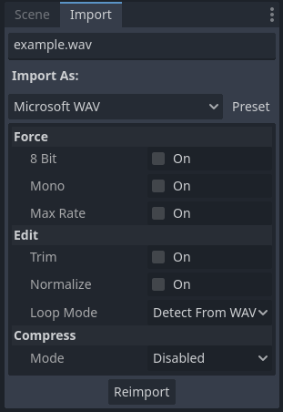
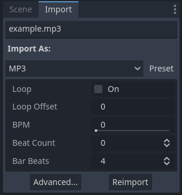
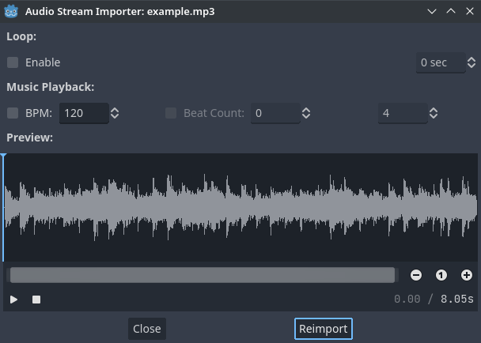
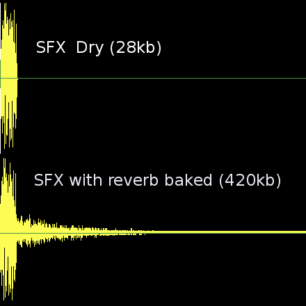

.. _doc_importing_audio_samples:

Importing audio samples
=======================

Supported audio formats
-----------------------

Godot provides 3 options to import your audio data: WAV, Ogg Vorbis and MP3.

Each format has different advantages:

- WAV files use raw data or light compression (IMA-ADPCM). They are lightweight
  on the CPU to play back (hundreds of simultaneous voices in this format are
  fine). The downside is that they take up a lot of disk space.
- Ogg Vorbis files use a stronger compression that results in much
  smaller file size, but require significantly more processing power to
  play back.
- MP3 files use better compression than WAV with IMA-ADPCM, but worse than
  Ogg Vorbis. This means that a MP3 file with roughly equal quality to
  Ogg Vorbis will be significantly larger. On the bright side, MP3 requires
  less CPU usage to play back compared to Ogg Vorbis.

.. note::

    If you've compiled the Godot editor from source with specific modules disabled,
    some formats may not be available.

Here is a comparative chart representing the file size of 1 second of audio with
each format:

+-----------------------------+-------------------+
| Format                      | 1 second of audio |
+=============================+===================+
| WAV 24-bit, 96 kHz, stereo  | 576 KB            |
+-----------------------------+-------------------+
| WAV 16-bit, 44 kHz, mono    | 88 KB             |
+-----------------------------+-------------------+
| WAV 16-bit, IMA-ADPCM, mono | 22 KB             |
+-----------------------------+-------------------+
| MP3 192 Kb/s, stereo        | 24 KB             |
+-----------------------------+-------------------+
| Ogg Vorbis 128 Kb/s, stereo | 16 KB             |
+-----------------------------+-------------------+
| Ogg Vorbis 96 Kb/s, stereo  | 12 KB             |
+-----------------------------+-------------------+

Note that the MP3 and Ogg Vorbis figures can vary depending on the encoding
type. The above figures use :abbr:`CBR (Constant Bit Rate)` encoding for
simplicity, but most Ogg Vorbis and MP3 files you can find online are encoded
with :abbr:`VBR (Variable Bit Rate)` encoding which is more efficient.
VBR encoding makes the effective audio file size depend on how "complex" the
source audio is.

.. tip::

    Consider using WAV for short and repetitive sound effects, and Ogg Vorbis for
    music, speech, and long sound effects. MP3 is useful for mobile and web projects
    where CPU resources are limited, especially when playing multiple compressed
    sounds at the same time (such as long ambient sounds).

Importing audio samples
-----------------------

Several options are available in the Import dock after selecting a WAV file in
the FileSystem dock:

   Import options in the Import dock after selecting a WAV file in the FileSystem dock

The set of options available after selecting a Ogg Vorbis or MP3 file is different:

   Import options in the Import dock after selecting a MP3 file in the
   FileSystem dock. Options are identical for Ogg Vorbis files.

After importing a sound, you can play it back using the AudioStreamPlayer,
AudioStreamPlayer2D or AudioStreamPlayer3D nodes. See :ref:`doc_audio_streams`
for more information.

Import options (WAV)
--------------------

Force > 8 Bit
-------------

If enabled, forces the imported audio to use 8-bit quantization if the source
file is 16-bit or higher.

Enabling this is generally not recommended, as 8-bit quantization decreases
audio quality significantly. If you need smaller file sizes, consider using Ogg
Vorbis or MP3 audio instead.

Force > Mono
------------

If enabled, forces the imported audio to be mono if the source file is stereo.
This decreases the file size by 50% by merging the two channels into one.

Force > Max Rate
----------------

If set to a value greater than ``0``, forces the audio's sample rate to be
reduced to a value lower than or equal to the value specified here.

This can decrease file size noticeably on certain sounds, without impacting
quality depending on the actual sound's contents. See
:ref:`doc_importing_audio_samples_best_practices` for more information.

Edit > Trim
-----------

The source audio file may contain long silences at the beginning and/or the end.
These silences are inserted by :abbr:`DAWs (Digital Audio Workstations)` when
saving to a waveform, which increases their size unnecessarily and add latency
to the moment they are played back.

Enabling **Trim** will automatically trim the beginning and end of the audio if
it's lower than -50 dB *after* normalization (see **Edit > Normalize** below). A
fade-in/fade-out period of 500 samples is also used during trimming to avoid
audible pops.

Edit > Normalize
----------------

If enabled, audio volume will be *normalized* so that its peak volume is equal
to 0 dB. When enabled, normalization will make audio sound louder depending on
its original peak volume.

Edit > Loop Mode
----------------

Unlike Ogg Vorbis and MP3, WAV files can contain metadata to indicate whether
they're looping (in addition to loop points). By default, Godot will follow this
metadata, but you can choose to apply a specific loop mode:

- **Disabled:** Don't loop audio, even if metadata indicates the file should be
  played back looping.
- **Forward:** Standard audio looping.
- **Ping-Pong:** Play audio forward until it's done playing, then play it
  backward and repeat. This is similar to mirrored texture repeat, but for
  audio.
- **Backward:** Play audio in reverse and loop back to the end when done playing.

When choosing one of the **Forward**, **Ping-Pong** or **Backward** loop modes,
loop points can also be defined to make only a specific part of the sound loop.
**Loop Begin** is set in samples after the beginning of the audio file. **Loop
End** is also set in samples after the beginning of the audio file, but will use
the end of the audio file if set to ``-1``.

.. warning::

    In AudioStreamPlayer, the ``finished`` signal won't be emitted for looping
    audio when it reaches the end of the audio file, as the audio will keep
    playing indefinitely.

Compress > Mode
---------------

Two compression modes can be chosen for WAV files: **Disabled** (default) or
**RAM (Ima-ADPCM)**. **RAM (Ima-ADPCM)** reduces file size and memory usage a
little, at the cost of decreasing quality in an audible manner.

Ogg Vorbis and MP3 don't decrease quality as much and can provide greater file
size reductions, at the cost of higher CPU usage during playback. This higher
CPU usage is usually not a problem (especially with MP3), unless playing dozens
of compressed sounds at the same time on mobile/web platforms.

Import options (Ogg Vorbis and MP3)
-----------------------------------

Loop
^^^^

If enabled, the audio will begin playing at the beginning after playback ends by
reaching the end of the audio.

.. warning::

    In AudioStreamPlayer, the ``finished`` signal won't be emitted for looping
    audio when it reaches the end of the audio file, as the audio will keep
    playing indefinitely.

Loop Offset
^^^^^^^^^^^

The loop offset determines where audio will start to loop after playback reaches
the end of the audio. This can be used to only loop a part of the audio file,
which is useful for some ambient sounds or music. The value is determined in
seconds relative to the beginning of the audio, so ``0`` will loop the entire
audio file.

Only has an effect if **Loop** is enabled.

A more convenient editor for **Loop Offset** is provided in the
:ref:`Advanced import settings <doc_importing_audio_samples_advanced_import_settings>`
dialog, as it lets you preview your changes without having to reimport the audio.

BPM
^^^

The Beats Per Minute of the audio track. This should match the BPM measure that
was used to compose the track. This is only relevant for music that wishes to
make use of interactive music functionality (not implemented yet), not sound
effects.

A more convenient editor for **BPM** is provided in the
:ref:`Advanced import settings <doc_importing_audio_samples_advanced_import_settings>`
dialog, as it lets you preview your changes without having to reimport the audio.

Beat Count
^^^^^^^^^^

The beat count of the audio track. This is only relevant for music that wishes
to make use of interactive music functionality (not implemented yet), not sound
effects.

A more convenient editor for **Beat Count** is provided in the
:ref:`Advanced import settings <doc_importing_audio_samples_advanced_import_settings>`
dialog, as it lets you preview your changes without having to reimport the audio.

Bar Beats
^^^^^^^^^

The number of bars within a single beat in the audio track. This is only
relevant for music that wishes to make use of interactive music functionality
(not implemented yet), not sound effects.

A more convenient editor for **Bar Beats** is provided in the
:ref:`Advanced import settings <doc_importing_audio_samples_advanced_import_settings>`
dialog, as it lets you preview your changes without having to reimport the audio.

.. _doc_importing_audio_samples_advanced_import_settings:

Advanced import settings (Ogg Vorbis and MP3)
---------------------------------------------

If you double-click an Ogg Vorbis or MP3 file in the FileSystem dock (or choose
**Advanced…** in the Import dock), you will see a dialog appear:

   Advanced dialog when double-clicking a Ogg Vorbis or MP3 file in the FileSystem dock

This dialog allows you to edit the audio's loop point with a real-time preview,
in addition to the :abbr:`BPM (Beats Per Minute)`, beat count and bar beats.
These 3 settings are currently unused, but they will be used in the future for
interactive music support (which allows smoothly transitioning between different
music tracks).

.. note::

    Unlike WAV files, Ogg Vorbis and MP3 only support a "loop begin" loop point,
    not a "loop end" point. Looping can also be only be standard forward
    looping, not ping-pong or backward.

.. _doc_importing_audio_samples_best_practices:

Best practices
--------------

Use appropriate quality settings
^^^^^^^^^^^^^^^^^^^^^^^^^^^^^^^^

While keeping pristine-quality audio sources is important if you're performing
editing, using the same quality in the exported project is not necessary. For
WAV files, Godot offers several import options to reduce the final file size
without modifying the source file on disk.

To reduce memory usage and file size, choose an appropriate quantization,
sample rate and number of channels for your audio:

- There's no *audible* benefit to using 24-bit audio, especially in a game
  where several sounds are often playing at the same time (which makes it
  harder to appreciate individual sounds).
- Unless you are slowing down the audio at run-time, there's no *audible*
  benefit to using a sample rate greater than 48 kHz. If you wish to keep a
  source with a higher sample rate for editing, use the **Force > Max Rate**
  import option to limit the sample rate of the imported sound (only available
  for WAV files).
- Many sound effects can generally be converted to mono as opposed to stereo.
  If you wish to keep a source with stereo for editing, use the **Force > Mono**
  import option to convert the imported sound to mono (only available for WAV files).
- Voices can generally be converted to mono, but can also have their sample rate
  reduced to 22 kHz without a noticeable loss in quality (unless the voice is
  very high-pitched). This is because most human voices never go past 11 kHz.

Use real-time audio effects to reduce file size
^^^^^^^^^^^^^^^^^^^^^^^^^^^^^^^^^^^^^^^^^^^^^^^

Godot has an :ref:`extensive bus system <doc_audio_buses>` with built-in effects.
This saves SFX artists the need to add reverb to the sound effects,
reducing their size greatly and ensuring correct trimming.

As you can see above, sound effects become much larger in file size with reverb
added.

.. seealso::

    Audio samples can be loaded and saved at runtime using
    :ref:`runtime file loading and saving <doc_runtime_file_loading_and_saving_audio_video_files>`,
    including from an exported project.
