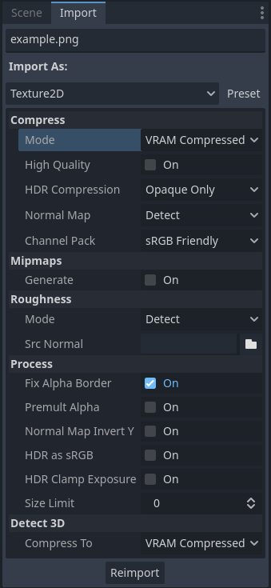
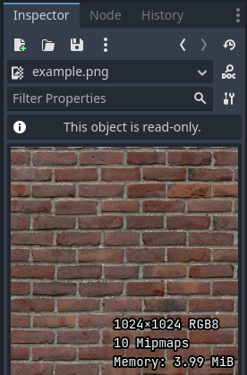
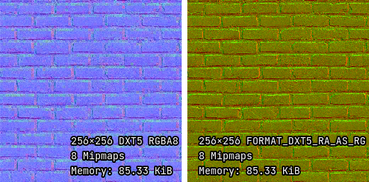
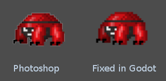

.. _doc_importing_images:

Importing images
================

Supported image formats
-----------------------

Godot can import the following image formats:

- BMP (``.bmp``)
  - No support for 16-bit per pixel images. Only 1-bit, 4-bit, 8-bit, 24-bit, and 32-bit per pixel images are supported.
- DirectDraw Surface (``.dds``)
  - If mipmaps are present in the texture, they will be loaded directly.
  This can be used to achieve effects using custom mipmaps.
- Khronos Texture (``.ktx``)
  - Decoding is done using `libktx <https://github.com/KhronosGroup/KTX-Software>`__.
  Only supports 2D images. Cubemaps, texture arrays and de-padding are not supported.
- OpenEXR (``.exr``)
  - Supports HDR (highly recommended for panorama skies).
- Radiance HDR (``.hdr``)
  - Supports HDR (highly recommended for panorama skies).
- JPEG (``.jpg``, ``.jpeg``)
  - Doesn't support transparency per the format's limitations.
- PNG (``.png``)
  - Precision is limited to 8 bits per channel upon importing (no HDR images).
- Truevision Targa (``.tga``)
- SVG (``.svg``)
  - SVGs are rasterized using `ThorVG <https://www.thorvg.org/>`__
  when importing them. `Support is limited <https://www.thorvg.org/about#:~:text=among%20the%20svg%20tiny%20specs%2C%20yet%20unsupported%20features%20in%20the%20thorvg%20are%20the%20following>`__;
  complex vectors may not render correctly. :ref:`Text must be converted to paths <doc_importing_images_svg_text>`;
  otherwise, it won't appear in the rasterized image.
  You can check whether ThorVG can render a certain vector correctly using its
  `web-based viewer <https://www.thorvg.org/viewer>`__.
  For complex vectors, rendering them to PNGs using `Inkscape <https://inkscape.org/>`__
  is often a better solution. This can be automated thanks to its
  `command-line interface <https://wiki.inkscape.org/wiki/index.php/Using_the_Command_Line#Export_files>`__.
- WebP (``.webp``)
  - WebP files support transparency and can be compressed lossily or losslessly.
  The precision is limited to 8 bits per channel.

.. note::

    If you've compiled the Godot editor from source with specific modules disabled,
    some formats may not be available.

Importing textures
------------------

The default action in Godot is to import images as textures. Textures are stored
in video memory. Their pixel data can't be accessed directly from the CPU
without converting them back to an :ref:`class_Image` in a script. This is what
makes drawing them efficient.

There are over a dozen import options that can be adjusted after selecting an
image in the FileSystem dock:

   Import options in the Import dock after selecting an image in the FileSystem dock.
   Some of these options are only visible with certain compression modes.

.. _doc_importing_images_changing_import_type:

Changing import type
^^^^^^^^^^^^^^^^^^^^

It is possible to choose other types of imported resources in the Import dock:

- **BitMap:** 1-bit monochrome texture (intended to be used as a click mask in
  :ref:`class_TextureButton` and :ref:`class_TouchScreenButton`). This resource
  type cannot be displayed directly onto 2D or 3D nodes, but the pixel values
  can be queried from a script using :ref:`get_bit
  <class_BitMap_method_get_bit>`.
- **Cubemap:** Import the texture as a 6-sided cubemap, with interpolation
  between the cubemap's sides (seamless cubemaps), which can be sampled in
  custom shaders.
- **CubemapArray:** Import the texture as a collection of 6-sided cubemaps,
  which can be sampled in custom shaders. This resource type can only be
  displayed when using the Forward+ or Forward Mobile rendering methods, not
  Compatibility.
- **Font Data (Monospace Image Font):** Import the image as a bitmap font where
  all characters have the same width. See :ref:`doc_gui_using_fonts`.
- **Image:** Import the image as-is. This resource type cannot be displayed
  directly onto 2D or 3D nodes, but the pixel values can be queried from a
  script using :ref:`get_pixel<class_Image_method_get_pixel>`.
- **Texture2D:** Import the image as a 2-dimensional texture, suited for display
  on 2D and 3D surfaces. This is the default import mode.
- **Texture2DArray:** Import the image as a collection of 2-dimensional textures.
  Texture2DArray is similar to a 3-dimensional texture, but without
  interpolation between layers. Built-in 2D and 3D shaders cannot display
  texture arrays, so you must create a custom shader in :ref:`2D <doc_canvas_item_shader>`
  or :ref:`3D <doc_spatial_shader>` to display a texture from a texture array.
- **Texture3D:** Import the image as a 3-dimensional texture. This is *not* a 2D
  texture applied onto a 3D surface. Texture3D is similar to a texture array, but
  with interpolation between layers. Texture3D is typically used for
  :ref:`class_FogMaterial` density maps in :ref:`volumetric fog
  <doc_volumetric_fog>`, :ref:`class_Environment` 3D LUT color correction and
  custom shaders.
- **TextureAtlas:** Import the image as an *atlas* of different textures. Can be
  used to reduce memory usage for animated 2D sprites. Only supported in 2D due
  to missing support in built-in 3D shaders.

Detect 3D
^^^^^^^^^

The default import options (no mipmaps and **Lossless** compression) are suited
for 2D, but are not ideal for most 3D projects. **Detect 3D** makes Godot aware
of when a texture is used in a 3D scene (such as a texture in a
:ref:`class_BaseMaterial3D`). If this happens, several import options are
changed so the texture flags are friendlier to 3D. Mipmaps are enabled and the
compression mode is changed to **VRAM Compressed** unless
:ref:`doc_importing_images_detect_3d_compress_to` is changed. The texture is
also reimported automatically.

A message is printed to the Output panel when a texture is detected to be used in 3D.

If you run into quality issues when a texture is detected to be used in 3D (e.g.
for pixel art textures), change the
:ref:`doc_importing_images_detect_3d_compress_to` option before using the
texture in 3D, or change :ref:`doc_importing_images_compress_mode` to
**Lossless** after using the texture in 3D. This is preferable to disabling
**Detect 3D**, as mipmap generation remains enabled to prevent textures from
looking grainy at a distance.

Import options
--------------

.. seealso::

    In Godot 4.0, changing the texture filter and repeat mode is no longer done
    in the import options.

    Instead, texture filter and repeat modes are changed in the CanvasItem
    properties in 2D (with a project setting acting as a default), and in a
    :ref:`per-material configuration in 3D <doc_standard_material_3d_sampling>`.
    In custom shaders, filter and repeat mode is changed on the ``sampler2D``
    uniform using hints described in the :ref:`doc_shading_language`
    documentation.

.. _doc_importing_images_compress_mode:

Compress > Mode
^^^^^^^^^^^^^^^

Images are one of the largest assets in a game. To handle them efficiently, they
need to be compressed. Godot offers several compression methods, depending on
the use case.

- **Lossless:** This is the default and most common compression mode for 2D assets.
  It shows assets without any kind of artifacting, and disk compression is
  decent. It will use considerably more amount of video memory than
  VRAM Compression, though. This is also the recommended setting for pixel art.
- **Lossy:** This is a good choice for large 2D assets. It has some artifacts,
  but less than VRAM compression and the file size is several times lower
  compared to Lossless or VRAM Uncompressed. Video memory usage isn't decreased
  by this mode; it's the same as with Lossless or VRAM Uncompressed.
- **VRAM Compressed:** This is the default and most common compression mode for
  3D assets. Size on disk is reduced and video memory usage is also decreased
  considerably (usually by a factor between 4 and 6). This mode should be
  avoided for 2D as it exhibits noticeable artifacts, especially for
  lower-resolution textures.
- **VRAM Uncompressed:** Only useful for formats that can't be compressed, such
  as raw floating-point images.
- **Basis Universal:** This alternative VRAM compression mode encodes the
  texture to a format that can be transcoded to most GPU-compressed formats at
  load-time. This provides very small files that make use of VRAM compression,
  at the cost of lower quality compared to VRAM Compressed and slow compression
  times. VRAM usage is usually the same as VRAM Compressed. Basis Universal does
  not support floating-point image formats (the engine will internally fall back
  to VRAM Compressed instead).

.. note::

    Even in 3D, "pixel art" textures should have VRAM compression disabled as it
    will negatively affect their appearance, without improving performance
    significantly due to their low resolution.

In this table, each of the 5 options are described together with their
advantages and disadvantages (|good| = best, |bad| = worst):

+------------------+-------------------------------+----------------------+------------------------------------------------------+------------------------+--------------------------------------+
| Compress mode    | Lossless                      | Lossy                | VRAM Compressed                                      | VRAM Uncompressed      | Basis Universal                      |
+==================+===============================+======================+======================================================+========================+======================================+
| **Description**  | Stored as Lossless WebP / PNG | Stored as Lossy WebP | Stored as S3TC, BPTC or ETC2 depending on platform   | Stored as raw pixels   | Transcoded to VRAM Compressed format |
+------------------+-------------------------------+----------------------+------------------------------------------------------+------------------------+--------------------------------------+
| **Size on disk** | |regular| Small               | |good| Very small    | |regular| Small                                      | |bad| Large            | |good| Very small                    |
+------------------+-------------------------------+----------------------+------------------------------------------------------+------------------------+--------------------------------------+
| **Memory usage** | |bad| Large                   | |bad| Large          | |good| Small                                         | |bad| Large            | |good| Small                         |
+------------------+-------------------------------+----------------------+------------------------------------------------------+------------------------+--------------------------------------+
| **Performance**  | |regular| Normal              | |regular| Normal     | |good| Fast                                          | |regular| Normal       | |good| Fast                          |
+------------------+-------------------------------+----------------------+------------------------------------------------------+------------------------+--------------------------------------+
| **Quality loss** | |good| None                   | |regular| Slight     | |bad| Moderate                                       | |good| None            | |bad| Moderate                       |
+------------------+-------------------------------+----------------------+------------------------------------------------------+------------------------+--------------------------------------+
| **Load time**    | |bad| Slow                    | |bad| Slow           | |good| Fast                                          | |regular| Normal       | |regular| Normal                     |
+------------------+-------------------------------+----------------------+------------------------------------------------------+------------------------+--------------------------------------+

Estimated memory usage for a single RGBA8 texture with mipmaps enabled:

+---------------+---------------------+---------------------+---------------------+---------------------+---------------------+
| Texture size  | Lossless            | Lossy               | VRAM Compressed     | VRAM Uncompressed   | Basis Universal     |
+===============+=====================+=====================+=====================+=====================+=====================+
| **128×128**   | |good| 85 KiB       | |good| 85 KiB       | |good| 21 KiB       | |good| 85 KiB       | |good| 21 KiB       |
+---------------+---------------------+---------------------+---------------------+---------------------+---------------------+
| **256×256**   | |good| 341 KiB      | |good| 341 KiB      | |good| 85 KiB       | |good| 341 KiB      | |good| 85 KiB       |
+---------------+---------------------+---------------------+---------------------+---------------------+---------------------+
| **512×512**   | |good| 1.33 MiB     | |good| 1.33 MiB     | |good| 341 KiB      | |good| 1.33 MiB     | |good| 341 KiB      |
+---------------+---------------------+---------------------+---------------------+---------------------+---------------------+
| **1024×1024** | |regular| 5.33 MiB  | |regular| 5.33 MiB  | |good| 1.33 MiB     | |regular| 5.33 MiB  | |good| 1.33 MiB     |
+---------------+---------------------+---------------------+---------------------+---------------------+---------------------+
| **2048×2048** | |bad| 21.33 MiB     | |bad| 21.33 MiB     | |regular| 5.33 MiB  | |bad| 21.33 MiB     | |regular| 5.33 MiB  |
+---------------+---------------------+---------------------+---------------------+---------------------+---------------------+
| **4096×4096** | |bad| 85.33 MiB     | |bad| 85.33 MiB     | |bad| 21.33 MiB     | |bad| 85.33 MiB     | |bad| 21.33 MiB     |
+---------------+---------------------+---------------------+---------------------+---------------------+---------------------+

.. note::

    In the above table, memory usage will be reduced by 25% for images that do
    not have an alpha channel (RGB8). Memory usage will be further decreased by
    25% for images that have mipmaps disabled.

Notice how at larger resolutions, the impact of VRAM compression is much
greater. With a 4:1 compression ratio (6:1 for opaque textures with S3TC), VRAM
compression effectively allows a texture to be twice as large on each axis,
while using the same amount of memory on the GPU.

VRAM compression also reduces the memory bandwidth required to sample the
texture, which can speed up rendering in memory bandwidth-constrained scenarios
(which are frequent on integrated graphics and mobile). These factors combined
make VRAM compression a must-have for 3D games with high-resolution textures.

You can preview how much memory a texture takes by double-clicking it in the
FileSystem dock, then looking at the Inspector:

   Previewing a texture in the Inspector. Credit: `Red Brick 03 - Poly Haven <https://polyhaven.com/a/red_brick_03>`__

Compress > High Quality
^^^^^^^^^^^^^^^^^^^^^^^

.. note::

    High-quality VRAM texture compression is only supported in the Forward+ and
    Forward Mobile rendering methods.

    When using the Compatibility rendering method, this option is always
    considered disabled.

If enabled, uses BPTC compression on desktop platforms and :abbr:`ASTC (Adaptive
Scalable Texture Compression)` compression on mobile platforms. When using BPTC,
BC7 is used for SDR textures and BC6H is used for HDR textures.

If disabled (default), uses the faster but lower-quality S3TC compression on
desktop platforms and ETC2 on mobile/web platforms. When using S3TC, DXT1 (BC1)
is used for opaque textures and DXT5 (BC3) is used for transparent or normal map
(:abbr:`RGTC (Red-Green Texture Compression)`) textures.

BPTC and ASTC support VRAM compression for HDR textures, but S3TC and ETC2 do
not (see **HDR Compression** below).

Compress > HDR Compression
^^^^^^^^^^^^^^^^^^^^^^^^^^

.. note::

    This option only has an effect on textures that are imported as HDR formats in Godot
    (``.hdr`` and ``.exr`` files).

If set to **Disabled**, never uses VRAM compression for HDR textures, regardless
of whether they're opaque or transparent. Instead, the texture is converted to
RGBE9995 (9-bits per channel + 5-bit exponent = 32 bits per pixel) to reduce
memory usage compared to a half-float or single-precision float image format.

If set to **Opaque Only** (default), only uses VRAM compression for opaque HDR
textures. This is due to a limitation of HDR formats, as there is no
VRAM-compressed HDR format that supports transparency at the same time.

If set to **Always**, will force VRAM compression even for HDR textures with an
alpha channel. To perform this, the alpha channel is discarded on import.

Compress > Normal Map
^^^^^^^^^^^^^^^^^^^^^

When using a texture as normal map, only the red and green channels are
required. Given regular texture compression algorithms produce artifacts that
don't look that nice in normal maps, the :abbr:`RGTC (Red-Green Texture Compression)`
compression format is the best fit for this data. Forcing this option to **Enable**
will make Godot import the image as :abbr:`RGTC (Red-Green Texture Compression)` compressed.
By default, it's set to **Detect**. This means that if the texture is ever detected to
be used as a normal map, it will be changed to **Enable** and reimported automatically.

Note that :abbr:`RGTC (Red-Green Texture Compression)` compression affects the
resulting normal map image. You will have to adjust custom shaders that use the
normal map's blue channel to take this into account. Built-in material shaders
already ignore the blue channel in a normal map (regardless of the actual normal
map's contents).

In the example below, the normal map with :abbr:`RGTC (Red-Green Texture Compression)`
compression is able to preserve its detail much better, while
using the same amount of memory as a standard RGBA VRAM-compressed texture:

   Normal map with standard VRAM compression (left) and with RGTC VRAM compression (right)

.. note::

  Godot requires the normal map to use the X+, Y+ and Z+ coordinates, which is
  known as an OpenGL-style normal map. If you've imported a material made to be
  used with another engine, it may be DirectX-style. In this case, the normal map
  needs to be converted by enabling the **Normal Map Invert Y** import option.

  More information about normal maps (including a coordinate order table for
  popular engines) can be found
  `here <http://wiki.polycount.com/wiki/Normal_Map_Technical_Details>`__.

Compress > Channel Pack
^^^^^^^^^^^^^^^^^^^^^^^

If set to **sRGB Friendly** (default), prevents the RG color format from being
used as it does not support sRGB color.

If set to **Optimized**, allows the RG color format to be used if the texture
does not use the blue channel.

A third option **Normal Map (RG Channels)** is *only* available in layered
textures (:ref:`class_Cubemap`, :ref:`class_CubemapArray`, :ref:`class_Texture2DArray`
and :ref:`class_Texture3D`). This forces all layers from the texture to be imported
with the RG color format to reduce memory usage, with only the red and green
channels preserved. This only has an effect on textures with the **VRAM Compressed**
or **Basis Universal** compression modes.

.. _doc_importing_images_mipmaps:

Mipmaps > Generate
^^^^^^^^^^^^^^^^^^

If enabled, smaller versions of the texture are generated on import. For
example, a 64×64 texture will generate 6 mipmaps (32×32, 16×16, 8×8, 4×4, 2×2,
1×1). This has several benefits:

- Textures will not become grainy in the distance (in 3D), or if scaled down due
  to camera zoom or CanvasItem scale (in 2D).
- Performance will improve if the texture is displayed in the distance, since
  sampling smaller versions of the original texture is faster and requires less
  memory bandwidth.

The downside of mipmaps is that they increase memory usage by roughly 33%.

It's recommended to enable mipmaps in 3D. However, in 2D, this should only be
enabled if your project visibly benefits from having mipmaps enabled. If the
camera never zooms out significantly, there won't be a benefit to enabling
mipmaps but memory usage will increase.

Mipmaps > Limit
^^^^^^^^^^^^^^^

.. warning::

    **Mipmaps > Limit** is currently not implemented and has no effect when changed.

If set to a value greater than ``-1``, limits the maximum number of mipmaps that
can be generated. This can be decreased if you don't want textures to become too
low-resolution at extreme distances, at the cost of some graininess.

Roughness > Mode
^^^^^^^^^^^^^^^^

The color channel to consider as a roughness map in this texture. Only effective if
**Roughness > Src Normal** is not empty.

Roughness > Src Normal
^^^^^^^^^^^^^^^^^^^^^^

The path to the texture to consider as a normal map for roughness filtering on
import. Specifying this can help decrease specular aliasing slightly in 3D.

Roughness filtering on import is only used in 3D rendering, not 2D.

Process > Fix Alpha Border
^^^^^^^^^^^^^^^^^^^^^^^^^^

This puts pixels of the same surrounding color in transition from transparent to
opaque areas. For textures displayed with bilinear filtering, this helps
mitigate the outline effect when exporting images from an image editor.

It's recommended to leave this enabled (as it is by default), unless this causes
issues for a particular image.

Process > Premult Alpha
^^^^^^^^^^^^^^^^^^^^^^^

An alternative to fixing darkened borders with **Fix Alpha Border** is to use
premultiplied alpha. By enabling this option, the texture will be converted to
this format. A premultiplied alpha texture requires specific materials to be
displayed correctly:

- In 2D, a :ref:`class_CanvasItemMaterial` will need to be created and
  configured to use the **Premul Alpha** blend mode on CanvasItems that use this
  texture.
- In 3D, there is no support for premultiplied alpha blend mode yet, so this
  option is only suited for 2D.

Process > Normal Map Invert Y
^^^^^^^^^^^^^^^^^^^^^^^^^^^^^

Godot requires the normal map to use the X+, Y+ and Z+ coordinates, which is
known as an OpenGL-style normal map. If you've imported a material made to be
used with another engine, it may be DirectX-style. In this case, the normal map
needs to be converted by enabling the **Normal Map Invert Y** import option.

More information about normal maps (including a coordinate order table for
popular engines) can be found
`here <http://wiki.polycount.com/wiki/Normal_Map_Technical_Details>`__.

Process > HDR as sRGB
^^^^^^^^^^^^^^^^^^^^^

Some HDR images you can find online may be broken and contain sRGB color data
(instead of linear color data). It is advised not to use those files. If you
absolutely have to, enabling this option on will make them look correct.

.. warning::

    Enabling **HDR as sRGB** on well-formatted HDR images will cause the
    resulting image to look too dark, so leave this disabled if unsure.

Process > HDR Clamp Exposure
^^^^^^^^^^^^^^^^^^^^^^^^^^^^

Some HDR panorama images you can find online may contain extremely bright
pixels, due to being taken from real life sources without any clipping.

While these HDR panorama images are accurate to real life, this can cause the
radiance map generated by Godot to contain sparkles when used as a background
sky. This can be seen in material reflections (even on rough materials in
extreme cases). Enabling **HDR Clamp Exposure** can resolve this using a smart
clamping formula that does not introduce *visible* clipping – glow will keep
working when looking at the background sky.

Process > Size Limit
^^^^^^^^^^^^^^^^^^^^

If set to a value greater than ``0``, the size of the texture is limited on
import to a value smaller than or equal to the value specified here. For
non-square textures, the size limit affects the longer dimension, with the
shorter dimension scaled to preserve aspect ratio. Resizing is performed using
cubic interpolation.

This can be used to reduce memory usage without affecting the source images, or
avoid issues with textures not displaying on mobile/web platforms (as these
usually can't display textures larger than 4096×4096).

.. _doc_importing_images_detect_3d_compress_to:

Detect 3D > Compress To
^^^^^^^^^^^^^^^^^^^^^^^

This changes the :ref:`doc_importing_images_compress_mode` option that is used
when a texture is detected as being used in 3D.

Changing this import option only has an effect if a texture is detected as being
used in 3D. Changing this to **Disabled** then reimporting will not change the
existing compress mode on a texture (if it's detected to be used in 3D), but
choosing **VRAM Compressed** or **Basis Universal** will.

SVG > Scale
^^^^^^^^^^^

*This is only available for SVG images.*

The scale the SVG should be rendered at, with ``1.0`` being the original design
size. Higher values result in a larger image. Note that unlike font
oversampling, this affects the physical size the SVG is rendered at in 2D. See
also **Editor > Scale With Editor Scale** below.

.. _doc_importing_images_editor_import_options:

Editor > Scale With Editor Scale
^^^^^^^^^^^^^^^^^^^^^^^^^^^^^^^^

*This is only available for SVG images.*

If true, scales the imported image to match the editor's display scale factor.
This should be enabled for editor plugin icons and custom class icons, but
should be left disabled otherwise.

Editor > Convert Colors With Editor Theme
^^^^^^^^^^^^^^^^^^^^^^^^^^^^^^^^^^^^^^^^^

*This is only available for SVG images.*

If checked, converts the imported image's colors to match the editor's icon and
font color palette. This assumes the image uses the exact same colors as
:ref:`Godot's own color palette for editor icons <doc_editor_icons>`, with the
source file designed for a dark editor theme. This should be enabled for editor
plugin icons and custom class icons, but should be left disabled otherwise.

.. _doc_importing_images_svg_text:

Importing SVG images with text
------------------------------

As the SVG library used in Godot doesn't support rasterizing text found in SVG
images, text must be converted to a path first. Otherwise, text won't appear in
the rasterized image.

There are two ways to achieve this in a non-destructive manner, so you can keep
editing the original text afterwards:

- Select your text object in Inkscape, then duplicate it in place by pressing
  :kbd:`Ctrl + D` and use **Path > Object to Path**. Hide the original text
  object afterwards using the **Layers and Objects** dock.
- Use the Inkscape command line to export a SVG from another SVG file with text
  converted to paths:

::

    inkscape --export-text-to-path --export-filename svg_with_text_converted_to_path.svg svg_with_text.svg

Best practices
--------------

Supporting high-resolution texture sizes in 2D without artifacts
^^^^^^^^^^^^^^^^^^^^^^^^^^^^^^^^^^^^^^^^^^^^^^^^^^^^^^^^^^^^^^^^

To support :ref:`multiple resolutions <doc_multiple_resolutions>` with crisp
visuals at high resolutions, you will need to use high-resolution source images
(suited for the highest resolution you wish to support without blurriness, which
is typically 4K in modern desktop games).

There are 2 ways to proceed:

- Use a high base resolution in the project settings (such as 4K), then use the
  textures at original scale. This is an easier approach.
- Use a low base resolution in the project settings (such as 1080p), then
  downscale textures when using them. This is often more difficult and can make
  various calculations in script tedious, so the approach described above is
  recommended instead.

After doing this, you may notice that textures become grainy at lower viewport
resolutions. To resolve this, enable **Mipmaps** on textures used in 2D in the
Import dock. This will increase memory usage.

Enabling mipmaps can also make textures appear blurrier, but you can choose
to make textures sharper (at the cost of some graininess) by setting
**Rendering > Textures > Default Filters > Texture Mipmap Bias** to a
negative value.

Use appropriate texture sizes in 3D
^^^^^^^^^^^^^^^^^^^^^^^^^^^^^^^^^^^

While there's no "one size fits all" recommendation, here are some general
recommendations for choosing texture sizes in 3D:

- The size of a texture should be adjusted to have a consistent texel density
  compared to surrounding objects. While this cannot be ensured perfectly when
  sticking to power-of-two texture sizes, it's usually possible to keep texture
  detail fairly consistent throughout a 3D scene.
- The smaller the object appears on screen, the smaller its texture should be.
  For example, a tree that only appears in the background doesn't need a texture
  resolution as high as other objects the player may be able to walk close to.
- Using power-of-two texture sizes is recommended, but is not required. Textures
  don't have to be square – sizes such as 1024×512 are acceptable.
- There are diminishing returns to using large texture sizes, despite the
  increased memory usage and loading times. Most modern 3D games not using a
  pixel art style stick to 2048×2048 textures on average, with 1024×1024 and
  512×512 for textures spanning smaller surfaces.
- When working with physically-based materials in 3D, you can reduce memory
  usage and file size without affecting quality too much by using a lower
  resolution for certain texture maps. This works especially well for textures
  that only feature low-frequency detail (such as a normal map for a snow
  texture).

If you have control over how the 3D models are created, these tips are also
worth exploring:

- When working with 3D models that are mostly symmetrical, you may be able to
  use mirrored UVs to double the effective texel density. This may look
  unnatural when used on human faces though.
- When working with 3D models using a low-poly style and plain colors, you can
  rely on vertex colors instead of textures to represent colors on the model's
  surfaces.

.. seealso::

    Images can be loaded and saved at runtime using
    :ref:`runtime file loading and saving <doc_runtime_file_loading_and_saving_images>`,
    including from an exported project.
