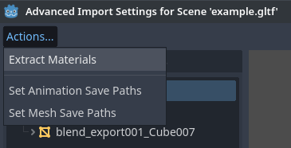
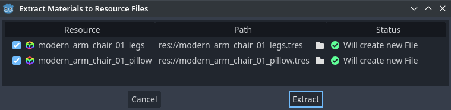
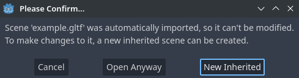
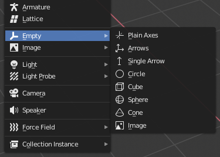

.. _doc_importing_3d_scenes:

Importing 3D scenes
===================

Godot scene importer
--------------------

When dealing with 3D assets, Godot has a flexible and configurable importer.

Godot works with *scenes*. This means that the entire scene being worked on in
your favorite 3D modeling software will be transferred as close as possible.

Godot supports the following 3D *scene file formats*:

- glTF 2.0 **(recommended)**. Godot has full support for both text (``.gltf``)
  and binary (``.glb``) formats.
- ``.blend`` (Blender). This works by calling Blender to export to glTF in a
  transparent manner (requires Blender to be installed).
- DAE (COLLADA), an older format that is fully supported.
- OBJ (Wavefront) format + their MTL material files. This is also fully
  supported, but pretty limited given the format's limitations (no support for
  pivots, skeletons, animations, UV2, PBR materials, ...).
- FBX, supported via `FBX2glTF <https://github.com/godotengine/FBX2glTF>`__ integration.
  This requires installing an external program that links against the proprietary FBX SDK,
  so we recommend using other formats listed above (if suitable for your workflow).

Copy the scene file together with the textures and mesh data (if separate) to
the project repository, then Godot will do a full import when focusing the
editor window.

Exporting glTF 2.0 files from Blender (recommended)
---------------------------------------------------

There are 3 ways to export glTF files from Blender:

- As a glTF binary file (``.glb``).
- As a glTF text-based file with embedded binary data (``.gltf`` file)
- As a glTF text-based file with separate binary data and textures (``.gltf``
  file + ``.bin`` file + textures).

glTF binary files (``.glb``) are the smallest of the three options. They include
the mesh and textures set up in Blender. When brought into Godot the textures
are part of the object's material file.

glTF embedded files (``.gltf``) function the same way as binary files. They
don't provide extra functionality in Godot, and shouldn't be used since they
have a larger file size.

There are two reasons to use glTF with the textures separate. One is to have the
scene description in a text based format and the binary data in a separate
binary file. This can be useful for version control if you want to review
changes in a text-based format. The second is you need the texture files
separate from the material file. If you don't need either of those, glTF binary
files are fine.

.. warning::

    If your model contains blend shapes (also known as "shape keys" and "morph
    targets"), your glTF export setting **Export Deformation Bones Only** needs
    to be configured to **Enabled** under the Animation export configurations.

    Exporting non-deforming bones anyway will lead to incorrect shading.

.. note::

    Blender versions older than 3.2 do not export emissive textures with the
    glTF file. If your model uses one and you're using an older version of
    Blender, it must be brought in separately.

    By default, Blender has backface culling disabled on materials and will
    export materials to match how they render in Blender. This means that
    materials in Godot will have their cull mode set to **Disabled**. This can
    decrease performance since backfaces will be rendered, even when they are
    being culled by other faces. To resolve this, enable **Backface Culling** in
    Blender's Materials tab, then export the scene to glTF again.

Importing ``.blend`` files directly within Godot
------------------------------------------------

.. note::

    This functionality requires Blender 3.0 or later.

From Godot 4.0 onwards, the editor can directly import ``.blend`` files by
calling `Blender <https://www.blender.org/>`__'s glTF export functionality in a
transparent manner.

This allows you to iterate on your 3D scenes faster, as you can save the scene
in Blender, alt-tab back to Godot then see your changes immediately. When
working with version control, this is also more efficient as you no longer need
to commit a copy of the exported glTF file to version control.

To use ``.blend`` import, you must install Blender before opening the Godot
editor (if opening a project that already contains ``.blend`` files). If you
keep Blender installed at its default location, Godot should be able to detect
its path automatically. If this isn't the case, configure the path to the
Blender executable in the Editor Settings (**Filesystem > Import > Blender >
Blender 3 Path**).

If you keep ``.blend`` files within your project folder but don't want them to
be imported by Godot, disable **Filesystem > Import > Blender > Enabled** in the
advanced Project Settings.

.. note::

    When working in a team, keep in mind using ``.blend`` files in your project
    will require *all* team members to have Blender installed. While Blender is
    a free download, this may add friction when working on the project.
    ``.blend`` import is also not available on the Android and web editors, as
    these platforms can't call external programs.

    If this is problematic, consider using glTF scenes exported from Blender
    instead.

Exporting DAE files from Blender
--------------------------------

Blender has built-in COLLADA support, but it does not work properly for the
needs of game engines and shouldn't be used as-is. However, scenes exported with
the built-in Collada support may still work for simple scenes without animation.

For complex scenes or scenes that contain animations, Godot provides a
`Blender plugin <https://github.com/godotengine/collada-exporter>`_
that will correctly export COLLADA scenes for use in Godot.

Importing OBJ files in Godot
----------------------------

OBJ is one of the simplest 3D formats out there, so Godot should be able to
import most OBJ files successfully. However, OBJ is also a very limited format:
it doesn't support skinning, animation, UV2 or PBR materials.

There are 2 ways to use OBJ meshes in Godot:

- Load them directly in a MeshInstance3D node, or any other property that
  expects as mesh (such as GPUParticles3D). This is the default mode.
- Change their import mode to **OBJ as Scene** in the Import dock then restart
  the editor. This allows you to use the same import options as glTF or Collada
  scenes, such as unwrapping UV2 on import (for :ref:`doc_using_lightmap_gi`).

.. note::

    Blender 3.4 and later can export RGB vertex colors in OBJ files (this is a
    nonstandard extension of the OBJ format). Godot is able to import those
    vertex colors since Godot 4.0, but they will not be displayed on the
    material unless you enable **Vertex Color > Use As Albedo** on the material.

    Vertex colors from OBJ meshes keep their original color space once imported
    (sRGB/linear), but their brightness is clamped to 1.0 (they can't be
    overbright).

Importing FBX files in Godot
----------------------------

When opening a project containing FBX scenes, you will see a dialog asking you
to configure FBX import. Click the link in the dialog to download a fbx2gltf
binary, then extract the ZIP archive, place the binary anywhere you wish, then
specify its path in the dialog.

If you keep ``.fbx`` files within your project folder but don't want them to
be imported by Godot, disable **Filesystem > Import > FBX > Enabled** in the
advanced Project Settings.

.. seealso::

    The full installation process for using FBX in Godot is described on the
    `FBX import page of the Godot website <https://godotengine.org/fbx-import>`__.

Exporting textures separately
-----------------------------

While textures can be exported with a model in certain file formats, such as glTF 2.0, you can also export them
separately. Godot uses PBR (physically based rendering) for its materials, so if a texturing program can export PBR
textures they can work in Godot. This includes the `Substance suite <https://www.substance3d.com/>`__,
`ArmorPaint (open source) <https://armorpaint.org/>`__, and `Material Maker (open source) <https://github.com/RodZill4/material-maker>`__.

.. note:: For more information on Godot's materials, see :ref:`doc_standard_material_3d`.

Exporting considerations
------------------------

Since GPUs can only render triangles, meshes that contain quads or N-gons have
to be *triangulated* before they can be rendered. Godot can triangulate meshes
on import, but results may be unpredictable or incorrect, especially with
N-gons. Regardless of the target application, triangulating *before* exporting
the scene will lead to more consistent results and should be done whenever
possible.

To avoid issues with incorrect triangulation after importing in Godot, it is
recommended to make the 3D modeling software triangulate objects on its own. In
Blender, this can be done by adding a Triangulate modifier to your objects and
making sure **Apply Modifiers** is checked in the export dialog. Alternatively,
depending on the exporter, you may be able to find and enable a **Triangulate
Faces** option in the export dialog.

To avoid issues with 3D selection in the editor, it is recommended to apply the
object transform in the 3D modeling software before exporting the scene.

.. note::

    It is important that the mesh is not deformed by bones when exporting. Make sure
    that the skeleton is reset to its T-pose or default rest pose before exporting
    with your favorite 3D editor.

Import workflows
----------------

Since Godot can only save its own scene format (``.tscn``/``.scn``), Godot
cannot save over the original 3D scene file (which uses a different format).
This is also a safer approach as it avoids making accidental changes to the
source file.

To allow customizing the scene and its materials, Godot's scene importer allows
for different workflows regarding how data is imported.

.. figure:: img/importing_3d_scenes_import_dock.webp
   :align: center
   :alt: Import dock after selecting a 3D scene in the FileSystem dock

   Import dock after selecting a 3D scene in the FileSystem dock

This import process is customizable using 3 separate interfaces, depending on your needs:

- The **Import** dock, after selecting the 3D scene by clicking it once in the
  FileSystem dock.
- The **Advanced Import Settings** dialog, which can be accessed by double-clicking
  the 3D scene in the FileSystem dock or by clicking the **Advanced…** button in
  the Import dock. This allows you to customize per-object options in Godot.
- :ref:`Import hints <doc_importing_3d_scenes_import_hints>`, which are special
  suffixes added to object names in the 3D modeling software. This allows you to
  customize per-object options in the 3D modeling software.

For basic customization, using the Import dock suffices. However, for more
complex operations such as defining material overrides on a per-material basis,
you'll need to use the Advanced Import Settings dialog, import hints, or possibly both.

.. _doc_importing_3d_scenes_using_the_import_dock:

Using the Import dock
^^^^^^^^^^^^^^^^^^^^^

The following options can be adjusted in the Import dock after selecting a 3D
scene in the FileSystem dock:

- **Root Type:** The node type to use as a root node. Using node types that
  inherit from Node3D is recommended. Otherwise, you'll lose the ability to
  position the node directly in the 3D editor.
- **Root Name:** The name of the root node in the imported scene. This is
  generally not noticeable when instancing the scene in the editor (or
  drag-and-dropping from the FileSystem dock), as the root node is renamed to
  match the filename in this case.
- **Apply Root Scale:** If enabled, **Root Scale** will be *applied* on the
  meshes and animations directly, while keeping the root node's scale to the
  default `(1, 1, 1)`. This means that if you add a child node later on within
  the imported scene, it won't be scaled. If disabled, **Root Scale** will
  multiply the scale of the root node instead.

**Meshes**

- **Ensure Tangents:** If checked, generate vertex tangents using
  `Mikktspace <http://www.mikktspace.com/>`__ if the input meshes don't have
  tangent data. When possible, it's recommended to let the 3D modeling software
  generate tangents on export instead on relying on this option. Tangents are
  required for correct display of normal and height maps, along with any
  material/shader features that require tangents. If you don't need material
  features that require tangents, disabling this can reduce output file size and
  speed up importing if the source 3D file doesn't contain tangents.
- **Generate LODs:** If checked, generates lower detail variants of the
  mesh which will be displayed in the distance to improve rendering performance.
  Not all meshes benefit from LOD, especially if they are never rendered from
  far away. Disabling this can reduce output file size and speed up importing.
  See :ref:`doc_mesh_lod` for more information.
- **Create Shadow Meshes:** If checked, enables the generation of
  shadow meshes on import. This optimizes shadow rendering without reducing
  quality by welding vertices together when possible. This in turn reduces the
  memory bandwidth required to render shadows. Shadow mesh generation currently
  doesn't support using a lower detail level than the source mesh (but shadow
  rendering will make use of LODs when relevant).
- **Light Baking:** Configures the meshes'
  :ref:`global illumination mode <class_GeometryInstance3D_property_gi_mode>`
  in the 3D scene. If set to **Static Lightmaps**, sets the meshes' GI mode to
  **Static** and generates UV2 on import for :ref:`lightmap baking <doc_using_lightmap_gi>`.
- **Lightmap Texel Size:** Only visible if **Light Baking** is set to **Static
  Lightmaps**. Controls the size of each texel on the baked lightmap. A smaller
  value results in more precise lightmaps, at the cost of larger lightmap sizes
  and longer bake times.

**Skins**

- **Use Named Skins:** If checked, use named :ref:`Skins <class_Skin>` for animation.
  The :ref:`class_MeshInstance3D` node contains 3 properties of relevance here: a skeleton
  NodePath pointing to the Skeleton3D node (usually ``..``), a mesh, and a skin:

  - The :ref:`class_Skeleton3D` node contains a list of bones with names, their pose and rest,
    a name and a parent bone.
  - The mesh is all of the raw vertex data needed to display a mesh. In terms of the mesh,
    it knows how vertices are weight-painted and uses some internal numbering
    often imported from 3D modeling software.
  - The skin contains the information necessary to bind this mesh onto this Skeleton3D.
    For every one of the internal bone IDs chosen by the 3D modeling software, it contains two things.
    Firstly, a Matrix known as the Bind Pose Matrix, Inverse Bind Matrix, or IBM for short.
    Secondly, the Skin contains each bone's name (if **Use Named Skins** is enabled),
    or the bone's index within the Skeleton3D list (if **Use Named Skins** is disabled).

Together, this information is enough to tell Godot how to use the bone poses in
the Skeleton3D node to render the mesh from each MeshInstance3D. Note that each
MeshInstance3D may share binds, as is common in models exported from Blender, or
each MeshInstance3D may use a separate Skin object, as is common in models
exported from other tools such as Maya.

**Animation**

- **Import:** If checked, import animations from the 3D scene.
- **FPS:** The number of frames per second to use for baking animation curves to
  a series of points with linear interpolation. It's recommended to configure
  this value to match the value you're using as a baseline in your 3D modeling
  software. Higher values result in more precise animation with fast movement
  changes, at the cost of higher file sizes and memory usage. Thanks to
  interpolation, there is usually not much benefit in going above 30 FPS (as the
  animation will still appear smooth at higher rendering framerates).
- **Trimming:** Trim the beginning and end of animations if there are no
  keyframe changes. This can reduce output file size and memory usage with
  certain 3D scenes, depending on the contents of their animation tracks.
- **Remove Immutable Tracks:** Remove animation tracks that only contain default
  values. This can reduce output file size and memory usage with certain 3D
  scenes, depending on the contents of their animation tracks.

**Import Script**

- **Path:** Path to an import script, which can run code *after*
  the import process has completed for custom processing.
  See :ref:`doc_importing_3d_scenes_import_script` for more information.

**glTF**

- **Embedded Texture Handling:** Controls how textures embedded within glTF
  scenes should be handled. **Discard All Textures** will not import any
  textures, which is useful if you wish to manually set up materials in Godot
  instead. **Extract Textures** extracts textures to external images, resulting
  in smaller file sizes and more control over import options. **Embed as Basis
  Universal** and **Embed as Uncompressed** keeps the textures embedded in the
  imported scene, with and without VRAM compression respectively.

Using the Advanced Import Settings dialog
^^^^^^^^^^^^^^^^^^^^^^^^^^^^^^^^^^^^^^^^^

The first tab you'll see is the **Scene** tab. The options available in the
panel on the right are identical to the Import dock, but you have access to a 3D
preview. The 3D preview can be rotated by holding down the left mouse button
then dragging the mouse. Zoom can be adjusted using the mouse wheel.

.. figure:: img/importing_3d_scenes_advanced_import_settings_scene.webp
   :align: center
   :alt: Advanced Import Settings dialog (Scene tab)

   Advanced Import Settings dialog (Scene tab).
   Credit: `Modern Arm Chair 01 - Poly Haven <https://polyhaven.com/a/modern_arm_chair_01>`__

**Configuring node import options**

You can select individual nodes that compose the scene while in the **Scene**
tab using the tree view at the left:

.. figure:: img/importing_3d_scenes_advanced_import_settings_node.webp
   :align: center
   :alt: Selecting a node in the Advanced Import Settings dialog (Scene tab)

   Selecting a node in the Advanced Import Settings dialog (Materials tab)

This exposes several per-node import options:

- **Skip Import:** If checked, the node will not be present in the final
  imported scene. Enabling this disables all other options.
- **Generate > Physics:** If checked, generates a PhysicsBody3D *parent* node
  with collision shapes that are *siblings* to the MeshInstance3D node.
- **Generate > NavMesh:** If checked, generates a NavigationRegion3D *child*
  node for :ref:`navigation <doc_navigation_overview_3d>`. **Mesh + NavMesh**
  will keep the original mesh visible, while **NavMesh Only** will only import
  the navigation mesh (without a visual representation). **NavMesh Only** is
  meant to be used when you've manually authored a simplified mesh for navigation.
- **Generate > Occluder:** If checked, generates an OccluderInstance3D *sibling*
  node for :ref:`occlusion culling <doc_occlusion_culling>` using the mesh's
  geometry as a basis for the occluder's shape. **Mesh + Occluder** will keep
  the original mesh visible, while **Occluder Only** will only import the
  occluder (without a visual representation). **Occluder Only** is meant to be
  used when you've manually authored a simplified mesh for occlusion culling.

These options are only visible if some of the above options are enabled:

- **Physics > Body Type:** Only visible if **Generate > Physics** is enabled.
  Controls the PhysicsBody3D that should be created. **Static** creates a
  StaticBody3D, **Dynamic** creates a RigidBody3D, **Area** creates an Area3D.
- **Physics > Shape Type:** Only visible if **Generate > Physics** is enabled.
  **Trimesh** allows for precise per-triangle collision, but it can only be used
  with a **Static** body type. Other types are less precise and may require
  manual configuration, but can be used with any body type. For static level
  geometry, use **Trimesh**. For dynamic geometry, use primitive shapes if
  possible for better performance, or use one of the convex decomposition modes
  if the shape is large and complex.
- **Decomposition > Advanced:** Only visible if **Physics > Shape Type** is
  **Decompose Convex**. If checked, allows adjusting advanced decomposition
  options. If disabled, only a preset **Precision** can be adjusted (which is
  usually sufficient).
- **Decomposition > Precision:** Only visible if **Physics > Shape Type** is
  **Decompose Convex**. Controls the precision to use for convex decomposition.
  Higher values result in more detailed collision, at the cost of slower
  generation and increased CPU usage during physics simulation. To improve
  performance, it's recommended to keep this value as low as possible for your
  use cases.
- **Occluder > Simplification Distance:** Only visible if **Generate >
  Occluder** is set to **Mesh + Occluder** or **Occluder Only**. Higher values
  result in a occluder mesh with fewer vertices (resulting in decreased CPU
  utilization), at the cost of more occlusion culling issues (such as false
  positives or false negatives). If you run into objects disappearing when they
  shouldn't when the camera is near a certain mesh, try decreasing this value.

**Configuring mesh and material import options**

In the Advanced Import Settings dialog, there are 2 ways to select individual
meshes or materials:

- Switch to the **Meshes** or **Materials** tab in the top-left corner of the dialog.
- Stay in the **Scene** tab, but unfold the options on the tree view on the
  left. After choosing a mesh or material, this presents the same information as
  the **Meshes** and **Materials** tabs, but in a tree view instead of a list.

If you select a mesh, different options will appear in the panel on the right:

.. figure:: img/importing_3d_scenes_advanced_import_settings_meshes.webp
   :align: center
   :alt: Advanced Import Settings dialog (Meshes tab)

   Advanced Import Settings dialog (Meshes tab)

The options are as follows:

- **Save to File:** Saves the :ref:`class_Mesh` *resource* to an external file
  (this isn't a scene file). You generally don't need to use this for placing
  the mesh in a 3D scene – instead, you should instance the 3D scene directly.
  However, having direct access to the Mesh resource is useful for specific
  nodes, such as :ref:`class_MeshInstance3D`, :ref:`class_MultiMeshInstance3D`,
  :ref:`class_GPUParticles3D` or :ref:`class_CPUParticles3D`.
  - You will also need to specify an output file path using the option that
  appears after enabling **Save to File**. It's recommended to use the ``.res``
  output file extension for smaller file sizes and faster loading speeds, as
  ``.tres`` is inefficient for writing large amounts of data.
- **Generate > Shadow Meshes:** Per-mesh override for the **Meshes > Create
  Shadow Meshes** scene-wide import option described in
  :ref:`doc_importing_3d_scenes_using_the_import_dock`. **Default** will use the
  scene-wide import option, while **Enable** or **Disable** can forcibly enable
  or disable this behavior on a specific mesh.
- **Generate > Lightmap UV:** Per-mesh override for the **Meshes > Light
  Baking** scene-wide import option described in
  :ref:`doc_importing_3d_scenes_using_the_import_dock`. **Default** will use the
  scene-wide import option, while **Enable** or **Disable** can forcibly enable
  or disable this behavior on a specific mesh.
  - Setting this to **Enable** on a scene with the **Static** light baking mode
  is equivalent to configuring this mesh to use **Static Lightmaps**. Setting this
  to **Disable** on a scene with the **Static Lightmaps** light baking mode is
  equivalent to configuring this mesh to use **Static** instead.
- **Generate > LODs:** Per-mesh override for the **Meshes > Generate LODs**
  scene-wide import option described in
  :ref:`doc_importing_3d_scenes_using_the_import_dock`. **Default** will use the
  scene-wide import option, while **Enable** or **Disable** can forcibly enable
  or disable this behavior on a specific mesh.
- **LODs > Normal Split Angle:** The minimum angle difference between two
  vertices required to preserve a geometry edge in mesh LOD generation. If
  running into visual issues with LOD generation, decreasing this value may help
  (at the cost of less efficient LOD generation).
- **LODs > Normal Merge Angle:** The minimum angle difference between two
  vertices required to preserve a geometry edge in mesh LOD generation. If
  running into visual issues with LOD generation, decreasing this value may help
  (at the cost of less efficient LOD generation).

If you select a material, only one option will appear in the panel on the right:

.. figure:: img/importing_3d_scenes_advanced_import_settings_materials.webp
   :align: center
   :alt: Advanced Import Settings dialog (Materials tab)

   Advanced Import Settings dialog (Materials tab)

When **Use External** is checked and an output path is specified, this lets you
use an external material instead of the material that is included in the
original 3D scene file; see the section below.

Extracting materials to separate files
^^^^^^^^^^^^^^^^^^^^^^^^^^^^^^^^^^^^^^

While Godot can import materials authored in 3D modeling software, the default
configuration may not be suitable for your needs. For example:

- You want to configure material features not supported by your 3D application.
- You want to use a different texture filtering mode, as this option is
  configured in the material since Godot 4.0 (and not in the image).
- You want to replace one of the materials with an entirely different material,
  such as a custom shader.

To be able to modify the 3D scene's materials in the Godot editor, you need to
use *external* material resources.

In the top-left corner of the Advanced Import Settings dialog, choose
**Actions… > Extract Materials**:

   Extracting all built-in materials to external resources in the Advanced Import Settings dialog

After choosing this option, select a folder to extract material ``.tres`` files
to, then confirm the extraction:

   Confirming material extraction in the Advanced Import Settings subdialog

.. note::

    After extracting materials, the 3D scene will automatically be configured to
    use external material references. As a result, you don't need to manually
    enable **Use External** on every material to make the external ``.tres``
    material effective.

When **Use External** is enabled, remember that the Advanced Import Settings
dialog will keep displaying the mesh's original materials (the ones designed in
the 3D modeling software). This means your customizations to the materials won't
be visible within this dialog. To preview your modified materials, you need to
place the imported 3D scene in another scene using the editor.

Godot will not overwrite changes made to extracted materials when the source 3D
scene is reimported. However, if the material name is changed in the source 3D
file, the link between the original material and the extracted material will be
lost. As a result, you'll need to use the Advanced Import Settings dialog to
associate the renamed material to the existing extracted material.

The above can be done in the dialog's **Materials** tab by selecting the
material, enabling **Save to File**, then specifying the save path using the
**Path** option that appears after enabling **Save to File**.

.. _doc_importing_3d_scenes_import_script:

Using import scripts for automation
^^^^^^^^^^^^^^^^^^^^^^^^^^^^^^^^^^^

A special script to process the whole scene after import can be provided.
This is great for post-processing, changing materials, doing funny stuff with
the geometry, and more.

Create a script that is not attached to any node by right-clicking in the
FileSystem dock and choosing **New > Script…**. In the script editor, write the
following:

::

    @tool # Needed so it runs in editor.
    extends EditorScenePostImport

    # This sample changes all node names.
    # Called right after the scene is imported and gets the root node.
    func _post_import(scene):
        # Change all node names to "modified_[oldnodename]"
        iterate(scene)
        return scene # Remember to return the imported scene

    # Recursive function that is called on every node
    # (for demonstration purposes; EditorScenePostImport only requires a `_post_import(scene)` function).
    func iterate(node):
        if node != null:
            print_rich("Post-import: [b]%s[/b] -> [b]%s[/b]" % [node.name, "modified_" + node.name])
            node.name = "modified_" + node.name
            for child in node.get_children():
                iterate(child)

The ``_post_import(scene: Node)`` function takes the imported scene as argument
(the parameter is actually the root node of the scene). The scene that will
finally be used **must** be returned (even if the scene can be entirely different).

Using animation libraries
^^^^^^^^^^^^^^^^^^^^^^^^^

As of Godot 4.0, you can choose to import **only** animations from a glTF file and
nothing else. This is used in some asset pipelines to distribute animations
separately from models. For example, this allows you to use one set of
animations for several characters, without having to duplicate animation data in
every character.

To do so, select the glTF file in the FileSystem dock, then change the import
mode to Animation Library in the Import dock:

.. figure:: img/importing_3d_scenes_changing_import_type.webp
   :align: center
   :alt: Changing the import type to Animation Library in the Import dock

   Changing the import type to Animation Library in the Import dock

Click **Reimport** and restart the editor when prompted. After restarting, the
glTF file will be imported as an :ref:`class_AnimationLibrary` instead of a
:ref:`class_PackedScene`. This animation library can then be referenced in an
:ref:`class_AnimationPlayer` node.

The import options that are visible after changing the import mode to Animation
Library act the same as when using the Scene import mode. See
:ref:`doc_importing_3d_scenes_using_the_import_dock` for more information.

Filter script
^^^^^^^^^^^^^

It is possible to specify a filter script in a special syntax to decide which
tracks from which animations should be kept.

The filter script is executed against each imported animation. The syntax
consists of two types of statements, the first for choosing which animations to
filter, and the second for filtering individual tracks within the matched
animation. All name patterns are performed using a case-insensitive expression
match, with support for ``?`` and ``*`` wildcards (using
:ref:`String.matchn() <class_String_method_matchn>` under the hood).

The script must start with an animation filter statement (as denoted by the line
beginning with an ``@``). For example, if we would like to apply filters to all
imported animations which have a name ending in ``"_Loop"``::

    @+*_Loop

Similarly, additional patterns can be added to the same line, separated by
commas. Here is a modified example to additionally *include* all animations with
names that begin with ``"Arm_Left"``, but also *exclude* all animations which
have names ending in ``"Attack"``::

    @+*_Loop, +Arm_Left*, -*Attack

Following the animation selection filter statement, we add track filtering
patterns to indicate which animation tracks should be kept or discarded. If no
track filter patterns are specified, then all tracks within the matched
animations will be discarded!

It's important to note that track filter statements are applied in order for
each track within the animation, this means that one line may include a track, a
later rule can still discard it. Similarly, a track excluded by an early rule
may then be re-included once again by a filter rule further down in the filter
script.

For example: include all tracks in animations with names ending in ``"_Loop"``,
but discard any tracks affecting a ``"Skeleton"`` which end in ``"Control"``,
unless they have ``"Arm"`` in their name::

    @+*_Loop
    +*
    -Skeleton:*Control
    +*Arm*

In the above example, tracks like ``"Skeleton:Leg_Control"`` would be discarded,
while tracks such as ``"Skeleton:Head"`` or ``"Skeleton:Arm_Left_Control"``
would be retained.

Any track filter lines that do not begin with a ``+`` or ``-`` are ignored.

Storage
^^^^^^^

By default, animations are saved as built-in. It is possible to save them to a
file instead. This allows adding custom tracks to the animations and keeping
them after a reimport.

Optimizer
^^^^^^^^^

When animations are imported, an optimizer is run, which reduces the size of the
animation considerably. In general, this should always be turned on unless you
suspect that an animation might be broken due to it being enabled.

Clips
^^^^^

It is possible to specify multiple animations from a single timeline as clips.
For this to work, the model must have only one animation that is named
``default``. To create clips, change the clip amount to something greater than
zero. You can then name a clip, specify which frames it starts and stops on, and
choose whether the animation loops or not.

Scene inheritance
-----------------

In many cases, it may be desired to make manual modifications to the imported
scene. By default, this is not possible because if the source 3D asset changes,
Godot will re-import the *whole* scene.

However, it is possible to make local modifications by using *scene
inheritance*. If you try to open the imported scene using **Scene > Open
Scene…** or **Scene > Quick Open Scene…**, the following dialog will appear:

   Dialog when opening an imported 3D scene in the editor

In inherited scenes, the only limitations for modification are:

- Nodes from the base scene can't be removed, but additional nodes can be added
  anywhere.
- Subresources can't be edited. Instead, you need to save them externally as
  described above.

Other than that, everything is allowed.

.. _doc_importing_3d_scenes_import_hints:

Import hints
------------

Many times, when editing a scene, there are common tasks that need to be done
after exporting:

- Adding collision detection to objects.
- Setting objects as navigation meshes.
- Deleting nodes that are not used in the game engine (like specific lights used
  for modelling).

To simplify this workflow, Godot offers several suffixes that can be added to
the names of the objects in your 3D modelling software. When imported, Godot
will detect suffixes in object names and will perform actions automatically.

.. warning::

    All the suffixes described below are **case-sensitive**.

Remove nodes (-noimp)
^^^^^^^^^^^^^^^^^^^^^

Objects that have the ``-noimp`` suffix will be removed at import-time no matter
what their type is. They will not appear in the imported scene.

This is equivalent to enabling **Skip Import** for a node in the Advanced Import
Settings dialog.

Create collisions (-col, -convcol, -colonly, -convcolonly)
^^^^^^^^^^^^^^^^^^^^^^^^^^^^^^^^^^^^^^^^^^^^^^^^^^^^^^^^^^

The option ``-col`` will work only for Mesh objects. If it is detected, a child
static collision node will be added, using the same geometry as the mesh. This
will create a triangle mesh collision shape, which is a slow, but accurate
option for collision detection. This option is usually what you want for level
geometry (but see also ``-colonly`` below).

The option ``-convcol`` will create a :ref:`class_ConvexPolygonShape3D` instead of
a :ref:`class_ConcavePolygonShape3D`. Unlike triangle meshes which can be concave,
a convex shape can only accurately represent a shape that doesn't have any
concave angles (a pyramid is convex, but a hollow box is concave). Due to this,
convex collision shapes are generally not suited for level geometry. When
representing simple enough meshes, convex collision shapes can result in better
performance compared to a triangle collision shape. This option is ideal for
simple or dynamic objects that require mostly-accurate collision detection.

However, in both cases, the visual geometry may be too complex or not smooth
enough for collisions. This can create physics glitches and slow down the engine
unnecessarily.

To solve this, the ``-colonly`` modifier exists. It will remove the mesh upon
importing and will create a :ref:`class_StaticBody3D` collision instead.
This helps the visual mesh and actual collision to be separated.

The option ``-convcolonly`` works in a similar way, but will create a
:ref:`class_ConvexPolygonShape3D` instead using convex decomposition.

With Collada files, the option ``-colonly`` can also be used with Blender's
empty objects. On import, it will create a :ref:`class_StaticBody3D` with a
collision node as a child. The collision node will have one of a number of
predefined shapes, depending on Blender's empty draw type:

   Choosing a draw type for an Empty on creation in Blender

- Single arrow will create a :ref:`class_SeparationRayShape3D`.
- Cube will create a :ref:`class_BoxShape3D`.
- Image will create a :ref:`class_WorldBoundaryShape3D`.
- Sphere (and the others not listed) will create a :ref:`class_SphereShape3D`.

When possible, **try to use a few primitive collision shapes** instead of triangle
mesh or convex shapes. Primitive shapes often have the best performance and
reliability.

.. note::

    For better visibility on Blender's editor, you can set the "X-Ray" option
    on collision empties and set some distinct color for them by changing
    **Edit > Preferences > Themes > 3D Viewport > Empty**.

    If using Blender 2.79 or older, follow these steps instead:
    **User Preferences > Themes > 3D View > Empty**.

.. seealso::

    See :ref:`doc_collision_shapes_3d` for a comprehensive overview of collision
    shapes.

Create navigation (-navmesh)
^^^^^^^^^^^^^^^^^^^^^^^^^^^^

A mesh node with the ``-navmesh`` suffix will be converted to a navigation mesh.
The original Mesh object will be removed at import-time.

Create a VehicleBody (-vehicle)
^^^^^^^^^^^^^^^^^^^^^^^^^^^^^^^

A mesh node with the ``-vehicle`` suffix will be imported as a child to a
:ref:`class_VehicleBody3D` node.

Create a VehicleWheel (-wheel)
^^^^^^^^^^^^^^^^^^^^^^^^^^^^^^

A mesh node with the ``-wheel`` suffix will be imported as a child to a
:ref:`class_VehicleWheel3D` node.

Rigid Body (-rigid)
^^^^^^^^^^^^^^^^^^^

A mesh node with the ``-rigid`` suffix will be imported as a :ref:`class_RigidBody3D`.

Animation loop (-loop, -cycle)
^^^^^^^^^^^^^^^^^^^^^^^^^^^^^^

Animation clips in the source 3D file that start or end with the token ``loop`` or ``cycle``
will be imported as a Godot :ref:`class_Animation` with the loop flag set.
**Unlike the other suffixes described above, this does not require a hyphen.**

In Blender, this requires using the NLA Editor and naming the Action with the ``loop`` or
``cycle`` prefix or suffix.
