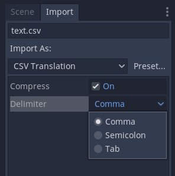

.. _doc_importing_translations:

Importing translations
======================

Games and internationalization
------------------------------

The gaming community isn't monolingual or monocultural. It's made up of
many different languages and cultures - just like the Godot community!
If you want to allow players to experience your game in their language,
one of things you'll need to provide is text translations, which Godot
supports via internationalized text.

In regular desktop or mobile applications, internationalized text is
usually located in resource files (or .po files for GNU stuff). Games,
however, can use several orders of magnitude more text than
applications, so they must support efficient methods for dealing with
loads of multilingual text.

There are two approaches to generate multilingual language games and
applications. Both are based on a key:value system. The first is to use
one of the languages as the key (usually English), the second is to use a
specific identifier. The first approach is probably easier for
development if a game is released first in English, later in other
languages, but a complete nightmare if working with many languages at
the same time.

In general, games use the second approach and a unique ID is used for
each string. This allows you to revise the text while it is being
translated to other languages. The unique ID can be a number, a string,
or a string with a number (it's just a unique string anyway).

.. note:: If you need a more powerful file format, Godot also supports
          loading translations written in the gettext ``.po`` format. See
          :ref:`doc_localization_using_gettext` for details.

Translation format
------------------

To complete the picture and allow efficient support for translations,
Godot has a special importer that can read CSV files. Most spreadsheet
editors can export to this format, so the only requirement is that the files
have a special arrangement. The CSV files **must** be saved with UTF-8 encoding
without a `byte order mark <https://en.wikipedia.org/wiki/Byte_order_mark>`__.

CSV files must be formatted as follows:

+--------+----------+----------+----------+
| keys   | <lang1>  | <lang2>  | <langN>  |
+========+==========+==========+==========+
| KEY1   | string   | string   | string   |
+--------+----------+----------+----------+
| KEY2   | string   | string   | string   |
+--------+----------+----------+----------+
| KEYN   | string   | string   | string   |
+--------+----------+----------+----------+

The "lang" tags must represent a language, which must be one of the :ref:`valid
locales <doc_locales>` supported by the engine. The "KEY" tags must be
unique and represent a string universally (they are usually in
uppercase, to differentiate from other strings). These keys will be replaced at
runtime by the matching translated string. Note that the case is important,
"KEY1" and "Key1" will be different keys.
The top-left cell is ignored and can be left empty or having any content.
Here's an example:

+-------+-----------------------+------------------------+------------------------------+
| keys  | en                    | es                     | ja                           |
+=======+=======================+========================+==============================+
| GREET | Hello, friend!        | Hola, amigo!           | こんにちは                   |
+-------+-----------------------+------------------------+------------------------------+
| ASK   | How are you?          | Cómo está?             | 元気ですか                   |
+-------+-----------------------+------------------------+------------------------------+
| BYE   | Goodbye               | Adiós                  | さようなら                   |
+-------+-----------------------+------------------------+------------------------------+
| QUOTE | "Hello" said the man. | "Hola" dijo el hombre. | 「こんにちは」男は言いました |
+-------+-----------------------+------------------------+------------------------------+

The same example is shown below as a comma-separated plain text file,
which should be the result of editing the above in a spreadsheet.
When editing the plain text version, be sure to enclose with double
quotes any message that contains commas, line breaks or double quotes,
so that commas are not parsed as delimiters, line breaks don't create new
entries and double quotes are not parsed as enclosing characters. Be sure
to escape any double quotes a message may contain by preceding them with
another double quote. Alternatively, you can select another delimiter than
comma in the import options.

.. code-block:: none

    keys,en,es,ja
    GREET,"Hello, friend!","Hola, amigo!",こんにちは
    ASK,How are you?,Cómo está?,元気ですか
    BYE,Goodbye,Adiós,さようなら
    QUOTE,"""Hello"" said the man.","""Hola"" dijo el hombre.",「こんにちは」男は言いました

CSV importer
------------

Godot will treat CSV files as translations by default. It will import them
and generate one or more compressed translation resource files next to it.

Importing will also add the translation to the list of
translations to load when the game runs, specified in project.godot (or the
project settings). Godot allows loading and removing translations at
runtime as well.

Select the ``.csv`` file and access the **Import** dock to define import
options. You can toggle the compression of the imported translations, and
select the delimiter to use when parsing the CSV file.

Be sure to click **Reimport** after any change to these options.
