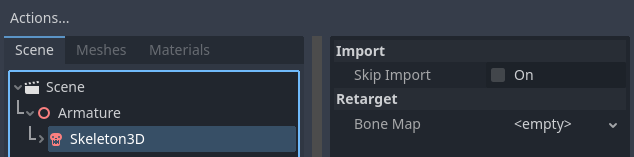
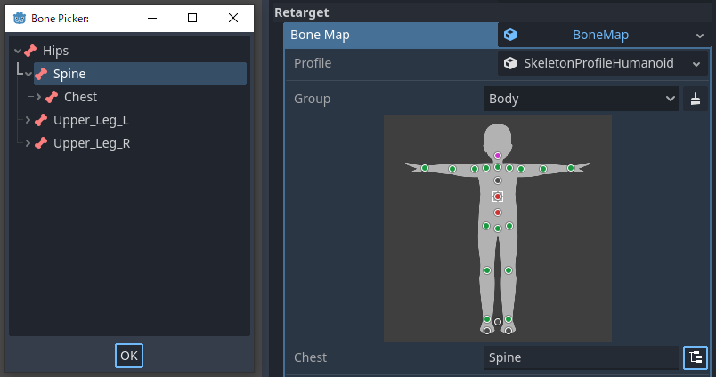
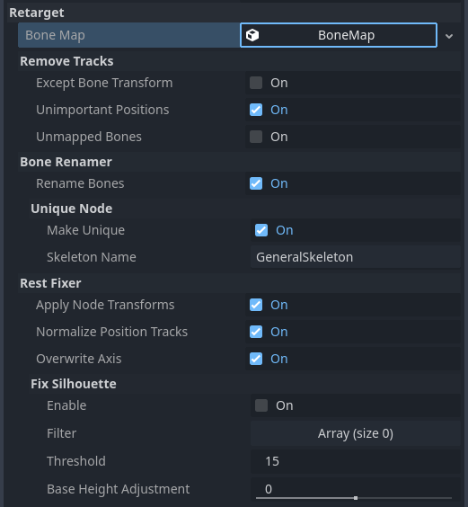
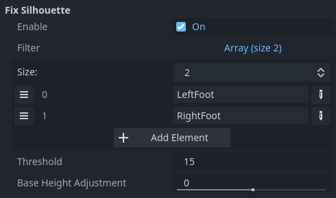

.. _doc_retargeting_3d_skeletons:

Retargeting 3D Skeletons
========================

To share animations among multiple Skeletons
--------------------------------------------

Godot has Position/Rotation/Scale 3D tracks (which this document calls "Transform" tracks)
with Nodepaths to bones for Skeleton bone animation. This means you can't
share animations between multiple Skeletons just by using the same bone
names.

Godot allows each bone to have a parent-child relationship and can have rotation
and scale as well as position, which means that bones that share a name can still
have different Transform values.

The Skeleton stores the Transform values necessary for the default pose as Bone Rest.
If Bone Pose is equal to Bone Rest, it means that the Skeleton is in the default pose.

.. note:: Godot 3.x and Godot 4.0+ have different Bone Pose behaviors.
          In Godot 3.x, Bone Pose is relative to Bone Rest, but in Godot 4.0+,
          it includes Bone Rest. See this `article <https://godotengine.org/article/animation-data-redesign-40>`__.

Skeletal models have different Bone Rests depending on the environment from
which they were exported. For example, the bones of a glTF model output from Blender
have "Edit Bone Orientation" as the Bone Rest rotation. However, there are skeletal
models without any Bone Rest rotations, such as the glTF model output from Maya.

To share animations in Godot, it is necessary to match Bone Rests as well as Bone Names
to remove unwanted tracks in some cases. In Godot 4.0+, you can do that using the scene
importer.

Options for Retargeting
-----------------------

Bone Map
~~~~~~~~

When you select the Skeleton3D node in the advanced scene import menu, a menu will appear
on the right-hand side containing the "Retarget" section. The Retarget section has a single
property ``bone_map``.

With the Skeleton node selected, first set up a new :ref:`class_bonemap` and :ref:`class_skeletonprofile`.
Godot has a preset called :ref:`class_skeletonprofilehumanoid` for humanoid models.
This tutorial proceeds with the assumption that you are using :ref:`class_skeletonprofilehumanoid`.

.. note:: If you need a profile for a model such as a beast or creature, you can export
          a :ref:`class_skeletonprofile` from SkeletonEditor with some information converted from Skeleton.

When you use :ref:`class_skeletonprofilehumanoid`, auto-mapping will be performed when the
:ref:`class_skeletonprofile` is set. If the auto-mapping does not work well, you can map bones manually.

Any missing, duplicate or incorrect parent-child relationship mappings will be indicated
by a magenta / red button (depending on the editor setting). It does not block the import process,
but it warns that animations may not be shared correctly.

.. note:: The auto-mapping uses pattern matching for the bone names. So we recommend
          to use common English names for bones.

After you set up the ``bone_map``, several options are available in the sections below.

Remove Tracks
~~~~~~~~~~~~~

If you import resources as an :ref:`class_animationlibrary` that will be shared, we recommend to enable these options.
However, if you import resources as scenes, these should be disabled in some cases.
For example, if you import a character with animated accessories,
these options may cause the accessories to not animate.

Except Bone Transform
^^^^^^^^^^^^^^^^^^^^^

Removes any tracks except the bone Transform track from the animations.

Unimportant Positions
^^^^^^^^^^^^^^^^^^^^^

Removes Position tracks other than ``root_bone`` and ``scale_base_bone``
defined in :ref:`class_skeletonprofile` from the animations. In :ref:`class_skeletonprofilehumanoid`,
this means that to remove Position tracks other than "Root" and "Hips".
Since Godot 4.0+, animations include Bone Rest in the Transform value. If you disable this option,
the animation may change the body shape unpredictably.

Unmapped Bones
^^^^^^^^^^^^^^

Removes unmapped bone Transform tracks from the animations.

Bone Renamer
~~~~~~~~~~~~

Rename Bones
^^^^^^^^^^^^

Rename the mapped bones.

Unique Node
^^^^^^^^^^^

Makes Skeleton a unique node with the name specified in the ``skeleton_name``.
This allows the animation track paths to be unified independent of the scene hierarchy.

Rest Fixer
~~~~~~~~~~

Reference poses defined in :ref:`class_skeletonprofilehumanoid` have the following rules:

* The humanoid is T-pose
* The humanoid is facing +Z in the Right-Handed Y-UP Coordinate System
* The humanoid should not have a Transform as Node
* Directs the +Y axis from the parent joint to the child joint
* +X rotation bends the joint like a muscle contracting

These rules are convenient definitions for blend animation and Inverse Kinematics (IK).
If your model does not match this definition, you need to fix it with these options.

Apply Node Transform
^^^^^^^^^^^^^^^^^^^^

If the asset is not exported correctly for sharing, the imported Skeleton may have
a Transform as a Node. For example, a glTF exported from Blender with no "Apply Transform"
executed is one such case. It looks like the model matches the definition,
but the internal Transforms are different from the definition.
This option fixes such models by applying Transforms on import.

.. note:: If the imported scene contains objects other than Skeletons, this option may have a negative effect.

Normalize Position Tracks
^^^^^^^^^^^^^^^^^^^^^^^^^

Position track is used mostly for model movement, but sharing the moving animation
between models with different heights may cause the appearance of slipping
due to the difference in stride length. This option normalizes the Position track values
based on the ``scale_base_bone`` height. The ``scale_base_bone`` height is stored
in the Skeleton as the ``motion_scale``, and the normalized Position track values is
multiplied by that value on playback. If this option is disabled, the Position tracks
is not normalized and the Skeleton's ``motion_scale`` is always imported as ``1.0``.

With :ref:`class_skeletonprofilehumanoid`, ``scale_base_bone`` is "Hips", therefore the Hips' height is used as the ``motion_scale``.

Overwrite Axis
^^^^^^^^^^^^^^

Unifies the models' Bone Rests by overwriting it to match the reference poses defined in the :ref:`class_skeletonprofile`.

.. note:: This is the most important option for sharing animations in Godot 4.0+,
          but be aware that this option can produce horrible results **if the original Bone Rest set externally is important**.
          If you want to share animations with keeping the original Bone Rest,
          consider to use the `Realtime Retarget Module <https://github.com/TokageItLab/realtime_retarget>`__.

Fix Silhouette
^^^^^^^^^^^^^^

Attempts to make the model's silhouette match that of the reference poses defined in the :ref:`class_skeletonprofile`,
such as T-Pose. This cannot fix silhouettes which are too different, and it may not work for fixing bone roll.

With :ref:`class_skeletonprofilehumanoid`, this option does not need to be enabled for T-pose models,
but should be enabled for A-pose models. However in that case, the fixed foot results
may be bad depending on the heel height of the model, so it may be necessary to add
the :ref:`class_skeletonprofile` bone names you do not want fixed in the ``filter`` array, as in the below example.

Also, for models with bent knees or feet, it may be necessary to adjust the ``scale_base_bone`` height.
For that, you can use ``base_height_adjustment`` option.
