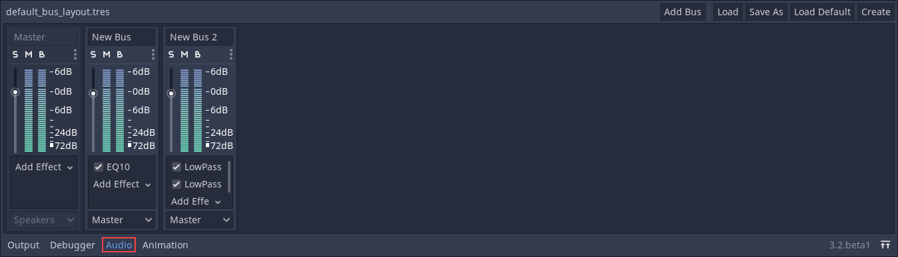
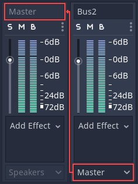
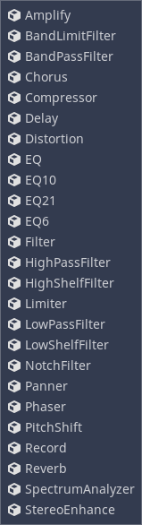
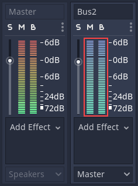

:article_outdated: True

.. _doc_audio_buses:

Audio buses
===========

Introduction
------------

Godot's audio processing code has been written with games in mind, with the aim
of achieving an optimal balance between performance and sound quality.

Godot's audio engine allows any number of audio buses to be created and any
number of effect processors can be added to each bus. Only the hardware of the
device running your game will limit the number of buses and effects that can be
used before performance starts to suffer.

Decibel scale
-------------

Godot's sound interface is designed to meet the expectations of sound design
professionals. To this end, it primarily uses the decibel scale.

For those unfamiliar with it, it can be explained with a few facts:

- The decibel (dB) scale is a relative scale. It represents the ratio of
  sound power by using 20 times the base 10 logarithm of the ratio
  (20 × log\ :sub:`10`\ (P/P\ :sub:`0`\ )).
- For every 6 dB, sound amplitude doubles or halves. 12 dB represents a factor
  of 4, 18 dB a factor of 8, 20 dB a factor of 10, 40 dB a factor of 100, etc.
- Since the scale is logarithmic, true zero (no audio) can't be represented.
- 0 dB is the maximum amplitude possible in a digital audio system.
  This limit is not the human limit, but a limit from the sound hardware.
  Audio with amplitudes that are too high to be represented properly below 0 dB
  create a kind of distortion called *clipping*.
- To avoid clipping, your sound mix should be arranged so that the output of the
  *master bus* (more on that later) never exceeds 0 dB.
- Every 6 dB below the 0 dB limit, sound energy is *halved*.
  It means the sound volume at -6 dB is half as loud as 0dB.
  -12 dB is half as loud as -6 dB and so on.
- When working with decibels, sound is considered no longer audible
  between -60 dB and -80 dB. This makes your working range generally
  between -60 dB and 0 dB.

This can take a bit getting used to, but it's friendlier in the end
and will allow you to communicate better with audio professionals.

Audio buses
-----------

Audio buses can be found in the bottom panel of the Godot editor:

An *audio bus* (also called an *audio channel*) can be considered a place that
audio is channeled through on the way to playback through a device's speakers.
Audio data can be *modified* and *re-routed* by an audio bus. An audio bus
has a VU meter (the bars that light up when sound is played) which indicates the
amplitude of the signal passing through.

The leftmost bus is the *master bus*. This bus outputs the mix to your speakers
so, as mentioned in the *Decibel scale* section above, make sure that your mix
level doesn't reach 0 dB in this bus. The rest of the audio buses can be
flexibly routed. After modifying the sound, they send it to another bus to
the left. The destination bus can be specified for each of the non-master audio
buses. Routing always passes audio from buses on the right to buses further
to the left. This avoids infinite routing loops.

In the above image, the output of *Bus 2* has been routed to the *Master* bus.

Playback of audio through a bus
-------------------------------

To test passing audio to a bus, create an AudioStreamPlayer node, load an
AudioStream and select a target bus for playback:

.. image:: img/audio_buses3.png

Finally, toggle the **Playing** property to **On** and sound will flow.

.. seealso::

    You may also be interested in reading about :ref:`doc_audio_streams` now.

Adding effects
--------------

Audio buses can contain all sorts of effects. These effects modify the sound in
one way or another and are applied in order.

For information on what each effect does, see :ref:`doc_audio_effects`.

Automatic bus disabling
-----------------------

There is no need to disable buses manually when not in use. Godot detects
that the bus has been silent for a few seconds and disables it (including
all effects).

   Disabled buses have a blue VU meter instead of a red-green one.

Bus rearrangement
-----------------

Stream Players use bus names to identify a bus, which allows adding, removing
and moving buses around while the reference to them is kept. However, if a bus
is renamed, the reference will be lost and the Stream Player will output
to Master. This system was chosen because rearranging buses is a more common
process than renaming them.

Default bus layout
------------------

The default bus layout is automatically saved to the
``res://default_bus_layout.tres`` file. Custom bus arrangements can be saved
and loaded from disk.
