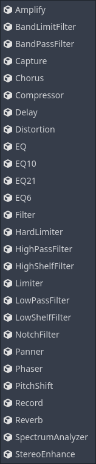

.. _doc_audio_effects:

Audio effects
=============

Godot includes several audio effects that can be added to an audio bus to alter
every sound that goes through that bus.

Understanding how each effect works can be difficult, so don't feel discouraged
if you have to look things up! If you are new to audio, an understanding of the
essential effects can help you in most cases! Those are:

- Equalizer & Filter
- Limiter
- Delay & Reverb

Try every effect out to get a sense of how they alter sound.

.. note::

  :ref:`AudioSample <class_AudioSample>` does not support these effects.

Here follows short descriptions of the available effects:

Amplify
~~~~~~~

Changes the volume of the sound. Some care needs to be taken, though: setting
the volume level too high can digitally clip the sound, which can produce
unpleasant crackles and pops. Consider using a
:ref:`hard limiter <doc_hard_limiter>` or a :ref:`compressor <doc_compressor>`
to prevent clipping, or :ref:`distortion <doc_distortion>` on clip mode if
clipping at or below 0 dB is desired.

.. _doc_band_limit_filter:

BandLimitFilter
~~~~~~~~~~~~~~~

A "band-limit" filter attenuates the frequencies at the *cutoff* point, and
allows frequencies outside of that point to pass unchanged. It is similar to
the :ref:`notch filter <doc_notch_filter>`, but weaker. It is the opposite of
the :ref:`band-pass filter <doc_band_pass_filter>`. This filter can be used to
give more room for other sounds to play at the cutoff point.

.. _doc_band_pass_filter:

BandPassFilter
~~~~~~~~~~~~~~

A "band-pass" filter allow frequencies at the *cutoff* point to pass unchanged,
and attenuates frequencies outside of that point. It is the opposite of the
:ref:`band-limit filter <doc_band_limit_filter>` and
:ref:`notch filter <doc_notch_filter>`. This filter can be used to simulate
sounds passing through an old telephone line or megaphone. Modulating the
cutoff point can simulate the sound of a wah-wah guitar pedal, think of the
guitar in Jimi Hendrix's *Voodoo Child (Slight Return)*.

Capture
~~~~~~~

Copies the audio samples of the audio bus that this effect is attached to
into an internal ring buffer. This can be used to capture data from the
microphone or to transmit audio over the network in real-time. In general, it
can be used to store real-time audio data for playback, and even to create
real-time audio visualization, like an oscilloscope. This effect does not alter
the audio.

Chorus
~~~~~~

A "chorus" effect duplicates a signal and very slightly alters the timing and
pitch of each duplicate, and modulates them over time via an LFO
(low-frequency oscillator). The duplicates (also called "voices") are then
mixed back together with the original signal, giving the impression that the
sound comes from multiple sources. In the real world, this kind of effect is
found in pianos, choirs, and instrument ensembles. This effect can also be used
to widen mono audio and make digital sounds have a more natural or analog
quality.

.. _doc_compressor:

Compressor
~~~~~~~~~~

A "compressor" automatically attenuates (or "ducks") the volume of the input
signal when its amplitude exceeds a certain volume threshold. The amount of
attenuation applied is proportional to how far the input audio exceeds the
threshold. The compressor's Ratio parameter controls the degree of attenuation.
One of the main uses of a compressor is to reduce the dynamic range of signals
with very loud and quiet parts. Reducing the dynamic range of a signal can make
it fit more comfortably in a mix.

The compressor has many uses. For example:

- It can be used in the Master bus to compress the whole output before it hits
  a limiter's ceiling, which makes the effect of the limiter much more subtle.
- It can be used in voice clips to ensure they sound as even as possible.
- It can be *sidechained* by another sound source. This means it can reduce the
  volume of one signal by using the volume of another audio bus for threshold
  detection. This technique is very common in video game mixing to "duck" the
  volume of music or sound effects when in-game or multiplayer voices need to
  be fully audible.
- It can accentuate *transients* by using a slower attack, which lets louder
  parts go through before they are compressed. This can emphasize the
  "punchiness" of sound effects.

.. note::

  If your goal is solely to prevent a signal from exceeding a given amplitude
  altogether, a :ref:`hard limiter <doc_hard_limiter>` is likely a better
  choice than a compressor for this purpose. However, applying compression
  before a limiter is still good practice.

.. _doc_delay:

Delay
~~~~~

A "delay" effect duplicates a signal and repeats it multiple times, with a
short period of time between each repetition (also called "tap"). Taps decay
in volume over time. All of this creates an echo effect. Delay is great to
simulate the acoustic space of a canyon or large room, where sound bounces off
of surfaces and arrives at the listener after some *delay*. This is similar to
:ref:`reverb <doc_reverb>`, which has a more natural and blurred sound to it.
Using delay in conjunction with reverb can create very natural sounding
environments.

.. _doc_distortion:

Distortion
~~~~~~~~~~

A "distortion" effect modifies the volume of the sound in a way that changes
its waveform, which can result in a "harsh" and "bright" sound.

Here are some of the distortion types that Godot offers:

- *Clip*: clamps the volume of the sound, which makes it sound harsh.
- *Overdrive*: sounds like a guitar distortion pedal or megaphone.
- *Lo-fi*: reduces the *bit depth* of the signal, emulating old speakers.

All types of distortion can add higher frequencies to the original sound, which
helps it stand out better in a mix.

.. warning::

  Be careful with the amount of distortion added, as it can create very harsh
  and loud sounds.

EQ
~~

An "equalizer" gives you control over the gain of frequencies in the entire
spectrum, through the use of "bands" which represent different regions of the
spectrum. Equalizers can be essential to achieve a cleaner mix, allowing
multiple sounds to play together without frequencies competing with each other.
An equalizer on the Master bus can be useful to attenuate low and high
frequencies that the device's speakers can't reproduce well. For example,
phone and tablet speakers usually don't reproduce low frequency sounds well,
and could make a limiter or compressor attenuate the Master volume more than
necessary. This effect can be disabled when headphones are plugged in, which
gives the user the best of both worlds.

.. note::

  This audio effect is what all other equalizers inherit from. It can be
  extended with custom scripts to create an equalizer with a custom number of
  bands.

EQ6, EQ10, EQ21
~~~~~~~~~~~~~~~

Godot provides three equalizers with different numbers of bands, which are
represented in the title (6, 10, and 21 bands, respectively).

Filter
~~~~~~

A "filter" controls the gain of frequencies, through the use of a *cutoff* as a
frequency threshold. It differs from an equalizer in that it uses different
"shapes" to control frequencies; meaning frequencies will have their gain
adjusted whether they are lower, higher, at, or outside the cutoff point,
depending on the filter type. Filters can help give room to each sound and
create interesting effects.

.. note::

  This audio effect is what all other filters inherit from. It should not be
  used directly.

.. _doc_hard_limiter:

HardLimiter
~~~~~~~~~~~

A "limiter" disallows audio signals from exceeding a given volume threshold
level. Hard limiters predict volume peaks, and will smoothly apply gain
reduction when the volume crosses the ceiling threshold level. It works
similarly to a compressor, but is designed to not let the volume cross a
certain volume level at all. Adding a limiter as the last effect of the Master
bus is good practice, as it offers an easy safeguard against clipping.
If clipping is desired, consider using the :ref:`distortion <doc_distortion>`
effect on clip mode.

HighPassFilter
~~~~~~~~~~~~~~

A "high-pass" filter attenuates frequencies lower than the *cutoff* point and
allows higher frequencies to pass unchanged. This filter can be used to remove
the bass content of a signal, making it sound "thinner".

HighShelfFilter
~~~~~~~~~~~~~~~

A "high-shelf" filter controls the gain of all frequencies above the *cutoff*
point. This filter can be used to increase or decrease clarity of a sound.

Limiter
~~~~~~~

.. note::

  This is the old limiter effect, and it is recommended to use the new
  :ref:`hard limiter <doc_hard_limiter>` effect instead. This effect is kept to
  preserve compatibility, however it should be considered deprecated.

Here is an example of how this effect works: if the ceiling is set to -12 dB,
and the threshold is 0 dB, all samples going through get reduced by 12 dB.
This changes the waveform of the sound and introduces distortion.

LowPassFilter
~~~~~~~~~~~~~

A "low-pass" filter attenuates frequencies higher than the *cutoff* point and
allows lower frequencies to pass unchanged. Low pass filters can be used to
simulate "muffled" sounds. For instance, underwater sounds, sounds blocked by
walls, or distant sounds.

LowShelfFilter
~~~~~~~~~~~~~~

A "low-shelf" filter controls the gain of all frequencies below the *cutoff*
point. This filter can be used to adjust the "strength" of a sound, by
increasing or decreasing the gain of the bass range.

.. _doc_notch_filter:

NotchFilter
~~~~~~~~~~~

A "notch" filter attenuates the frequencies at the *cutoff* point, and allows
frequencies outside of that point to pass unchanged. It is the opposite of the
:ref:`band-pass filter <doc_band_pass_filter>`. This filter can be used to give
more room for other sounds to play at the cutoff point. Because of how much it
attenuates frequencies, it can also be used to completely remove very specific
and undesired frequencies.

Panner
~~~~~~

Moves the sound to the left or right. Headphones are recommended when
configuring this effect.

.. note::

  This effect may not be necessary with
  :ref:`AudioStreamPlayer2D <class_AudioStreamPlayer2D>` and
  :ref:`AudioStreamPlayer3D <class_AudioStreamPlayer3D>`, since they handle
  panning automatically.

Phaser
~~~~~~

A "phaser" effect creates a copy that is out-of-phase and mixes back together
with the original. The copy is then modulated by an LFO
(low-frequency oscillator), which makes some frequencies cancel each other out
in interesting ways. The result of that is a series of peaks and troughs that
sweep across the spectrum. This effect can be used to create sci-fi effects or
Darth Vader-like voices.

PitchShift
~~~~~~~~~~

Allows the adjustment of the signal's pitch independently of its speed. All
frequencies can be raised or lowered with minimal effect on *transients*. This
effect can be useful to create unusually high or deep voices. Do note that
altering pitch can sound unnatural when pushed outside of a narrow window.

Record
~~~~~~

Stores audio data into an :ref:`AudioStreamWAV <class_AudioStreamWAV>`.
One usage example of this effect is to record microphone input and save as a
WAV file.

.. _doc_reverb:

Reverb
~~~~~~

A "reverb" effect plays a copy of the input audio back continuously, which
decays over a period of time, and creates a blurry echo effect
(or "reverberation"). Reverb is great to simulate sounds in different
kinds of spaces, which can range from small rooms to big caverns. This is
similar to :ref:`delay <doc_delay>`, which has a less blurry sound to it. Using
reverb in conjunction with delay can create very natural sounding environments.

Reverb is commonly outputted from :ref:`Area3Ds <class_Area3D>`
(see :ref:`Reverb buses <doc_audio_streams_reverb_buses>`).

SpectrumAnalyzer
~~~~~~~~~~~~~~~~

Plots the amplitude of the audio signal within specified frequency ranges. This
would typically be used for real-time audio visualization, like a spectrogram.
Visualizing voices can be a great way to draw attention to them without
increasing their volume. This effect does not alter audio.

.. note::

  Accessing
  :ref:`AudioEffectSpectrumAnalyzerInstance <class_AudioEffectSpectrumAnalyzerInstance>`
  is necessary to make use of this effect. A demo project using this can be found
  `here <https://github.com/godotengine/godot-demo-projects/tree/master/audio/spectrum>`__.

StereoEnhance
~~~~~~~~~~~~~

Adjusts the gain of the left and right channels, and makes mono sounds stereo
through phase shift. This can be used to widen or narrow a sound. Headphones
are recommended when configuring this effect.
