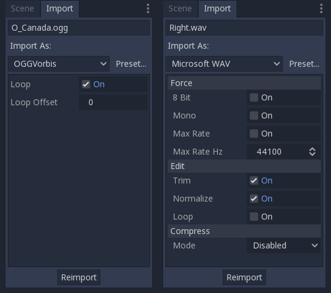

.. _doc_audio-streams:

Audio streams
=============

Introduction
------------

As you might have read already in the :ref:`Audio Buses Tutorial<doc_audio-buses>` ,
sound is sent to each bus via an AudioStreamPlayer.

There are many types of AudioStreamPlayers which will be explained in detail. Each of it loads
an AudioStream and plays it back.

AudioStream
-----------

An audio stream is an abstract object that emits sound. It can come from many places, but most commonly
from the filesystem. Audio files such as .wav or .ogg can be loaded as AudioStreams and placed
inside an AudioStreamPlayer.

When using these kind of files, you should choose which one is best for your specific use case:

* Audio files of type *.wav* are considerably big, but use little amount of your CPU to play. Hundreds of them can be played simultaneously with little impact to performance. This format is usually best for short sound effects, as the importer will trim them and convert them to IMA-ADPCM.
* Audio files of type *.ogg* are much smaller, but use considerably more amount of CPU power to play back, so only a few can be played back (especially on mobile!). This format is usually best for music or long sound effect sequences. It also works well for voice at relatively low bitrates.

Keep in mind both .wav and .ogg generally don't contain looping information, so this information must be set on the import options of each:

There are other types of AudioStreams, such as AudioStreamRandomPitch, which takes an existing AudioStream and modulates the pitch every time it's played back randomly (great for some sound effects),
and more will keep appearing in the future.

AudioStreamPlayer
-----------------

This is the standard stream player, it can play to any given bus. In 5.1 sound, it can send to stereo mix or front speakers.

AudioStreamPlayer2D
-------------------

This is a variant of AudioStreamPlayer but emits sound in a 2D positional environment. When close to the left of the screen, the panning will go left. When close to the right side, it will go right.

While it's possible to send these effects to specific audio buses, one of the best strategies is to use an Area2D to divert sound to a specific bus. This allows to create buses with different
reverb or sound qualities and make the emitter will automatically send to them when entering the Area2D shapes.

.. image:: img/audio_stream_2d_area.png

AudioStreamPlayer3D
-------------------

This is a variant of AudioStreamPlayer but emits sound in a 3D positional environment. Depending on the location of the player relative of the screen, it can position sound in Stereo, 5.1 or 7.1 depending
on the chosen audio setup.

Similar to AudioStreamPlayer2D, an Area can divert the sound to an audio bus.

.. image:: img/audio_stream_3d_area.png

Unlike for 2D, the 3D version of AudioStreamPlayer has a few more advanced options:

Reverb buses
~~~~~~~~~~~~

Godot allows 3D Audio Streams that enter a specific *Area* to send dry and wet audio to separate buses. This is useful when you have several reverb configurations for different types of rooms.
This is done by enabling this type of reverb in the *Reverb Bus* section of *Area* properties:

.. image:: img/audio_stream_reverb_bus.png

At the same time, a special bus layout is created where each area receives the reverb info from each area. Of course, an actual Reverb effect must be created in that bus for anything to happen:

.. image:: img/audio_stream_reverb_bus2.png

The Area Reverb Bus section has also a specific parameter named "Uniformity". Some types of rooms bounce sounds more than others (like for example, a typical warehouse), so reverberation can be heard
almost uniformly across the room even though the source is far away. Playing around with this parameter can simulate that effect.

Doppler
~~~~~~~

When the relative velocity between an emitter and listener changes, this is perceived as an increase or decrease of the pitch shift. Godot can track changes in velocities of *AudioStreamPlayer3D* or *Camera*.
Both have this property, which must be enabled manually:

.. image:: img/audio_stream_doppler.png

Simply enable it by setting it depending on how objects will be moved (whether on regular *process* or *physics_process* step) and the tracking will happen automatically!
