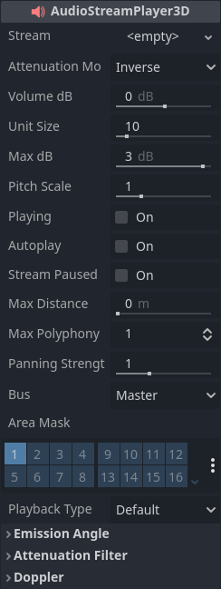
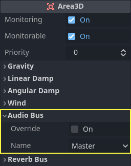
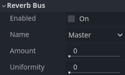

:article_outdated: True

.. _doc_audio_streams:

Audio streams
=============

Introduction
------------

As you might have already read in :ref:`doc_audio_buses`, sound is sent to
each bus via an AudioStreamPlayer node. There are different kinds
of AudioStreamPlayers. Each one loads an AudioStream and plays it back.

AudioStream
-----------

An audio stream is an abstract object that emits sound. The sound can come from
many places, but is most commonly loaded from the filesystem. Audio files can be
loaded as AudioStreams and placed inside an AudioStreamPlayer. You can find
information on supported formats and differences in :ref:`doc_importing_audio_samples`.

There are other types of AudioStreams, such as :ref:`AudioStreamRandomizer<class_AudioStreamRandomizer>`.
This one picks a different audio stream from a list of streams each time it's played
back, and applies random pitch and volume shifting. This can be helpful for adding
variation to sounds that are played back often.

AudioStreamPlayer
-----------------

This is the standard, non-positional stream player. It can play to any bus.
In 5.1 sound setups, it can send audio to stereo mix or front speakers.

.. UPDATE: Experimental. When Playback Type is no longer experimental, update
.. this paragraph.

Playback Type is an experimental setting, and could change in future versions
of Godot. It exists so Web exports use Web Audio-API based samples instead of
streaming all sounds to the browser, unlike most platforms. This prevents the
audio from being garbled in single-threaded Web exports. By default, only the
Web platform will use samples. Changing this setting is not recommended, unless
you have an explicit reason to. You can change the default playback type
for the web and other platforms in the project settings under **Audio > General**
(advanced settings must be turned on to see the setting).

AudioStreamPlayer2D
-------------------

.. image:: img/audio_stream_2d.webp

This is a variant of AudioStreamPlayer, but emits sound in a 2D positional
environment. When close to the left of the screen, the panning will go left.
When close to the right side, it will go right.

.. note::

    Area2Ds can be used to divert sound from any AudioStreamPlayer2Ds they
    contain to specific buses. This makes it possible to create buses with
    different reverb or sound qualities to handle action happening in a
    particular parts of your game world.

AudioStreamPlayer3D
-------------------

This is a variant of AudioStreamPlayer, but emits sound in a 3D positional
environment. Depending on the location of the player relative to the screen,
it can position sound in stereo, 5.1 or 7.1 depending on the chosen audio setup.

Similar to AudioStreamPlayer2D, an Area3D can divert the sound to an audio bus.

Unlike for 2D, the 3D version of AudioStreamPlayer has a few more advanced options:

.. _doc_audio_streams_reverb_buses:

Reverb buses
~~~~~~~~~~~~

.. warning::

    This feature is not supported on the web platform if the AudioStreamPlayer's
    playback mode is set to **Sample**, which is the default. It will only work if the
    playback mode is set to **Stream**, at the cost of increased latency if threads
    are not enabled.

    See :ref:`Audio playback in the Exporting for the Web documentation <doc_exporting_for_web_audio_playback>`
    for details.

Godot allows for 3D audio streams that enter a specific Area3D node to send dry
and wet audio to separate buses. This is useful when you have several reverb
configurations for different types of rooms. This is done by enabling this type
of reverb in the **Reverb Bus** section of the Area3D's properties:

At the same time, a special bus layout is created where each Area3D receives the
reverb info from each Area3D. A Reverb effect needs to be created and configured
in each reverb bus to complete the setup for the desired effect:

The Area3D's **Reverb Bus** section also has a parameter named **Uniformity**.
Some types of rooms bounce sounds more than others (like a warehouse), so
reverberation can be heard almost uniformly across the room even though the
source may be far away. Playing around with this parameter can simulate
that effect.

Doppler
~~~~~~~

.. warning::

    This feature is not supported on the web platform if the AudioStreamPlayer's
    playback mode is set to **Sample**, which is the default. It will only work if the
    playback mode is set to **Stream**, at the cost of increased latency if threads
    are not enabled.

    See :ref:`Audio playback in the Exporting for the Web documentation <doc_exporting_for_web_audio_playback>`
    for details.

When the relative velocity between an emitter and listener changes, this is
perceived as an increase or decrease in the pitch of the emitted sound.
Godot can track velocity changes in the AudioStreamPlayer3D and Camera nodes.
Both nodes have this property, which must be enabled manually:

Enable it by setting it depending on how objects will be moved:
use **Idle** for objects moved using ``_process``, or **Physics**
for objects moved using ``_physics_process``. The tracking will
happen automatically.
