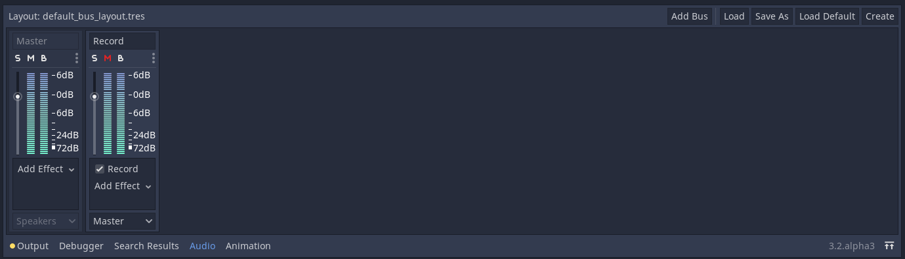
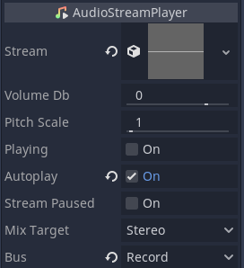

:article_outdated: True

.. _doc_recording_with_microphone:

Recording with microphone
=========================

Godot supports in-game audio recording for Windows, macOS, Linux, Android and
iOS.

A simple demo is included in the official demo projects and will be used as
support for this tutorial:
`<https://github.com/godotengine/godot-demo-projects/tree/master/audio/mic_record>`_.

You will need to enable audio input in the project settings ``Project Settings -> Audio -> Driver -> Enable Input``, or you'll just get empty audio files.

The structure of the demo
-------------------------

The demo consists of a single scene. This scene includes two major parts: the
GUI and the audio.

We will focus on the audio part. In this demo, a bus named ``Record`` with the
effect ``Record`` is created to handle the audio recording.
An ``AudioStreamPlayer`` named ``AudioStreamRecord`` is used for recording.

.. tabs::
 .. code-tab:: gdscript GDScript

    var effect
    var recording

    func _ready():
        # We get the index of the "Record" bus.
        var idx = AudioServer.get_bus_index("Record")
        # And use it to retrieve its first effect, which has been defined
        # as an "AudioEffectRecord" resource.
        effect = AudioServer.get_bus_effect(idx, 0)

 .. code-tab:: csharp

    private AudioEffectRecord _effect;
    private AudioStreamSample _recording;

    public override void _Ready()
    {
        // We get the index of the "Record" bus.
        int idx = AudioServer.GetBusIndex("Record");
        // And use it to retrieve its first effect, which has been defined
        // as an "AudioEffectRecord" resource.
        _effect = (AudioEffectRecord)AudioServer.GetBusEffect(idx, 0);
    }

The audio recording is handled by the :ref:`class_AudioEffectRecord` resource
which has three methods:
:ref:`get_recording() <class_AudioEffectRecord_method_get_recording>`,
:ref:`is_recording_active() <class_AudioEffectRecord_method_is_recording_active>`,
and :ref:`set_recording_active() <class_AudioEffectRecord_method_set_recording_active>`.

.. tabs::
  .. code-tab:: gdscript GDScript

    func _on_record_button_pressed():
        if effect.is_recording_active():
            recording = effect.get_recording()
            $PlayButton.disabled = false
            $SaveButton.disabled = false
            effect.set_recording_active(false)
            $RecordButton.text = "Record"
            $Status.text = ""
        else:
            $PlayButton.disabled = true
            $SaveButton.disabled = true
            effect.set_recording_active(true)
            $RecordButton.text = "Stop"
            $Status.text = "Recording..."

  .. code-tab:: csharp

    private void OnRecordButtonPressed()
    {
        if (_effect.IsRecordingActive())
        {
            _recording = _effect.GetRecording();
            GetNode<Button>("PlayButton").Disabled = false;
            GetNode<Button>("SaveButton").Disabled = false;
            _effect.SetRecordingActive(false);
            GetNode<Button>("RecordButton").Text = "Record";
            GetNode<Label>("Status").Text = "";
        }
        else
        {
            GetNode<Button>("PlayButton").Disabled = true;
            GetNode<Button>("SaveButton").Disabled = true;
            _effect.SetRecordingActive(true);
            GetNode<Button>("RecordButton").Text = "Stop";
            GetNode<Label>("Status").Text = "Recording...";
        }
    }

At the start of the demo, the recording effect is not active. When the user
presses the ``RecordButton``, the effect is enabled with
``set_recording_active(true)``.

On the next button press, as ``effect.is_recording_active()`` is ``true``,
the recorded stream can be stored into the ``recording`` variable by calling
``effect.get_recording()``.

.. tabs::
  .. code-tab:: gdscript GDScript

    func _on_play_button_pressed():
        print(recording)
        print(recording.format)
        print(recording.mix_rate)
        print(recording.stereo)
        var data = recording.get_data()
        print(data.size())
        $AudioStreamPlayer.stream = recording
        $AudioStreamPlayer.play()

  .. code-tab:: csharp

    private void OnPlayButtonPressed()
    {
        GD.Print(_recording);
        GD.Print(_recording.Format);
        GD.Print(_recording.MixRate);
        GD.Print(_recording.Stereo);
        byte[] data = _recording.Data;
        GD.Print(data.Length);
        var audioStreamPlayer = GetNode<AudioStreamPlayer>("AudioStreamPlayer");
        audioStreamPlayer.Stream = _recording;
        audioStreamPlayer.Play();
    }

To playback the recording, you assign the recording as the stream of the
``AudioStreamPlayer`` and call ``play()``.

.. tabs::
  .. code-tab:: gdscript GDScript

    func _on_save_button_pressed():
        var save_path = $SaveButton/Filename.text
        recording.save_to_wav(save_path)
        $Status.text = "Saved WAV file to: %s\n(%s)" % [save_path, ProjectSettings.globalize_path(save_path)]

  .. code-tab:: csharp

    private void OnSaveButtonPressed()
    {
        string savePath = GetNode<LineEdit>("SaveButton/Filename").Text;
        _recording.SaveToWav(savePath);
        GetNode<Label>("Status").Text = string.Format("Saved WAV file to: {0}\n({1})", savePath, ProjectSettings.GlobalizePath(savePath));
    }

To save the recording, you call ``save_to_wav()`` with the path to a file.
In this demo, the path is defined by the user via a ``LineEdit`` input box.
