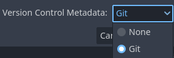

.. _doc_version_control_systems:

Version control systems
=======================

Introduction
------------

Godot aims to be VCS-friendly and generate mostly readable and mergeable files.

Version control plugins
-----------------------

Godot also supports the use of version control systems in the editor itself.
However, version control in the editor requires a plugin for the specific VCS
you're using.

As of July 2023, there is only a Git plugin available, but the community may
create additional VCS plugins.

Official Git plugin
^^^^^^^^^^^^^^^^^^^

Using Git from inside the editor is supported with an official plugin.
You can find the latest releases on
`GitHub <https://github.com/godotengine/godot-git-plugin/releases>`__.

Documentation on how to use the Git plugin can be found on its
`wiki <https://github.com/godotengine/godot-git-plugin/wiki>`__.

Files to exclude from VCS
-------------------------

.. note::

    This lists files and folders that should be ignored from version control in
    Godot 4.1 and later.

    The list of files of folders that should be ignored from version control in
    Godot 3.x and Godot 4.0 is **entirely** different. This is important, as Godot
    3.x and 4.0 may store sensitive credentials in ``export_presets.cfg`` (unlike Godot
    4.1 and later).

    If you are using Godot 3, check the ``3.5`` version of this documentation page
    instead.

There are some files and folders Godot automatically creates when opening a
project in the editor for the first time. To avoid bloating your version control
repository with generated data, you should add them to your VCS ignore:

- ``.godot/``: This folder stores various project cache data.
- ``*.translation``: These files are binary imported
  :ref:`translations <doc_internationalizing_games>` generated from CSV files.

You can make the Godot project manager generate version control metadata for you
automatically when creating a project. When choosing the **Git** option, this
creates ``.gitignore`` and ``.gitattributes`` files in the project root:

   Creating version control metadata in the project manager's **New Project** dialog

In existing projects, select the **Project** menu at the top of the editor, then
choose **Version Control > Generate Version Control Metadata**. This creates the
same files as if the operation was performed in the project manager.

Working with Git on Windows
---------------------------

Most Git for Windows clients are configured with the ``core.autocrlf`` set to
``true``. This can lead to files unnecessarily being marked as modified by Git
due to their line endings being converted from LF to CRLF automatically.

It is better to set this option as:

::

    git config --global core.autocrlf input

Creating version control metadata using the project manager or editor will
automatically enforce LF line endings using the ``.gitattributes`` file.
In this case, you don't need to change your Git configuration.
