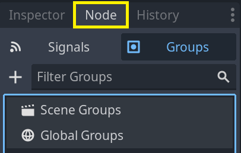
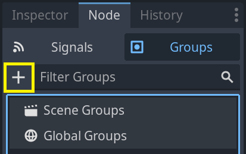
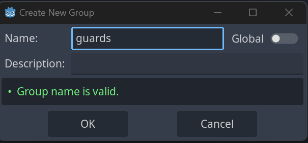
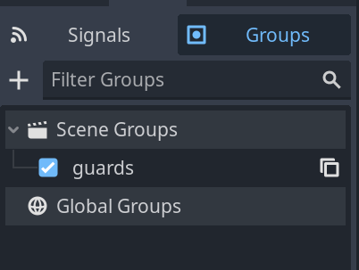
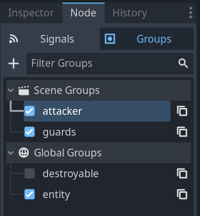
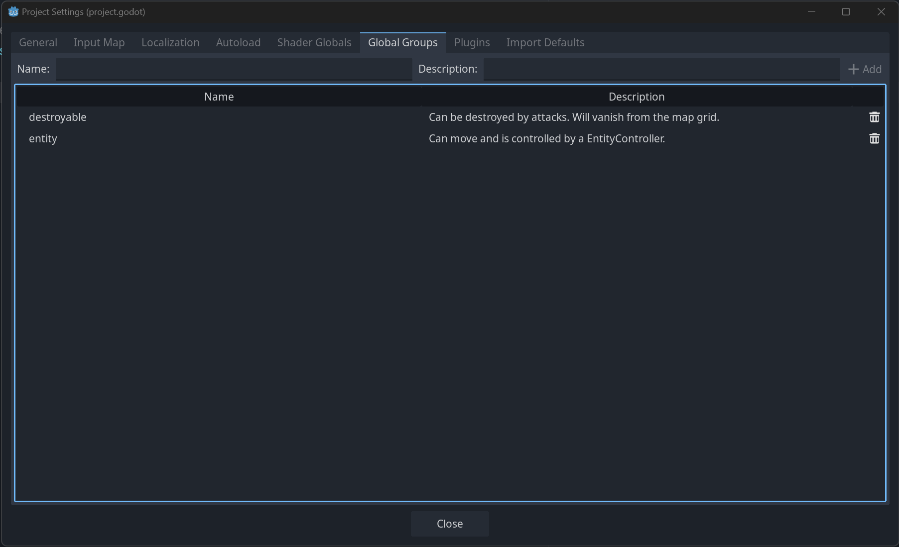

.. _doc_groups:

Groups
======

Groups in Godot work like tags in other software. You can add a node to as many
groups as you want. Then, in code, you can use the SceneTree to:

- Get a list of nodes in a group.
- Call a method on all nodes in a group.
- Send a notification to all nodes in a group.

This is a useful feature to organize large scenes and decouple code.

Managing groups
---------------

Groups are created by adding a node to a new group name, and likewise they are
removed by removing all nodes from a given group.

There are two ways to add/remove nodes to groups:

- During design, by using the Node dock in the editor, or the Global Groups in project settings.
- During execution, by calling :ref:`Node.add_to_group() <class_Node_method_add_to_group>`
  or :ref:`Node.remove_from_group() <class_Node_method_remove_from_group>`.

Using the Node dock
~~~~~~~~~~~~~~~~~~~

You can create new groups using the Groups tab in the Node dock.

Select one or more nodes in the Scene dock then click the add button with the + symbol.

You should now see the Create New Group modal appear. Write the group name in the field.

You can optionally mark the option "Global", which will make the group visible project-wide,
and able to be reused in any project scene. This will also allow you to give it a description.

When done, press Ok to create it.

You should see the new groups appear in the Groups tab under Scene Groups if the Global option was
unmarked, or under Global Groups if that option was marked.

Selected Node(s) from the Scene dock can be added into groups by marking the checkbox on the left side
of the groups in the Groups dock. The node(s) you had selected when creating a new group will be automatically checked.

All groups present in the project that were marked as Global, created from any scene, will be visible under Global Groups.

Any other group derived from nodes in the current scene will appear under Scene Groups.

.. warning:: The same underlying logic is used for both Global and Scene groups. 
             Groups with the same name are considered one and the same. This feature is purely organizational.

You can manage Global Groups in the Global Groups dock, inside Project Settings. There, you will be able to add new
global groups, or change existing groups' names and descriptions.

Using code
~~~~~~~~~~

You can also manage groups from scripts. The following code adds the node to
which you attach the script to the ``guards`` group as soon as it enters the
scene tree.

.. tabs::
 .. code-tab:: gdscript GDScript

    func _ready():
        add_to_group("guards")

 .. code-tab:: csharp

    public override void _Ready()
    {
        base._Ready();

        AddToGroup("guards");
    }

Imagine you're creating an infiltration game. When an
enemy spots the player, you want all guards and robots to be on alert.

In the fictional example below, we use ``SceneTree.call_group()`` to alert all
enemies that the player was spotted.

.. tabs::
 .. code-tab:: gdscript GDScript

    func _on_player_spotted():
        get_tree().call_group("guards", "enter_alert_mode")

 .. code-tab:: csharp

    public void _OnPlayerDiscovered()
    {
        GetTree().CallGroup("guards", "enter_alert_mode");
    }

The above code calls the function ``enter_alert_mode`` on every member of the
group ``guards``.

To get the full list of nodes in the ``guards`` group as an array, you can call
:ref:`SceneTree.get_nodes_in_group()
<class_SceneTree_method_get_nodes_in_group>`:

.. tabs::
 .. code-tab:: gdscript GDScript

    var guards = get_tree().get_nodes_in_group("guards")

 .. code-tab:: csharp

    var guards = GetTree().GetNodesInGroup("guards");

The :ref:`SceneTree <class_SceneTree>` class provides many more useful methods
to interact with scenes, their node hierarchy, and groups. It allows you to
switch scenes easily or reload them, quit the game or pause and unpause it. It
also provides useful signals.
