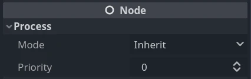

.. _doc_pausing_games:

Pausing games and process mode
==============================

Introduction
------------

In most games it is desirable to, at some point, interrupt the
game to do something else, such as taking a break or changing options.
Implementing a fine-grained control for what can be paused (and what cannot)
is a lot of work, so a simple framework for pausing is provided in
Godot.

How pausing works
-----------------

To pause the game the pause state must be set. This is done by assigning
``true`` to the :ref:`SceneTree.paused <class_SceneTree_property_paused>` property:

.. tabs::
 .. code-tab:: gdscript GDScript

    get_tree().paused = true

 .. code-tab:: csharp

    GetTree().Paused = true;

Doing this will cause two things. First, 2D and 3D physics will be stopped
for all nodes. Second, the behavior of certain nodes will stop or start
depending on their process mode.

.. note:: The physics servers can be made active while the game is
          paused by using their ``set_active`` methods.

Process Modes
-------------

Each node in Godot has a "Process Mode" that defines when it processes. It can
be found and changed under a node's :ref:`Node <class_Node>` properties in the inspector.

You can also alter the property with code:

.. tabs::
 .. code-tab:: gdscript GDScript

    func _ready():
        process_mode = Node.PROCESS_MODE_PAUSABLE

 .. code-tab:: csharp

    public override void _Ready()
    {
        ProcessMode = Node.ProcessModeEnum.Pausable;
    }

This is what each mode tells a node to do:  

-  **Inherit**: Process depending on the state of the parent,
   grandparent, etc. The first parent that has a non-Inherit state.
-  **Pausable**: Process the node (and its children in Inherit
   mode) only when the game is not paused.
-  **WhenPaused**: Process the node (and its children in Inherit
   mode) *only* when the game is paused.
-  **Always**: Process the node (and its children in Inherit
   mode) no matter what. Paused or not, this node will process.
-  **Disabled**: The node (and its children in Inherit
   mode) will not process at all.

By default, all nodes have this property in the "Inherit" state. If the
parent is set to "Inherit", then the grandparent will be checked and so
on. If a state can't be found in any of the grandparents, the pause state
in SceneTree is used. This means that, by default, when the game is paused
every node will be paused. Several things happen when a node stops processing.

The ``_process``, ``_physics_process``, ``_input``, and ``_input_event`` functions
will not be called. However signals still work and cause their connected function to
run, even if that function's script is attached to a node that is not currently being processed.

Animation nodes will pause their current animation, audio nodes
will pause their current audio stream, and particles will pause. These resume
automatically when the game is no longer paused.

It is important to note that even if a node is processing while the game is
paused physics will **NOT** work for it by default. As stated earlier this is
because the physics servers are turned off. The physics servers can be made
active while the game is paused by using their ``set_active`` methods.

Pause menu example
------------------

Start by creating a button that will be used to pause the game.

Create a menu containing a close button, set the **Process Mode** of the menu's root node
to **When Paused**, then hide the menu. Since the process mode is set to **When Paused**
on the root node, all its children and grandchildren will inherit that process mode.
This way, all the nodes in the menu will start processing when the game is paused.

Attach a script to the menu's root node, connect the pause button created earlier to a new method in
the script, and inside that method pause the game and show the pause menu.

.. tabs::
 .. code-tab:: gdscript GDScript

    func _on_pause_button_pressed():
        get_tree().paused = true
        show()

 .. code-tab:: csharp

    private void OnPauseButtonPressed()
    {
        GetTree().Paused = true;
        Show();
    }

Finally, connect the menu's close button to a new method in the script. Inside that method,
unpause the game and hide the pause menu.

.. tabs::
 .. code-tab:: gdscript GDScript

    func _on_close_button_pressed():
        hide()
        get_tree().paused = false

 .. code-tab:: csharp

    private void OnCloseButtonPressed()
    {
        Hide();
        GetTree().Paused = false;
    }

You should now have a working pause menu.
