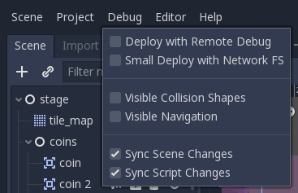
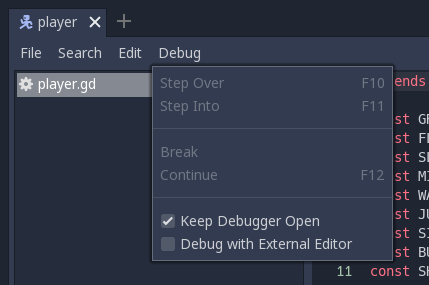
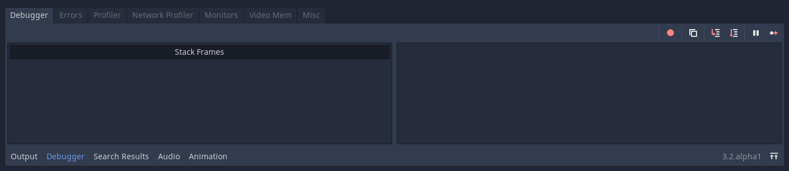
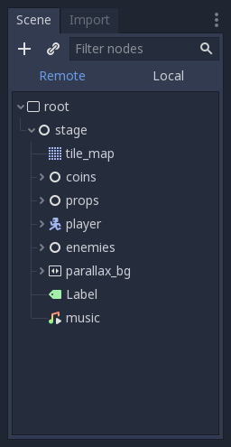

.. _doc_overview_of_debugging_tools:

Overview of debugging tools
===========================

This guide will give you an overview of the available debugging tools in the
engine.

Godot comes with a powerful debugger and profilers to track down bugs, inspect
your game at runtime, monitor essential metrics, and measure performances.
It also offers options to visualize collision boxes and navigation polygons
in the running game.

Finally, you have options to debug the game running on a remote device
and to reload changes to your scenes or your code while the game is running.

Debug menu options
------------------

There are a few common debug options you can toggle on or off when running
your game in the editor, which can help you in debugging your game.

You can find these options in the **Debug** editor menu.

Here are the descriptions of the options:

Deploy with Remote Debug
++++++++++++++++++++++++

When exporting and deploying, the resulting executable will attempt to connect
to the IP of your computer for debugging.

Small Deploy with Network FS
++++++++++++++++++++++++++++

This option speeds up testing for games with a large footprint on remote devices.

When **Small Deploy with Network FS** is on, instead of exporting the full game,
deploying the game builds a minimal executable. The editor then provides files
from the project over the network.

Also, on Android, the game is deployed using the USB cable to speed up deployment.

Visible Collision Shapes
++++++++++++++++++++++++

This option makes collision shapes and raycast nodes visible in the running game.

Visible Navigation
++++++++++++++++++

Navigation meshes and polygons will be visible on the running game.

Sync Scene Changes
++++++++++++++++++

With this option, any change you make to a scene in the editor at runtime
appears instantly. When used remotely on a device, this is more efficient
with the network filesystem.

Sync Script Changes
+++++++++++++++++++

Any script that is saved will be reloaded on the running game. When used
remotely on a device, this is more efficient with the network filesystem.

Script editor debug tools and options
-------------------------------------

The script editor has its own set of debug tools for use with breakpoints and
two options. The breakpoint tools can also be found in the **Debugger** tab
of the debugger.

The **Break** button causes a break in the script like a breakpoint would.
**Continue** makes the game continue after pausing at a breakpoint.
**Step Over** goes to the next line of code, and **Step Into** goes into
a function if possible. Otherwise, it does the same thing as **Step Over**.

The **Keep Debugger Open** option keeps the debugger open after a scene
has been closed. And the **Debug with External Editor** option lets you
debug your game with an external editor.

Debug project settings
----------------------

In the project settings, there is a **Debug** category with three subcategories
which control different things.

Settings
++++++++

These are some general settings such as printing the current FPS
to the **Output** panel, the maximum amount of functions when profiling
and others.

GDScript
++++++++

These settings allow you to toggle specific GDScript warnings, such as for
unused variables. You can also turn off warnings completely.

Shapes
++++++

Shapes are where you can adjust the color of shapes that only appear for
debugging purposes, such as collision and navigation shapes.

Debugging tools
---------------

You can find the debugger in the bottom panel. Click on **Debugger** to open it.

The debugger is split into several tabs, each focusing on a specific task.

Debugger
++++++++

The debugger tab opens automatically when the GDScript compiler reaches
a breakpoint in your code.

It gives you a `stack trace <https://en.wikipedia.org/wiki/Stack_trace>`__,
information about the state of the object, and buttons to control
the program's execution.

You can use the buttons in the top-right to:

- Skip all breakpoints. That way, you can save breakpoints for future
  debugging sessions.
- Copy the current error message.
- **Step Into** the code. This button takes you to the next line of code,
  and if it's a function, it steps line-by-line through the function.
- **Step Over** the code. This button goes to the next line of code,
  but it doesn't step line-by-line through functions.
- **Break**. This button pauses the game's execution.
- **Continue**. This button resumes the game after a breakpoint or pause.

Errors
++++++

This is where errors and warning messages are printed while running the game.

Profiler
++++++++

The debugger comes with three profilers for your processor, network operations,
and video memory.

The profiler is used to show why individual frames take as long as they do
to process and render.

Unlike other debugging tools, the profiler does not start automatically. It can
be started at any time during gameplay by pressing the start button. You can
even start the profiler before opening the game to profile startup performance.
It can also be started and stopped while the game is running without losing
information from when it was last running. The information it records won't
go away unless you click clear, or close the game, reopen it and start
the profiler again.

After starting and stopping the profiler you should see things being kept track
of on the left and a graph on the right. The items listed on the left are
everything that contributes to frame time, and they should each have a value
for time and calls for the current frame you are looking at.

The frame number in the top right tells you which frame you are currently
looking at. You can change this by using the up or down arrows, typing in the
frame number, or clicking on the graph.

If you want to add something to your graph, or think it looks too cluttered,
you can check and uncheck the box next to an item to add or remove it
from the graph.

Network Profiler
++++++++++++++++

The Network Profiler contains a list of all the nodes that communicate over the
multiplayer API and, for each one, some counters on the amount of incoming and
outgoing network interactions. It also features a bandwidth meter that displays
the total bandwidth usage at any given moment.

Monitors
++++++++

The monitors are graphs of several aspects of the game while its running such as
FPS, memory usage, how many nodes are in a scene and more. All monitors keep
track of stats automatically, so even if one monitor isn't open while the game
is running, you can open it later and see how the values changed.

Video Memory
++++++++++++

The **Video Mem** tab lists the video memory usage of the running game
and the resources using it.

Misc
++++

The **Misc** tab contains tools to identify the control nodes you are clicking
at runtime:

- **Clicked Control** tells you where the clicked node is in the scene tree.
- **Clicked Control Type** tells you the type of the node you clicked is.

Remote in scene dock
--------------------

When running a game in the editor two options appear at the top of the **Scene**
dock, **Remote** and **Local**. While using **Remote** you can inspect or change
the nodes' parameters in the running project.

.. note:: Some editor settings related to debugging can be found inside
          the **Editor Settings**, under the **Network > Debug** and **Debugger** sections.
