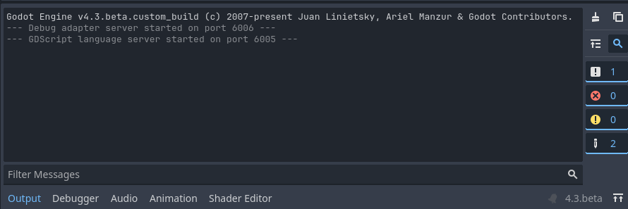
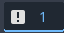
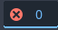
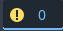
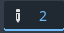
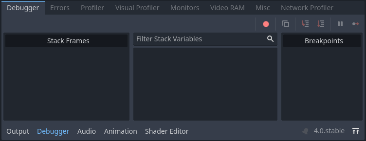
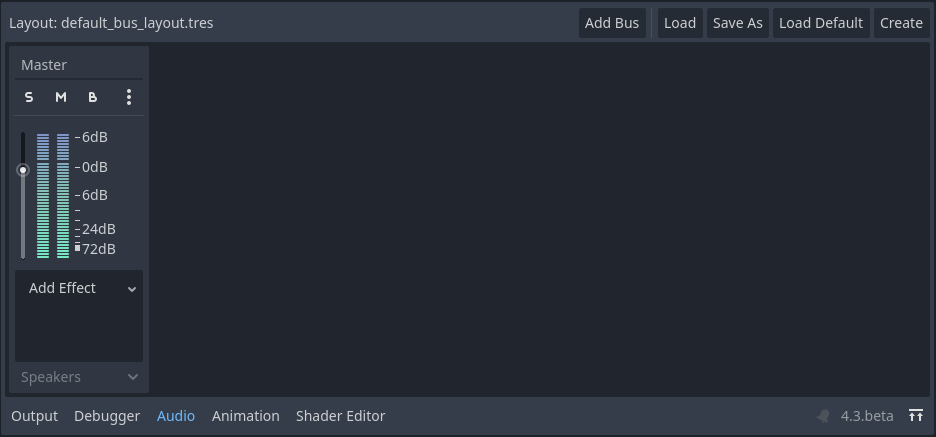
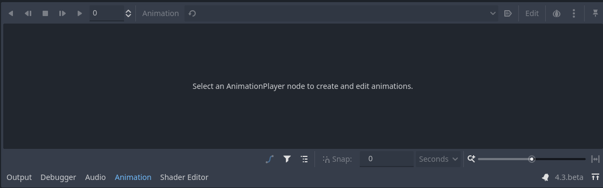
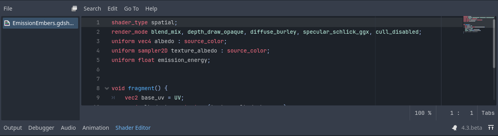

.. _doc_bottom_panel:

Bottom panel
------------

Bottom panel lies at the bottom of the Godot's editor. The default bottom panels 
at the startup are listed below, click on one page to read further about a
panel. Depending on the selected node, additional panels can be visible. 
If a panel is opened, its name is highlighted with blue.
Right next to the Godot's version will then also show the |expand| button to extend 
the opened panel to cover the viewport, which can be useful e.g., during 
debugging, or animation creation.

.. tip:: Shortcuts to toggle bottom panels as well as to perform 
  some actions, can be found in Editor Settings > Shortcuts > Bottom Panel.

Below is a list of default panels click on one to read more about it:

.. contents::
   :local:
   :depth: 2
   :backlinks: none

.. _doc_bottom_panel_output:

Output
~~~~~~

This panel shows the generated messages from the editor, or the 
running script or the game.

The broom button clears all shown messages. The button next to it copies the selected
messages into the clipboard.
Below the broom button is the collapse button for the duplicated messages. If
the same message is displayed consecutively, they will be shown as one, with the
indication of the repetition count. Clicking on it again will change its behaviour
to back.

The magnifier opens and focuses the search/filter bar. This lets you filter for 
a specific message, immediately as you type.

Below these four buttons, there is another set of four buttons with number 
indicators for filtering different types of messages. 

|info| This one is to show or hide the standard output messages, which are white.
In the game, these are the messages created with using e.g., using ``print()`` 
function.

|error| one is to display or hide error messages produced by the editor or the game. 
The error messages are red in the output. 

|warning| Similarly, this is to show or hide the warning messages, which are yellow.

|editor| This button is to show or hide messages produced by the editor, such as 
information or feedback on settings changes.

These buttons filter the messages even after they are generated, making them useful 
for finding what you are looking for as well as for debugging. The message count 
indicators will be blue if active; otherwise, they are grayed out.

.. _doc_bottom_panel_debugger:

Debugger
~~~~~~~~

The Debugger panel provides tools to debug your project. It includes a debugger and 
other tools such as a profiler and monitors to measure and observe how your 
game is performing.

See :ref:`doc_debugger_panel` for a detailed guide on debugging and this panel.

.. _doc_bottom_panel_audio:

Audio
~~~~~

This panel allows you to create audio buses (also known as `channels`) and add effects:

By default it has the master bus. **Add Bus** button adds additional buses. The next 
four buttons are to **Load**, **Save**, **Create** a new bus layout, or to 
**Load Default** layout.
**S**, **M**, and **B** on the buses are abbreviations for Solo, Mute, and 
Bypass.

Each bus can have different effects, and the settings of 
these effects are edited in the inspector dock after selecting one of the
added effects.
You can drag the buses to change the audio routing order.
You can also use the three-dot menu to duplicate, or delete the buses.
Master bus cannot be deleted.

To see a detailed guide on audio buses and effects, you can read 
:ref:`doc_audio_buses`.

.. _doc_bottom_panel_animation:

Animation
~~~~~~~~~

Godot's editor provides a powerful animation track editor, which 
you can see the results directly on the 2D or 3D screen, without requiring
you to run the game. If you open it without selecting an 
:ref:`AnimationNode <class_AnimationNode>`, it will be empty:

Refer to :ref:`Animation <toc-learn-features-animation>` for an in-depth manual
on animations.

.. _doc_bottom_panel_shader_editor:

Shader Editor
~~~~~~~~~~~~~

Shader Editor is a simplified version of Godot's Script Editor, with 
a highlighting support for the shader language. You can learn more 
on the Shaders in :ref:`doc_introduction_to_shaders` and read more on 
shading language here: :ref:`doc_shading_language`.

Godot provides a shading language based on 
`OpenGL Shading Language (GLSL) <https://www.khronos.org/opengl/wiki/OpenGL_Shading_Language>`__.
Instead of using Godot's Script Editor, shader files are written 
in the Shader Editor.
Shader Editor is empty at startup. You need to create a shader file, 
or open one to start working with:

Alternatively, double-clicking on an existing ``.gdshader`` 
or ``.gdshaderinc`` file in the FileSystem dock will also 
open the file in the Shader Editor.

While working with Shader Editor, you may consider expanding the panel 
with the expand button to have more space for coding.

The menus in the editor similar to the Godot's Script Editor menus.

- **File** menu provides options to create a new file, load (open) an existing file, 
  and save. You can also quickly open the viewed file in the inspector via this menu.
- **Search** menu allows you to search or replace in the file.
- **Go To** menu enables you to navigate to a specific line, create bookmarks and
  navigate through existing bookmarks.
- **Edit** menu provides options to perform actions on lines, or the selection, 
  providing a limited subset of the options in the Script Editor.
- **Help** takes you to the :ref:`Shading reference <toc-shading-reference>`
  page.

The |float| button next to the File menu allows you to float the editor, enabling 
you to move it to other monitors, for example. You can close it to restore its 
original location.

.. seealso:: To learn more on customizing docks, refer to
  :ref:`doc_customizing_editor`.
