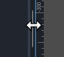
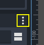
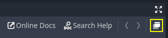
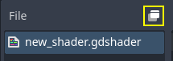
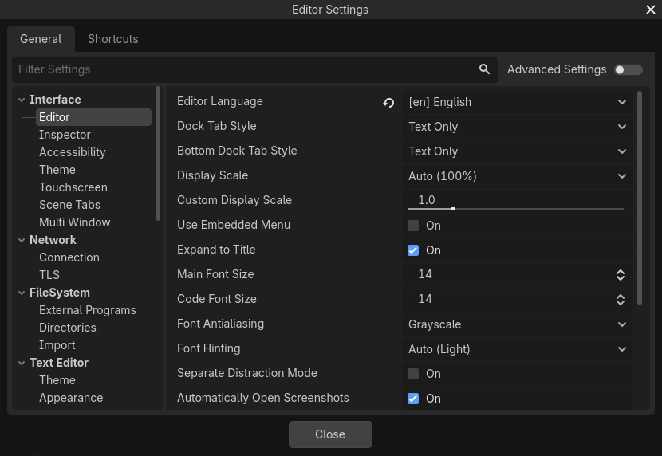

.. _doc_customizing_editor:

Customizing the interface
=========================

Godot's interface lives in a single window by default. Since Godot 4.0, you can
split several elements to separate windows to better make use of multi-monitor
setups.

.. _doc_customizing_editor_moving_docks:

Moving and resizing docks
-------------------------

Click and drag on the edge of any dock or panel to resize it horizontally or
vertically:

   Resizing a dock in the editor

Click the "3 vertical dots" icon at the top of any dock to change its location,
or split it to a separate window by choosing **Make Floating** in the submenu that appears:

   Moving a dock in the editor

To move a floating dock back to the editor window, close the dock window using
the **×** button in the top-right corner of the window (or in the top-left
corner on macOS). Alternatively, you can press :kbd:`Alt + F4` while the split
window is focused.

.. This page lacks information about:

    - Useful editor settings or sections of the settings window that are
      relevant to customizing the interface.
    - Layouts

Splitting the script or shader editor to its own window
-------------------------------------------------------

.. note::

    This feature is only available on platforms that support spawning multiple
    windows: Windows, macOS and Linux.

    This feature is also not available if **Single Window Mode** is enabled in
    the Editor Settings.

Since Godot 4.1, you can split the script or shader editor to its own window.

To split the script editor to its own window, click the corresponding button in
the top-right corner of the script editor:

   Splitting the script editor to its own window

To split the shader editor to its own window, click the corresponding button in
the top-right corner of the script editor:

   Splitting the shader editor to its own window

To go back to the previous state (with the script/shader editor embedded in the
editor window), close the split window using the **×** button in the top-right
corner of the window (or in the top-left corner on macOS). Alternatively, you
can press :kbd:`Alt + F4` while the split window is focused.

Customizing editor layouts
--------------------------

You may want to save and load a dock configuration depending on the kind of task
you're working on. For instance, when working on animating a character, it may
be more convenient to have docks laid out in a different fashion compared to
when you're designing a level.

For this purpose, Godot provides a way to save and restore editor layouts.
Before saving a layout, make changes to the docks you'd like to save. The
following changes are persisted to the saved layout:

- Moving a dock.
- Resizing a dock.
- Making a dock floating.
- Changing a floating dock's position or size.
- FileSystem dock properties: split mode, display mode, sorting order, file list
  display mode, selected paths and unfolded paths.

.. note::

    Splitting the script or shader editor to its own window is *not* persisted
    as part of a layout.

After making changes, open the **Editor** menu at the top of the editor then
choose **Editor Layouts > Save**. Enter a name for the layout, then click
**Save**. If you've already saved an editor layout, you can choose to override
an existing layout using the list.

After making changes, open the **Editor** menu at the top of the editor then
choose **Editor Layouts**. In the dropdown list, you will see a list of saved
editor layouts, plus **Default** which is a hardcoded editor layout that can't
be removed. The default layout matches a fresh Godot installation with no
changes made to the docks' positions and sizes, and no floating docks.

You can remove a layout using the **Delete** option in the **Editor Layouts**
dropdown.

.. tip::

    If you name the saved layout ``Default`` (case-sensitive), the default
    editor layout will be overwritten. Note that the ``Default`` does not appear
    in the list of layouts to overwrite until you overwrite it once, but you can
    still write its name manually.

    You can go back to the standard default layout by removing the ``Default``
    layout after overriding it. (This option does not appear if you haven't
    overridden the default layout yet.)

Editor layouts are saved to a file named ``editor_layouts.cfg`` in
the configuration path of the :ref:`doc_data_paths_editor_data_paths`.

Customizing editor settings
---------------------------

In the **Editor** menu at the top of the editor, you can find an **Editor
Settings** option. This opens a window similar to the Project Settings, but with
settings used by the editor. These settings are shared across all projects and
are not saved in the project files.

   The Editor Settings window

Some commonly changed settings are:

- **Interface > Editor > Editor Language:** Controls the language the editor
  displays in. To make English tutorials easier to follow, you may want to
  change this to English so that menu names are identical to names referred to
  by tutorials. The language can also be changed in the top-right corner of the
  project manager.
- **Interface > Editor > Display Scale:** Controls how large UI elements display
  on screen. The default **Auto** setting finds a suitable value based on your
  display's DPI and resolution. Due to engine limitations, it only takes the
  display-provided scaling factor on macOS, not on Windows or Linux.
- **Interface > Editor > Single Window Mode:** If enabled, this forces the
  editor to use a single window. This disables certain features such as
  splitting the script/shaders editor to their own window. Single-window mode
  can be more stable, especially on Linux when using Wayland.
- **Interface > Theme > Preset:** The editor theme preset to use. The **Light** theme
  preset may be easier to read if you're outdoors or in a room with sunlight.
  The **Black (OLED)** preset can reduce power consumption on OLED displays,
  which are increasingly common in laptops and phones/tablets.
- **FileSystem > Directories > Autoscan Project Path:** This can be set to a
  folder path that will be automatically scanned for projects in the project
  manager every time it starts.
- **FileSystem > Directories > Default Project Path:** Controls the default
  location where new projects are created in the project manager.
- **Editors > 3D > Emulate Numpad:** This allows using the top row 0-9 keys in
  the 3D editor as their equivalent numpad keys. It's recommended to enable this
  option if you don't have a number pad on your keyboard.
- **Editors > 3D > Emulate 3 Button Mouse:** This allows using the pan, zoom and
  orbit modifiers in the 3D editor even when not holding down any mouse button.
  It's recommended to enable this option if you're using a trackpad.

See the :ref:`class_EditorSettings` class reference for a complete description
of most editor settings. You can also hover an editor setting's name with the
mouse in the Editor Settings to show its description.
