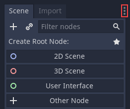

:article_outdated: True

.. _doc_customizing_editor:

Customizing the interface
=========================

Godot's interface lives in a single window. You cannot split it across multiple
screens although you can work with an external code editor like Atom or Visual
Studio Code for instance.

Moving and resizing docks
~~~~~~~~~~~~~~~~~~~~~~~~~

Click and drag on the edge of any dock or panel to resize it horizontally or
vertically.

.. image:: img/editor_ui_intro_editor_07.png

Click the three-dotted icon at the top of any dock to change its location.

Go to the ``Editor`` menu and ``Editor Settings`` to fine-tune the look and feel
of the editor.

.. This page lacks information about:

    - Useful editor settings or sections of the settings window that are
      relevant to customizing the interface.
    - Layouts
