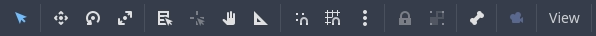

.. _doc_editor_interface:

Editor's Interface
==================

This section will explain the usage of the Godot Editor's interface and its elements.
It will also provide references to the pages if an element has detailed usage.
It assumes that you know the basics of Godot's terms and concepts. If this is 
not the case, please refer to the :ref:`doc_getting_started_intro`.

.. seealso:: To get a quick introduction to Godot's Project Manager and the Editor, 
  see :ref:`doc_intro_to_the_editor_interface`.

Overview
--------

The Godot's editor provides powerful and user-friendly tools to help you during your 
journey in 2D or 3D game development. To get a full list of features, you can refer 
to :ref:`doc_list_of_features`.

.. seealso:: To learn more about Godot's Project Manager, see :ref:`doc_project_manager`.

.. tip:: If you would like to directly jump to creating games with Godot, you can follow
  the :ref:`doc_your_first_2d_game` or :ref:`doc_your_first_3d_game` pages.
  
After creating or opening a project in :ref:`Project Manager <doc_project_manager>`, 
you will land in Godot's editor. Below is how the interface elements will be referred 
to in this document, as well as the subsequent chapters:

  Godot Editor with visible annotations of its elements.

Many actions performed using the mouse can also be executed using shortcuts. 
The documentation lists only the default shortcuts. Refer to :ref:`doc_default_key_mapping` 
for more details. Often, hovering over items or next to their action text displays 
the shortcut key to invoke them.

On the windows's topmost part, you will see the **main menus** on the left, the **workspace 
selector** in the middle with the :ref:`AssetLib <doc_what_is_assetlib>` next to it, 
the **playtest buttons** and **current renderer** on the right, by default.
Depending on the enabled plugins or changed Editor Settings, you may see additional
elements. For example, a plug-in provided workspace option.

Below the workspace buttons is the **scene switcher**.
With the |distraction-free| button on the far right, **distraction-free mode** can be 
toggled (default shortcut: :kbd:`Ctrl + Shift + F11`), which maximizes or 
restores the **viewport**'s size by hiding **docks** in the interface.

The large screen in the middle of the screen is the **viewport** with its **toolbar** 
just above. You can think the viewport as a level editor for 2D and 3D.

Viewport's toolbar will change based on the selected node and the current 
workspace. The following image is the default one for 2D workspace:

And the following is for the 3D one:

Below the viewport, are **bottom panels** that provide tools to view the game's output, 
debug it, or other tools to work with the nodes. Additional tools may appear if the 
selected node or resource has a resource with a tool associated. For example,
a Theme editor, or TileSet/TileMap editor.

At the right side of the bottom panel, you can see the |bell| icon and the Godot's **version**.
The bell icon displays warnings or errors as notification, which will disappear after some time.
Clicking on it shows the previous messages. An indicator will be visible if there is a new
message.
You can disable notifications by clicking on the bell, and pressing |bell-disable| button.
Clicking on the version copies the version information, which you can use during 
reporting issues.

Finally, on the either side of the viewport sit the **docks**, which you can customize
to your preference.

Interface Elements
------------------

Choose a topic from below to learn more about an interface element:

.. toctree::
   :maxdepth: 1
   :name: toc-editor-interface-elements
   
   main_menus
   workspace_selector
   playtest_buttons_and_renderer
   scene_switcher
   viewport
   bottom_panel
   docks
