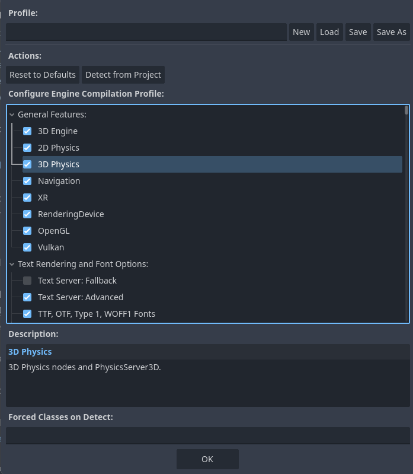

.. _doc_engine_compilation_config_editor:

Engine Compilation Configuration Editor
=======================================

The "Engine Compilation Configuration Editor" in Godot is a tool that allows developers 
to configure and customize the compilation settings for the Godot game engine 
while exporting your project as executable.
This includes options for enabling or disabling specific features, text rendering 
options, and nodes and classes.

By using this editor, developers can tailor the engine's compilation to suit their
specific project requirements, optimize for size, and manage the inclusion or 
exclusion of various engine features.

Usage
=====

To access the tool, navigate to `Project > Tools > Engine Compilation Configuration Editor...`.
You will see the following window:

Under "Configure Engine Compilation Profile", you will see a comprehensive set of 
options that you can enable or disable, grouped under "General Features", "Text 
Rendering and Font Options", and "Nodes and Classes".
By default, all features, font rendering options 
(except the :ref:`Text Fallback Server <class_TextServerFallback>`),
and classes will be active.
You can click on the items to read their descriptions below.

The settings affect the final size of the exported project; therefore, you may consider 
disabling the items that you will not need in your project.
For example, if you develop only 2D games and will never use a 3D-related node in your 
project, you may consider disabling `3D Engine` and `3D Physics` from the 
`General Feature` section.

In this window, you can create profiles to load later for different projects.
Type a name under `Profile` and save it. This will create a new `.build` file.

If you want to revert your changes back to the original values, you can use 
"Reset to Defaults."

You can also use the "Detect From Project" button if you want to quickly select only 
the nodes and classes that your project is using, and disable others automatically.

If you still want to have some nodes and resources selected even though you do not 
use them, you can force their selection by typing them under "Forced Classes on Detect."
Separate multiple node and class names by a comma (,). For example, writing 
``Bone2D, Line2D`` and pressing on "Detect from Project" will keep these two nodes 
selected even if the Godot does not detect them in the project's files.
