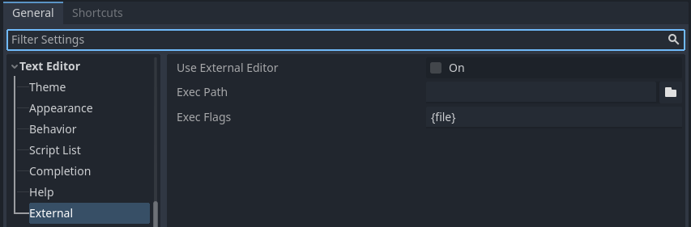
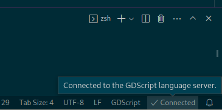

.. _doc_external_editor:

Using an external text editor
=============================

This page explains how to code using an external text editor.

.. note::

    To code C# in an external editor, see
    :ref:`the C# guide to configure an external editor <doc_c_sharp_setup_external_editor>`.

Godot can be used with an external text editor, such as Sublime Text or Visual
Studio Code. Browse to the relevant editor settings:
**Editor > Editor Settings > Text Editor > External**

   **Text Editor > External** section of the Editor Settings

There are two text fields: the executable path and command-line flags. The flags
allow you to integrate the editor with Godot, passing it the file path to open
and other relevant arguments. Godot will replace the following placeholders in
the flags string:

+---------------------+-----------------------------------------------------+
| Field in Exec Flags | Is replaced with                                    |
+=====================+=====================================================+
| ``{project}``       | The absolute path to the project directory          |
+---------------------+-----------------------------------------------------+
| ``{file}``          | The absolute path to the file                       |
+---------------------+-----------------------------------------------------+
| ``{col}``           | The column number of the error                      |
+---------------------+-----------------------------------------------------+
| ``{line}``          | The line number of the error                        |
+---------------------+-----------------------------------------------------+

Some example **Exec Flags** for various editors include:

+---------------------+-----------------------------------------------------+
| Editor              | Exec Flags                                          |
+=====================+=====================================================+
| Geany/Kate          | ``{file} --line {line} --column {col}``             |
+---------------------+-----------------------------------------------------+
| Atom                | ``{file}:{line}``                                   |
+---------------------+-----------------------------------------------------+
| JetBrains Rider     | ``{project} --line {line} {file}``                  |
+---------------------+-----------------------------------------------------+
| Visual Studio Code  | ``{project} --goto {file}:{line}:{col}``            |
+---------------------+-----------------------------------------------------+
| Vim (gVim)          | ``"+call cursor({line}, {col})" {file}``            |
+---------------------+-----------------------------------------------------+
| Emacs               | ``emacs +{line}:{col} {file}``                      |
+---------------------+-----------------------------------------------------+
| Sublime Text        | ``{project} {file}:{line}:{column}``                |
+---------------------+-----------------------------------------------------+

.. note::

    For Visual Studio Code on Windows, you will have to point to the ``code.cmd``
    file.

    For Emacs, you can call ``emacsclient`` instead of ``emacs`` if
    you use the server mode.

Using External Editor in Debugger
---------------------------------

Using external editor in debugger is determined by a separate option in settings.
For details, see :ref:`Script editor debug tools and options <doc_debugger_tools_and_options>`.

Official editor plugins
-----------------------

We have official plugins for the following code editors:

- `Visual Studio Code <https://github.com/godotengine/godot-vscode-plugin>`_
- `Emacs <https://github.com/godotengine/emacs-gdscript-mode>`_

LSP/DAP support
---------------

Godot supports the `Language Server Protocol <https://microsoft.github.io/language-server-protocol/>`_ (**LSP**) for code completion and the `Debug Adapter Protocol <https://microsoft.github.io/debug-adapter-protocol/>`_ (**DAP**) for debugging. You can check the `LSP client list <https://microsoft.github.io/language-server-protocol/implementors/tools/>`_ and `DAP client list <https://microsoft.github.io/debug-adapter-protocol/implementors/tools/>`_ to find if your editor supports them. If this is the case, you should be able to take advantage of these features without the need of a custom plugin.

To use these protocols, a Godot instance must be running on your current project. You should then configure your editor to communicate to the running adapter ports in Godot, which by default are ``6005`` for **LSP**, and ``6006`` for **DAP**. You can change these ports and other settings in the **Editor Settings**, under the **Network > Language Server** and **Network > Debug Adapter** sections respectively.

Below are some configuration steps for specific editors:

Visual Studio Code
^^^^^^^^^^^^^^^^^^

You need to install the official `Visual Studio Code plugin <https://github.com/godotengine/godot-vscode-plugin>`_.

For **LSP**, follow `these instructions <https://github.com/godotengine/godot-vscode-plugin#gdscript_lsp_server_port>`_ to change the default LSP port. The connection status can be checked on the status bar:

For **DAP**, specify the ``debugServer`` property in your ``launch.json`` file:

.. code-block:: json

    {
        "version": "0.2.0",
        "configurations": [
            {
                "name": "GDScript Godot",
                "type": "godot",
                "request": "launch",
                "project": "${workspaceFolder}",
                "port": 6007,
                "debugServer": 6006,
            }
        ]
    }

Emacs
^^^^^

Check the official instructions to configure `LSP <https://github.com/godotengine/emacs-gdscript-mode#auto-completion-with-the-language-server-protocol-lsp>`_, and `DAP <https://github.com/godotengine/emacs-gdscript-mode#using-the-debugger>`_.

