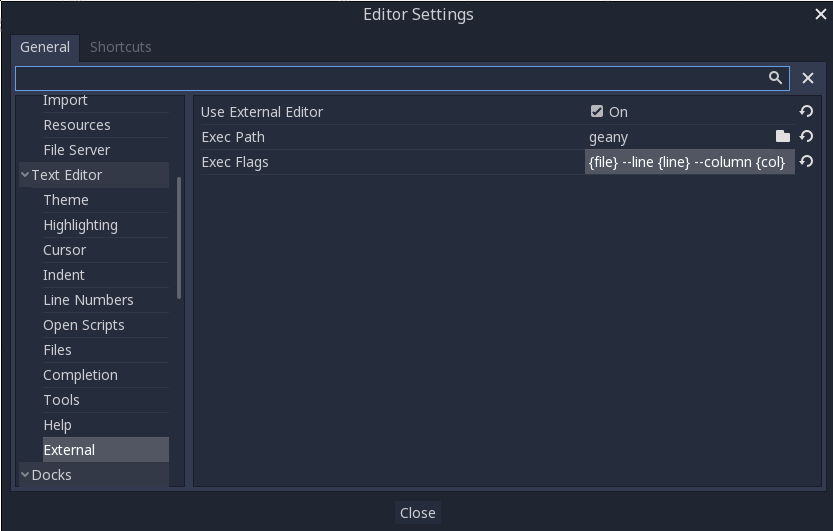

.. _doc_external_editor:

Using an external text editor
==============================

This page explains how to code using an external text editor.

Godot can be used with an external text editor, such as Sublime Text or Visual
Studio Code. Browse to the relevant editor settings: ``Editor -> Editor Settings
-> Text Editor -> External``

There are two fields: the executable path and command-line flags. The flags
allow you to integrate the editor with Godot, passing it the file path to open
and other relevant arguments. Godot will replace the following placeholders in
the flags string:

+---------------------+-----------------------------------------------------+
| Field in Exec Flags | Is replaced with                                    |
+=====================+=====================================================+
| ``{project}``       | The absolute path to the project directory          |
+---------------------+-----------------------------------------------------+
| ``{file}``          | The absolute path to the file                       |
+---------------------+-----------------------------------------------------+
| ``{col}``           | The column number of the error                      |
+---------------------+-----------------------------------------------------+
| ``{line}``          | The line number of the error                        |
+---------------------+-----------------------------------------------------+

Some example Exec Flags for various editors include:

+---------------------+-----------------------------------------------------+
| Editor              | Exec Flags                                          |
+=====================+=====================================================+
| Geany/Kate          | ``{file} --line {line} --column {col}``             |
+---------------------+-----------------------------------------------------+
| Atom/Sublime Text   | ``{file}:{line}``                                   |
+---------------------+-----------------------------------------------------+
| JetBrains Rider     | ``--line {line} {file}``                            |
+---------------------+-----------------------------------------------------+
| Visual Studio Code  | ``{project} --goto {file}:{line}:{col}``            |
+---------------------+-----------------------------------------------------+
| Vim (gVim)          | ``"+call cursor({line}, {col})" {file}``            |
+---------------------+-----------------------------------------------------+
| Emacs               | ``emacs +{line}:{col} {file}``                      |
+---------------------+-----------------------------------------------------+

.. note:: For Visual Studio Code, you will have to point to the ``code.cmd``
          file. For Emacs, you can call ``emacsclient`` instead of ``emacs`` if
          you use the server mode.

Official editor plugins
-----------------------

We have official plugins for the following code editors:

- `Visual Studio Code <https://github.com/godotengine/godot-vscode-plugin>`_
- `Emacs <https://github.com/godotengine/emacs-gdscript-mode>`_

Open editor with a script
-------------------------

For advanced behavior a script can be used to open the
external editor. The location of the script should be in a global directory.

For Unix the script with a `Shebang <https://en.wikipedia.org/wiki/Shebang_(Unix)>`__
replaces the executable path. For Windows the script interpreter replaces the executable path
and additionally the command-line flags contain the location of the script.

The following example opens a Visual Studio Code workspace if available.

.. tabs::
 .. code-tab:: python

    #!/usr/bin/env python3

    # Use vsCode as External Editor for Godot
    #
    # Settings to edit ( <...> must be replaced )
    #  - Unix
    #    - Exec Path  : <location-of-this-file> 
    #    - Exec FLags : {project} {file} {line} {col}
    #  - Windows
    #    - Exec Path  : <python-executable>
    #    - Exec Flags : <location-of-this-file> {project} {file} {line} {col}

    import os
    import shutil
    import sys

    # remove script location from args
    args = sys.argv[1:]

    # find vsCode workspace in project directory
    path = args[0]
    for filename in os.listdir(path):
        if filename.endswith(".code-workspace"):
            path = path + "/" + filename
            break

    # change this process to an instance of vsCode
    code = shutil.which("code")
    os.execl(code, "\""+code+"\"", "-g", path, args[1]+":"+args[2]+":"+args[3])

 .. code-tab:: javascript Javascript (Node)

    #!/usr/bin/env node

    /**
    * Use vsCode as External Editor for Godot
    * 
    * Settings to edit( <...> must be replaced )
    * - Unix
    *   - Exec Path: <location-of-this-file>
    *   - Exec FLags : {project} {file} {line} {col}
    * - Windows
    *   - Exec Path  : <node-executable>
    *   - Exec Flags : <location-of-this-file> {project} {file} {line} {col}
    */

    const cp = require('child_process')
    const fs = require("fs")

    //remove node and script location from args
    const args = process.argv.splice(2)

    //find vsCode workspace in project directory
    let path = args[0]
    const files = fs.readdirSync(path)
    for (let i = 0; i < files.length; i++) {
        const file = files[i]
        if (file.endsWith(".code-workspace")) {
            path = path + "/" + file
        }
    }

    //start vsCode in separate process
    cp.exec("code -g " + path + " " + args[1] + ":" + args[2] + ":" + args[3])

 .. code-tab:: typescript Typescript (Deno)

    #!/usr/bin/env -S deno run --allow-read --allow-run

    /**
    * Use vsCode as External Editor for Godot
    * 
    * Settings to edit( <...> must be replaced )
    * - Unix
    *   - Exec Path: <location-of-this-file>
    *   - Exec FLags : {project} {file} {line} {col}
    * - Windows
    *   - Exec Path  : <deno-executable>
    *   - Exec Flags : run --allow-read --allow-run <location-of-this-file>
    *                               {project} {file} {line} {col}
    */

    const args = Deno.args

    //find vsCode workspace in project directory
    let path = args[0]
    for await (const entry of Deno.readDir(path)) {
        if (entry.isFile && entry.name.endsWith(".code-workspace")) {
            path = path + "/" + entry.name
        }
    }

    //get correct vsCode name
    let code: string
    switch (Deno.build.os) {
        case "windows":
            code = "code.cmd";
            break;
        case "linux":
        case "darwin":
            code = "code"
            break;
    }

    //start vsCode in separate process
    await Deno.run({
        cmd: [code, path, "-g", args[1] + ":" + args[2] + ":" + args[3]],
    }).status()

::
