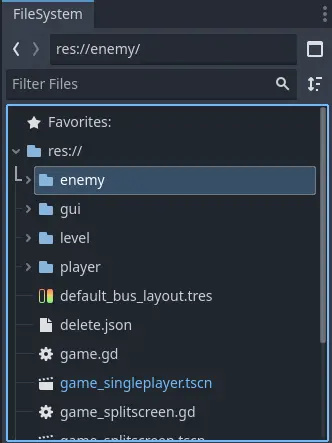

.. _doc_filesystem_dock:

FileSystem Dock
===============

FileSystem dock contains lists all resources available for the current project.
You can think it as a built-in file browser in the Godot's Editor.
The root folder is the :ref:`res:// <doc_filesystem>` folder.

The "<" and ">" arrows navigate between the previous and next selected file in the view history.
The text field next to the arrows shows the relative path to the selected file or folder.
Below this field is the location of all files and folders in the project.

The button next to the relative path field switches through the look of the contents. 
The square shows the resources in tree view, which the files and folders share the same location. 
Clicking on this button changes the split mode of the folders and files.
Clicking once lists the folders above and the subfolders or the files inside
the folders below. Clicking it again moves the folders to the left, and the subfolders and 
the files to the right.

In any viewing mode, you can use the "Filter Files" bar to search for a file or folder.
The button next to this bar provides a set of sorting options for the contents.
You can sort the contents by name, type, or modification time, in ascending or descending order.

If using a split mode, you can also change the look of thumbnails in the files section, by pressing
the button next to the sort button.

The blue ``.tscn`` file (Scene File) in the file list means that this scene is the main scene
if the project.
You can right click on any other scene files and choose "Set As Main Scene" to change it.
This can also later be changed via navigating to `Project > Project Settings > Run`.
You can also `instantiate` the scene or create a new scene by `inheriting` it using the context
menu on the scene files.

Hovering over a file gives information on the file size and the type.
Some resources can be dragged and dropped onto the 2D or 3D viewport if they are supported.
If a resource is accepted as a sub-resource, you can also drag it onto a sub-resource section 
inside the :ref:`doc_inspector_dock`.

Right-clicking on a folder or a file provides a set of options such as renaming, deleting, moving,
or duplicating.

Some of the interesting options are the following:

Note that, not all items will be visible for a single type of file.

- **Edit Dependencies...**: Shows a window with files that this file depends on. If you have
  missing dependencies, you can also pick replacements to fix them.
- **View Owners...**: Opens a window which shows the owners of a file. You can click on a result to 
  open it.
- **Create New**: Lets you create a new folder, scene, script, resource, or a text file inside a folder.
- **Copy Path**: Copies the relative path of the file or folder starting with ``res://``.
- **Copy Absolute Path**: Copies the absolute system path of a file or folder start.
- **Copy UID**: Copies the unique identifier of a resource if it has one. The path will start with ``uid://``.
  The UID will not change when the item is renamed or moved. See :ref:`ResourceUID <class_ResourceUID>` for more.
- **Add to Favorites**: Adds the selected file or folder to the favorites which will can easily be seen
  under `Favorites` section in the resource list.
- **Reimport**: If this file is a non-native resource, you can reimport them 
  
If you right click on a folder, you will have options to expand a folder or the hierarchy, or collapse it.
Also, "Set Folder Color..." submenu will be visible to change the color of the folder.

.. tip:: To move an item from one folder to another, you can drag and drop it directly onto 
  the destination folder.

.. tip:: Double-clicking a file opens the file if it can be opened inside the Editor.

.. seealso:: Refer to :ref:`doc_customizing_editor` for dock customization options.
