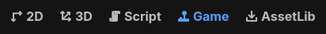
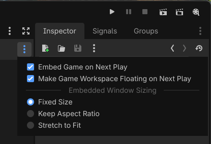
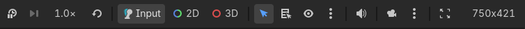
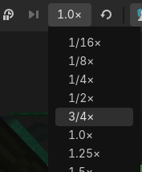

.. _doc_game_embedding:

Game embedding
==============

Godot supports optionally running the game in the editor itself. This is enabled by default.

.. note::

    Game embedding always runs the game in a separate process, no matter the embedding mode used.
    This means that if the game crashes, it will not crash the editor.

Configuring game embedding
--------------------------

Game embedding can be in one of 3 states:

- **Floating window** *(default)*: The game runs in a separate window, with a
  Game bar at the top that allows you to adjust settings and select nodes in the
  embedded game. Clicking the :button:`Game` main screen button focuses the
  floating window.
- **Main window:** The game runs in the editor, with a Game bar at the top that
  allows you to adjust settings and select nodes in the embedded game. Clicking
  the :button:`Game` main screen button switches to the tab with the running
  project.
- **Disabled:** The game runs in a separate window, as if it was an exported project.
  The Game bar at the top is not present; selecting nodes in the embedded game is not possible.

To configure this functionality, click the Game main screen at the top of the editor:

   Accessing the Game embedding main screen

Once on the Game main screen, click the dropdown menu at the top-right corner of the Game bar:

   Game embedding mode dropdown

Two options are available to configure the game embedding mode:

- **Embed Game on Next Play:** If enabled, game embedding is enabled and the
  Game bar is available for use on the running game.
- **Make Window Floating on Next Play:** If enabled, the game runs in a floating window.
  If disabled, the game runs in the main editor window.

Embedded window sizing
^^^^^^^^^^^^^^^^^^^^^^

As seen in the dropdown menu at the right of the Game bar, there are several
choices available to configure the embedded window size behavior. This affects
both floating window and main window embedding modes:

- **Fixed Size** *(default)*: Set the viewport size to a fixed resolution, as configured in the Project Settings.
  If both :ref:`display/window/size/window_width_override<class_ProjectSettings_property_display/window/size/window_width_override>`
  and :ref:`display/window/size/window_height_override<class_ProjectSettings_property_display/window/size/window_height_override>`
  are set above ``0``, this override is used instead.
- **Keep Aspect Ratio:** The viewport size stretches to match the game window size,
  but always follows the aspect ratio defined by the ``width / height`` as configured
  in the Project Settings.
- **Stretch to Fit**: The viewport size stretches to match the game window size,
  and may use an aspect ratio different than the one defined by the ``width / height``
  as configured in the Project Settings. This matches the behavior when game
  embedding is disabled.

These options have no effect when game embedding is disabled.

Features
--------

When game embedding is enabled, several features can be adjusted while the
project is running using the Game bar at the top.

   Game bar at the top of the embedded game window

In order from left to right:

Pause (F9)
^^^^^^^^^^

Pauses/resumes the game. When paused, the game will stop processing physics and
idle frames, but it will still render and process input. This allows you to
:ref:`select nodes in the scene <doc_game_embedding_interaction_mode>` and
inspect their properties in the editor inspector while the game is running.

Frame advance (F10)
^^^^^^^^^^^^^^^^^^^

Only available when the game is paused. Advances the game by one frame,
allowing you to inspect the state of the game at a specific moment in time.
This can be used to diagnose short-lived interactions (such as collisions)
that are hard to inspect when the game is running at full speed.

Game speed
^^^^^^^^^^

This option is a menu that can adjust the game speed. If the game sets
:ref:`Engine.time_scale <class_Engine_property_time_scale>` at runtime, it will
be multiplied by the value set here.

   Game speed dropdown at the left of the Game bar

This can be used to view interactions in slow motion, or speed up the game
significantly to test mechanics that normally take a long time to occur.

The reset button at the right of the dropdown resets the game speed to normal (1.0×).

.. tip::

    When adjusting the game speed using this mechanism, the physics tick rate
    (determined by the
    :ref:`physics/common/physics_ticks_per_second <class_ProjectSettings_property_physics/common/physics_ticks_per_second>`
    project setting) is automatically multiplied by the game speed.
    This allows the game logic to run at a different speed without affecting the
    physics simulation. For example:

    - If you set the game speed to 0.5, the physics tick rate is halved.
    - If you set the game speed to 4.0, the physics tick rate is quadrupled.

    The :ref:`maximum number of physics steps per frame <class_ProjectSettings_property_physics/common/max_physics_steps_per_frame>`
    is also increased to match the new physics tick rate, but it will not
    decrease below the default value when running in slow motion.

.. _doc_game_embedding_interaction_mode:

Interaction mode
^^^^^^^^^^^^^^^^

This controls the behavior when clicking or pressing keys while the embedded game window
has focus.

- **Input** *(default)*: Allow game input as usual.
- **2D:** Disable game input and allow to select Node2Ds, Controls, and
  manipulate the 2D camera.
- **3D:** Disable game input and allow to select Node3Ds and manipulate the 3D camera.

Nodes that are selected in the 2D or 3D modes can be inspected in the editor's
inspector, just like if they were selected in the editor. This allows you to
inspect and modify properties of nodes in the running game.

.. warning::

    Like in the Remote scene tree, changes made to the running game this way are
    not preserved when the game is stopped.

    To make changes that are preserved after stopping the game, you need to select
    the nodes in the editor's Local scene tree and modify them from there while the game
    is running instead. Make sure :menu:`Debug > Synchronize Scene Changes` is enabled
    when doing this.

Select mode
^^^^^^^^^^^

*Only effective if the interaction mode is 2D or 3D, not Input.*

When enabling this option, the "show list of selectable nodes at position
clicked" mode is disabled. However, you can still perform this action in select
mode by using :kbd:`Ctrl + Alt + Right mouse button` at the desired location.

Show list of selectable nodes at position clicked
^^^^^^^^^^^^^^^^^^^^^^^^^^^^^^^^^^^^^^^^^^^^^^^^^

*Only effective if the interaction mode is 2D or 3D, not Input.*

Like in the editor, this shows a list of selectable nodes at the position
clicked. This is useful when multiple nodes are overlapping and you want to
select a specific one. When enabling this option, select mode is disabled.

Toggle selection visibility
^^^^^^^^^^^^^^^^^^^^^^^^^^^

*Only effective if the interaction mode is 2D or 3D, not Input.*

By default, the selected node in 2D or 3D interaction mode is highlighted with
an orange rectangle or box (like in the editor).

When this option is enabled, it appears as a closed eye icon. Future selections
will not be highlighted in the game view, but are still selected for inspection
in the inspector. This is useful to avoid visual clutter.

Selection advanced options
^^^^^^^^^^^^^^^^^^^^^^^^^^

Two advanced options are available in the dropdown menu next to the select mode icons:

- **Don't Select Locked Nodes:** When enabled, nodes that are locked in the
  editor cannot be selected. This mimics editor behavior.
- **Select Group over Children:** When enabled, grouped nodes are selected
  instead of their individual children. This mimics editor behavior.

Mute game audio
^^^^^^^^^^^^^^^

This mutes game audio when enabled, without affecting the editor or other
applications. This is particularly useful on macOS and Android, which do not
come with a per-application volume slider out of the box.

Camera override
^^^^^^^^^^^^^^^

When enabled, the camera stops following the game camera. You can then move the
2D/3D camera freely by switching to the 2D/3D interaction mode and using the
typical navigation controls:

- In the 2D interaction mode, use the middle mouse button (or
  :kbd:`Space + Left mouse button`) to pan around and the mouse wheel to zoom.
- In the 3D interaction mode, hold the right mouse button and press :kbd:`W`,
  :kbd:`A`, :kbd:`S`, :kbd:`D` to use freelook. Use the middle mouse button to
  orbit, :kbd:`Shift + Middle mouse button` to pan, and the mouse wheel to zoom.
  Additionally, you can use :kbd:`Ctrl + Minus`, :kbd:`Ctrl + Plus` and :kbd:`Ctrl + 0`
  to control the field of view (relative to the game's own camera FOV).

This is useful to inspect parts of the scene that are not visible from the game
camera's point of view, or to inspect the game camera itself. When the camera
override is disabled, the camera will snap back to the game camera's point of
view.

When disabling camera override, the overridden camera's position and rotation
are not reset. This allows you to quickly toggle back and forth between the game
camera and the overridden camera.

.. note::

    If the camera override appears to be non-interactive, make sure to be in the
    2D or 3D interaction mode. The camera override will keep working while in
    the Input interaction mode, but you won't be able to move the overridden
    camera while in that mode (unless using the **Manipulate From Editors**
    camera override mode as described below).

    When overriding the 2D/3D camera, the project's scripts are not aware of
    this camera override. Keep this in mind when inspecting properties that
    depend on the camera position, as they will account for the original camera
    position instead.

Camera override options
^^^^^^^^^^^^^^^^^^^^^^^

- **Reset 2D/3D Camera:** Resets the 2D/3D camera to the position and rotation
  defined by the game. Note that the camera will still be frozen in place until
  you disable camera override.
- **Manipulate In-Game** *(default)*: The camera override is controlled from the game window.
  This allows controlling the camera without needing to switch back to the editor.
- **Manipulate From Editors:** The camera override is controlled from the editor
  window. This can be useful on multi-monitor setups where the editor can be
  displayed side-by-side with the running project. Also, when using this option,
  the camera override position can be remembered across project runs, since it
  will reuse the editor camera position directly when enabled.

.. note::

    The camera override may appear less smooth while using the
    **Manipulate From Editors** camera override mode, as a result of using
    local network communication between the editor and the game to
    update the camera position.

Limitations
-----------

Game embedding has a number of limitations to be aware of:

- On the Android editor, game embedding always uses a floating window.
  By default, the floating window is kept on top of the editor using Android's
  picture-in-picture functionality. This behavior can be disabled in the Game
  bar by unchecking :menu:`Keep on Top using PiP` in the menu at the right of
  the Game bar.
- Window mode changes (e.g. fullscreen) are not supported when using game embedding.
- When :menu:`Debug > Customize Run Instances...` is used to enable running with
  multiple instances, only the first instance will use game embedding. Other
  instances will spawn in their own window, without the Game bar at the top.
