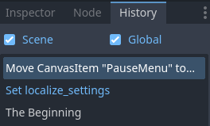

.. _doc_history_dock:

History Dock
============

If you are unhappy with a recent setting change you made in Godot, or you prefer the 
previous value of a node property, Godot keeps a list of actions in the `History` dock.
This history of actions is separate for each scene and is remembered until you close 
the project.

If you click on an item, the project will be reverted to that state. If you do not 
make any changes, you can change the state back and forth without losing anything.

You can choose whether to display the `Scene` related actions and include `Global` 
changes, such as changing an editor setting in Godot's Editor. Global changes will be 
displayed in blue text.

.. warning:: The changes made in the script/text editor are not displayed here.

.. tip:: Alternatively, you can use the `Scene` menu and select `Undo` or `Redo`, or use 
  the default :kbd:`Ctrl + Z` or :kbd:`Ctrl + Y` shortcuts (:kbd:`Cmd + Z` or
  :kbd:`Cmd + Z` on Mac).

.. seealso:: Refer to :ref:`doc_customizing_editor` for dock customization options.
