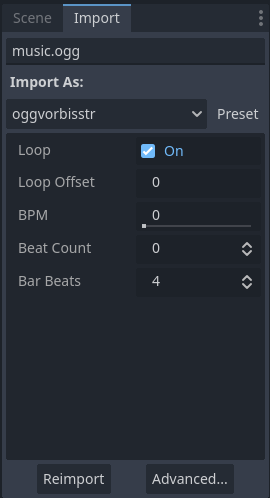

.. _doc_import_dock:

Import Dock
===========

Import dock allows you to change the importing parameters of non-native resources 
before importing them into your project.

By default, it is located next to the Scene Dock.

  Adjustable parameters while importing an OGG file

It employs numerous parameters for different types, therefore the detailed usage is
explained in :ref:`doc_import_process`.

To see in detail which parameters you can change, choose the respective type's class reference
from :ref:`ResourceImporter <class_ResourceImporter>`.

.. seealso:: Refer to :ref:`doc_customizing_editor` for dock customization options.
