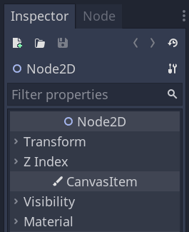
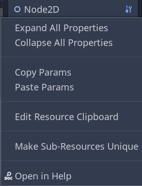

:article_outdated: True

.. _doc_editor_inspector_dock:

The Inspector
=============

This page explains how the Inspector dock works in-depth. You will learn how to edit properties, fold and unfold areas, use the search bar, and more.

.. warning:: This page is a work-in-progress.

Overview of the interface
-------------------------

Let's start by looking at the dock's main parts.

At the top are the file and navigation buttons.

Below it, you can find the selected node's name, its type, and the tools menu on the right side.

If you click the tool menu icon, a drop-down menu offers some view and edit options.

Then comes the search bar. Type anything in it to filter displayed properties. Delete the text to clear the search.

.. break down inspector content in class name, property categories that are foldable, and individual properties.

.. Using the buttons at the top.
.. Using the tool menu
.. List each property type and how to edit it
.. For numerical inputs, mention and link to a page about formulas
