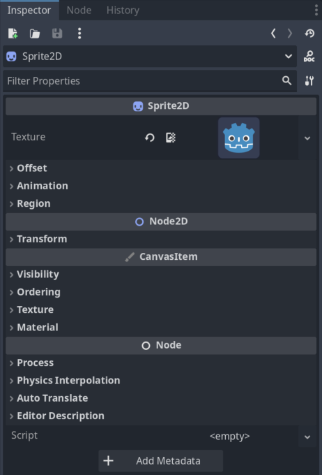
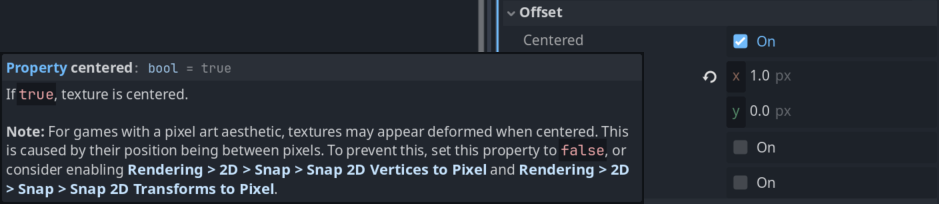
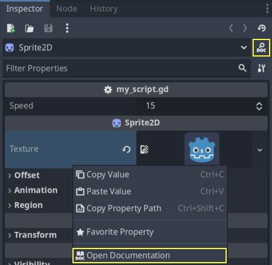
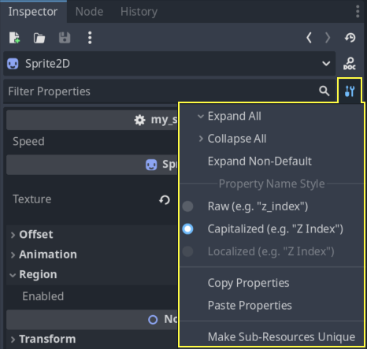
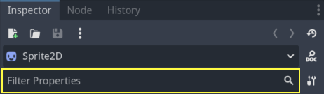
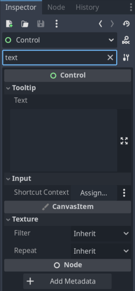
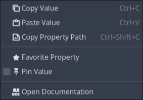
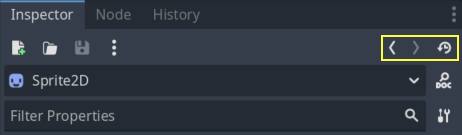
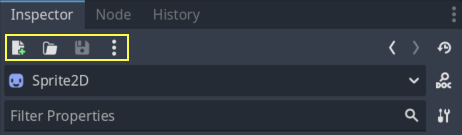
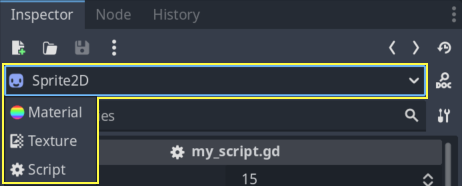

.. _doc_editor_inspector_dock:

The Inspector
=============
Overview of the interface
-------------------------
The **Inspector dock** is located on the right side of the editor. It is used to 
edit :ref:`Node<class_node>` properties, create and manage 
:ref:`Resources<doc_resources>`, and provide easy access to documentation for 
selected objects and their properties.

Viewing documentation
~~~~~~~~~~~~~~~~~~~~~
**Tooltips** are essential for understanding the numerous properties you'll 
encounter in the Inspector. The property's description and documentation are 
shown in a tooltip when you mouseover the property's label.

.. tip:: Tooltip documentation can also be added to your custom properties 
    written in GDScript. See 
    :ref:`GDScript documentation comments<doc_gdscript_documentation_comments>` 
    for more information.
 
The Inspector has two buttons that open full documentation pages in the 
**Script Editor** workspace:

- **Object Documentation Button**: Opens documentation for the selected object.
- Select **Open Documentation** from a property's right-click context menu to 
  open the selected object's documentation and jump to the designated property 
  entry.

Managing object properties
--------------------------
The **Manage Object Properties** button menu has the following options:

- **Expand All**: Expand all the collapsible property groups.
- **Collapse All**: Collapse all the property groups.
- **Expand Non-Default**: Expand only the property groups that contain edited 
  properties.
- **Raw (e.g. "z_index")**: Display the actual property name on labels, without 
  formatting.
- **Capitalized (e.g. "Z Index")**: Format property labels with capital letters 
  and spaces between words.
- **Localized**: Display property label localized to the editor language, if 
  available.
- **Copy Properties**: Copy all property values on the selected object to the 
  clipboard.
- **Paste Properties**: Paste all property values from the clipboard to the 
  selected object, where applicable.
- **Make Sub-Resources Unique**: Make all of the selected object's shared 
  *Sub-Resources* unique, so that edits to the Sub-Resource are not shared 
  between each object that references it.

- **Filter Properties**: Search for and filter properties and property groups in 
  the Inspector.

.. note:: The **Filter Properties** text field uses *smart typing*, which means 
    you only need to enter partial words to begin searching. Notice in the above 
    screenshot how filtering by "text" results in properties that include the 
    words "Text" and "Context", as well as the *CanvasItem* property group named 
    "Texture".

A property's right-click context menu has the following options:

- **Copy Value**: Copy property value to the clipboard.
- **Paste Value**:  Paste property value from the clipboard.
- **Copy Property Path**: Copy the unformatted property name. e.g. "flip_h" is 
  the path for the property labeled "Flip H".
- **Favorite/Unfavorite Property**: Place the property at the top of the 
  inspector for all objects of the selected class.
- **Pin Value**: Pin a value to force it to be saved, even if it's equal to the 
  default value.
- **Open Documentation**: Open the selected object's documentation in the 
  **Script Editor** and jump to the designated property entry.  

.. tip:: Use **Pin Value** when the default value on a custom script is adequate 
    and does not need to be changed in the Inspector, but there's a possibility 
    that it may be changed in the code later. 
    
    For example, consider a scenario where ``var speed = 15`` is refactored to 
    ``var speed`` by a programmer cleaning up property initializations. 
    With a pinned ``speed`` property there's no need to manually change the new 
    default value of ``0`` back to ``15`` in the Inspector. This removes the 
    chance of potential errors that may be introduced with such a task 
    (miscommunication with a designer working in the Inspector, forgetting to 
    update documentation, etc.)

Navigating the inspector history
~~~~~~~~~~~~~~~~~~~~~~~~~~~~~~~~
Navigate through the history of selected objects with the three buttons at the 
top right of the Inspector:

- **Previous**: Go to previous edited object in history.
- **Next**: Go to next edited object in history.
- **View History**: List of recently edited objects.

.. tip:: Use the Inspector history to jump between commonly used objects without 
    having to find and select them every time from the Viewport, Scene dock, or 
    FileSystem dock.

Creating and managing resources
-------------------------------
Create, load, save, and manage Resources with the four buttons at the top left 
of the Inspector:

- **New**: Create a new resource in memory and edit it.
- **Load**: Load an existing resource from disk and edit it.\
- **Save**: Save the currently edited resource.\
- **More Options**: Edit Resource from Clipboard, Copy Resource, Show in 
  FileSystem, Make Resource Built-In

View and select all of a Node's Sub-Resources with the Node's dropdown menu:

.. note:: For more information on the different types of Resources, see the 
    :ref:`Resource API page <class_resource>`.
    
    Detailed instructions on how to use the Inspector to create and edit 
    Resources are available in the 
    :ref:`manual's Resources section<doc_resources>`.

Numeric property field shortcuts
--------------------------------

Numeric properties in the Inspector can be set using many of Godot's built-in 
mathematical expressions and constants. For example, you can enter ``randf()`` 
to set a property's value to a random float between ``0.0`` and ``1.0``, or 
write an operation like ``4*7.5/PI``.

.. note:: For a list of mathematical methods and constants in Godot, see the 
    :ref:`GDScript API page <class_@gdscript>`

Move keyboard focus between properties:

+-------------------------+--------------------+--------------------+
| Shortcut Key Action     | Windows, Linux     | macOS              |
+=========================+====================+====================+
| Next property field     | :kbd:`Tab`         | :kbd:`Tab`         |
+-------------------------+--------------------+--------------------+
| Previous property field | :kbd:`Shift + Tab` | :kbd:`Shift + Tab` |
+-------------------------+--------------------+--------------------+

Left click and drag a numeric property value to change it in ``0.005`` increments (on 
macOS it will be ``0.01`` increments). Hold the following modifier keys for 
additional control:

+-------------------------------------------------------+----------------+--------------+
| Modifier Key Action                                   | Windows, Linux | macOS        |
+=======================================================+================+==============+
| Increase/Decrease value by ``1`` and round to integer | :kbd:`Ctrl`    | :kbd:`Cmd`   |
+-------------------------------------------------------+----------------+--------------+
| Increase/Decrease value by ``0.001``                  | :kbd:`Shift`   | :kbd:`Shift` |
+-------------------------------------------------------+----------------+--------------+

Use :kbd:`Up Arrow` and :kbd:`Down Arrow` to change a numeric property value in 
``1.0`` increments. Hold the following modifier keys for additional control:

+------------------------------------+----------------+--------------+
| Modifier Key Action                | Windows, Linux | macOS        |
+====================================+================+==============+
| Increase/Decrease value by ``0.1`` | :kbd:`Alt`     | :kbd:`Opt`   |
+------------------------------------+----------------+--------------+
| Increase/Decrease value by ``10``  | :kbd:`Shift`   | :kbd:`Shift` |
+------------------------------------+----------------+--------------+
| Increase/Decrease value by ``100`` | :kbd:`Ctrl`    | :kbd:`Cmd`   |
+------------------------------------+----------------+--------------+