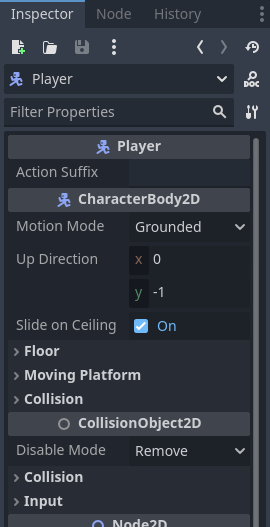
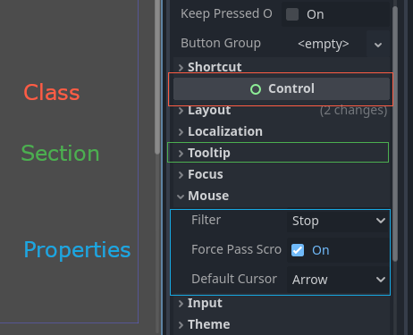
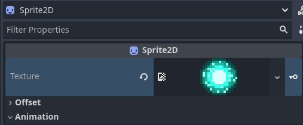
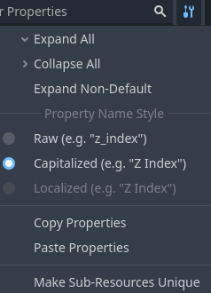

.. _doc_editor_inspector_dock:

Inspector Dock
===============

The Inspector dock lists all properties of an object, resource, or node.
It will update the list of the properties as you select a different node from the 
Scene Tree dock, or if you use **Open** command from the FileSystem's context menu.

This page explains how the Inspector dock works in-depth. You will learn how to edit 
properties, fold and unfold areas, use the search bar, and more.

Usage
-----

If the inspector dock is visible, clicking on a node in the scene tree will automatically
display its properties.
If it is not visible, you can show it by navigating to
**Editor > Editor Docks > Inspector**.

At the top of the dock are the file and navigation buttons.

From left to right:

- Opens a new window to select and create a resource in the memory and edit it.
- Opens a resource from the FileSystem to edit.
- Saves the currently edited resource to disk.
- Provides options to:

  - **Edit Resource from Clipboard** by pasting the copied resource.
  - **Copy Resource** to clipboard.
  - **Show in FileSystem** if the resource is already saved.
  - **Make Resource Built-In** to work in a built-in resource, not the one from the disk.
  
- The "<" and ">" arrows let you navigate through your edited object history.
- The button next to them opens the history list for a quicker navigation. If you created multiple 
  resources in the memory, you will also see them here.

Below, you can find the selected node's icon, its name, and the quick button to open 
its documentation on the right side.
Clicking on the node's name itself will list the sub-resources of this node if there are any.

Then comes the search bar. Type anything in it to filter displayed properties. 
Delete the text to clear the search.
This search is case insensitive and also searches letter by letter as you type.
For instance, if you type ``vsb``, one of the results you see will be
Visibility property as this property contains all of these letters.

Before discussing the tool button next to the filter bar, it is worth mentioning 
what you actually see below it and how it is structured.

Properties are grouped inside their respective *classes* as *sections*.
You can expand each section to view the related properties.

You can also open the documentation of each class by right-clicking on a class
and selecting **Open Documentation**.
Similarly, you can right click on a property and copy or paste its value,
copy the property path, favorite it to be shown on the top of the inspector, or open its 
documentation page.

If you hover your mouse over a property, you will see the description of what 
it does as well as how it can be called inside the script.

You can directly change the values by clicking, typing, or selecting from the menu.
If the property is a number or a slider, you can keep your left mouse button 
pressed and drag to change the values.

If a node's property is a sub-resource, you can click on the down arrow to pick a 
resource type, or load one using the **Quick Load** or **Load** options.
Alternatively, a supported resource can be dragged from the FileSystem.
Once you start dragging, the compatible property will be highlighted.
Simply drop it on the appropriate property's value.

After loading a sub-resource, you can click on it to see its properties or adjust them.

The values with different values than their original values will have a revert icon (|undo|).
Clicking on this icon reverts the value to its original state.
If the values are linked with each other, they will have a chain icon and changing one
will change others as well. You can unchain them by clicking on this icon.

If you are changing a property a lot, you may consider favoriting it by right-clicking and
choosing **Favorite Property**. This will show it at the top of the inspector for all objects 
of this class.

Now that we have a better understanding of the terms, we can proceed with the tool menu. 
If you click the tool menu icon next to the filter bar, a drop-down menu will offer
various view and edit options.

- **Expand All**: Expands all sections showing all available properties.
- **Collapse All**: Collapses all properties showing only classes and the sections.
- **Expand Non-Default**: Only expands the sections where the original value is different
  than the current value (the properties with a revert icon (|undo|)).
- **Property Name Style**: This section determines how the properties' text is displayed in 
  the inspector. ``Raw`` uses the property's own naming, ``Capitalized`` uses title 
  case by changing the initial letters of each word to uppercase and removing underscores, 
  ``Localized`` displays the translation of the properties if you are using the Editor 
  in a language other than English.
- **Copy Properties**: Copies all properties of the current node with their current values.
- **Paste Properties**: Pastes the copied properties from the clipboard. Useful to apply 
  the common properties of one node to another.
- **Make Sub-Resources Unique**: By default, a duplicated node shares the sub-resources of
  the original node. Changing one parameter of the sub-resource in one node, affects 
  the other one.
  Clicking this option makes each sub-resource used in this node unique, separated from 
  other nodes.

.. tip:: If a node has exported variables in its attached script, you will also see these 
  in the inspector. The first image in this section has one for the Player node:
  `Action Suffix`. See :ref:`doc_gdscript_exports` for more on this topic.

.. seealso:: Refer to :ref:`doc_customizing_editor` for dock customization options.

.. break down inspector content in class name, property categories that are foldable, and individual properties.

.. Using the buttons at the top.
.. Using the tool menu
.. List each property type and how to edit it
.. For numerical inputs, mention and link to a page about formulas
.. Refer to :ref:`doc_filesystem_dock`
