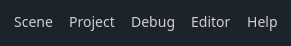
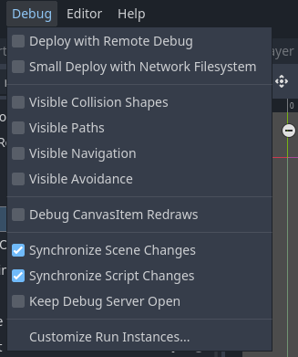

.. _doc_main_menus:

Main menus
==========

The Godot's main menu includes options for managing scenes, project, accessing editor 
settings, tools, and help resources:

Below, each menu and their items will be explained.
Choose a menu from the list below to learn more about its contents:

.. contents::
   :local:
   :depth: 2
   :backlinks: none

.. _doc_main_menus_scene:

Scene
-----

This menu contains items to perform scene-related actions. If not stated otherwise, the 
actions are applied to the currently opened scene:

- **New Scene**: Creates a new empty scene in the project.
- **New Inherited Scene**: Opens a file dialog to create a new scene from a ``.tscn`` file.
- **Open Scene**: Opens a file dialog to open a previously saved scene from the project's folder.
- **Reopen Closed Scene**: Opens the last closed scene's tab.
- **Open Recent**: Provides a list of recently opened scenes.
- **Save Scene**: Saves the current scene into file. If no file is present, it first asks you to
  choose a name for it.
- **Save Scene As**: Saves the current scene into a different file and uses this file for further
  "Save Scene" actions.
- **Save All Scenes**: Saves all scenes with unsaved changes.
- **Quick Open**: Opens the quick find window to find and open a resource within the project folder.
- **Quick Open Scene**: Similar to Quick Open, but filters the list, searching only within scenes.
- **Quick Open Script**: Similar to quick open, but filters the list, searching only within scenes.
- **Export As**: Allows to export the current scene as :ref:`MeshLibrary <doc_using_gridmaps>` or 
  :ref:`gITF 2.0 Scene <doc_exporting_3d_scenes>`. Choosing any of them will open the export window 
  to change the export settings.
- **Undo**: Reverses the most recent action in the current scene listed in the History dock's list.
- **Redo**: Reapplies the last undo operation. This action can be repeated if History dock 
  contains more actions in the list.
- **Reload Saved Scene**: Reopens the last saved state of the scene.
- **Close Scene**: Closes the currently opened scene.
- **Quit**: Exits the editor.

.. _doc_main_menus_project:

Project
-------

This menu provides project-related items:

- **Project Settings**: Opens a window to change all project relevant settings. You can 
  search for a specific setting using the filter bar. See :ref:`doc_project_settings` 
  for more details.
- **Version Control**: Provides actions to work with Version Control Systems (VCS). See 
  :ref:`doc_version_control_systems` for more on items under this item.
- **Export**: Opens a window to export your project as standalone binaries to different 
  platforms supported in Godot. More details on exporting refer to 
  :ref:`doc_exporting_projects`.
- **Open User Data Folder**: Opens the user data folder in the operating system's file 
  explorer. To see which folder is the user data folder, see 
  :ref:`doc_data_paths_persistent_user_data`.
- **Tools**: Contains some tools related to the project. It can also include additional 
  tools from plugins if a plugin provides one. By default, the following tools are listed:

  - **Orphan Resource Explorer**: Lists resources without owners.
  - **Engine Compilation Configuration Profile**: Lets you configure the Godot Engine's 
    features to export while compiling your project to reduce the binary size.
  - **Upgrade Mesh Surfaces**: Upgrades the meshes used in the project if they are 
    created or imported prior to Godot 4.2. Choosing it will show a confirmation dialog 
    with an information without performing any actions.
  - **C#**: If you are using Mono version of Godot, an additional menu will provide
    an option to `Create a C# Solution`.
  - **Download Project Source**: (This option will only be available in Web version).
    Allows you to download the project as a ZIP file packing all resources in it.

- **Reload Current Project**: This action reloads the current project, prompting the user 
  to discard or save any changes made in the project. The project will be reopened exactly 
  as you left it.
- **Quit to Project List**: Closes the editor and opens Project Manager.

.. _doc_main_menus_debug:

Debug
-----

There are a few common debug options you can toggle on or off when running your game in the 
editor, which can help you in debugging your game. If you hover over the items, you will 
get more information on the items.
Below, a brief description of each item is given:

- **Deploy with Remote Debug**: When exporting and deploying, the resulting executable will attempt to 
  connect to the IP of your computer for debugging.
- **Small Deploy with Network Filesystem**: Speeds up testing for games with a large footprint on 
  remote devices. If selected, instead of exporting the full game, deploying the game builds a minimal 
  executable. The editor then provides files from the project over the network.
  Also, on Android, the game is deployed using the USB cable to speed up deployment.
- **Visible Collision Shapes**: Toggles collision shapes' and raycast nodes' visibility in the running 
  game. You can configure the color of each shape in the inspector dock.
- **Visible Paths**: Toggles curve resources' visibility in the running game.
- **Visible Navigation**: Toggles navigation meshes' and polygons' visibility on the running game. You
  may need to enable `Debug` property to see it visible.
- **Visible Avoidance**: Toggles avoidance objects' visibility on the running game.
- **Debug Canvas Redraws**: Toggles the visibility of redraw requests of 2D objects as flashes, which 
  can be used to troubleshoot low processor mode.
- **Synchronize Scene Changes**: Toggles the direct synchronization of changes you make to a scene 
  in the editor at runtime. When used remotely on a device, this is more efficient with the network 
  filesystem.
- **Synchronize Script Changes**: Toggles direct the synchronization of scripts on the running game 
  by reloading them if any script is saved. When used remotely on a device, this is more efficient 
  with the network filesystem.
- **Keep Debug Server Open**: Determines whether to keep the debug server open to enable debugging using 
  an external editor to debug.
- **Customize Run Instances**: Allows you to create run configurations by specifying custom launch 
  arguments or feature tags for your game, for example, if you want to test the demo version of your 
  game, simply specify it as a feature, and check it in your game. This is also useful while debugging
  multiplayer games. Read :ref:`doc_overview_of_debugging_tools_run_instances` for more on
  this.

.. note:: To learn more on Debugging, read the :ref:`Debug <toc-learn-features-debug>` section.

..
  _ Debug page is outdated

.. _doc_main_menus_editor:

Editor
------

Godot's editor can be customized as your liking. This menu provides the following items:

- **Editor Settings**: Allows you to change Editor's settings, grouped by sections, and shortcuts, 
  grouped by areas, where they can be used. For all settings and their descriptions, see 
  :ref:`EditorSettings <class_EditorSettings>`. For default shortcuts, see 
  :ref:`doc_default_key_mapping`.
- **Command Palette**: Opens a searchable list to execute some menu or button commands, quickly.
- **Editor Docks**: Provides the list of available docks in the editor. Closed docks can be reopened
  by clicking on its name. If the clicked dock is already visible in the editor, it will be focused.
- **Editor Layout**: Provides options to save the current layout to be opened later. This can be used to 
  quickly to change the position and sizing of the current docks. You can read more on which changes 
  are saved on :ref:`doc_customizing_editor`. You can switch to created layouts or delete them.
- **Take Screenshot**: Takes a screenshot of the editor, saves into the 
  :ref:`user data folder <doc_data_paths_persistent_user_data>` and opens this folder with the 
  operating systems's default file explorer.
- **Toggle Fullscreen**: Maximizes the editor's window, hides window title and the taskbar, or reverts 
  it back.
- **Open Editor Settings/Data Folder**: Opens the editor's data folder in the file explorer of operating 
  system. To see which folder is the editor's data folder, see :ref:`doc_data_paths_editor_data_paths`.
- **Manage Editor Features**: Allows you to create profiles and limit the available features 
  usable in the Godot editor with profiles. More on this can be read in 
  :ref:`doc_managing_editor_features`.
- **Manage Export Templates**: Opens a window to manage export templates to be used while exporting your 
  game. See :ref:`doc_exporting_projects_export_templates` for more.
- **Configure FBX Importer**: Shows a dialog to specify the path for the FBX importer. 
  See :ref:`EditorSceneFormatImporterFBX <class_EditorSceneFormatImporterFBX2GLTF>` to read more.

.. _doc_main_menus_help:

Help
----

- **Search Help**: Opens a dialog to look for information about a class, method, property, constant, 
  or signal.
- **Online Documentation**: Opens the official Godot documentation page in the browser, accessible at 
  `<https://docs.godotengine.org/>`__.
- **Forum**: Opens the community forums in the browser, which is accessible at 
  `<https://forum.godotengine.org/>`__.
- **Community**: Opens the official community hub in the browser, which is accessible 
  at `<https://community.godotengine.org/>`__.
- **Copy System Info**: Copies Godot version, operating system, renderer and processor information 
  into clipboard.
- **Report a Bug**: Opens the Godot issue tracker in the browser.
- **Suggest a Feature**: Opens the proposal tracker in the browser.
- **Send Docs Feedback**: Opens the Godot Documentation's issue tracker in the browser.
- **About Godot**: Displays information on the Godot Engine, such as, version, authors, licenses, etc.
- **Support Godot Development**: Opens the donation page of Godot in the browser.
