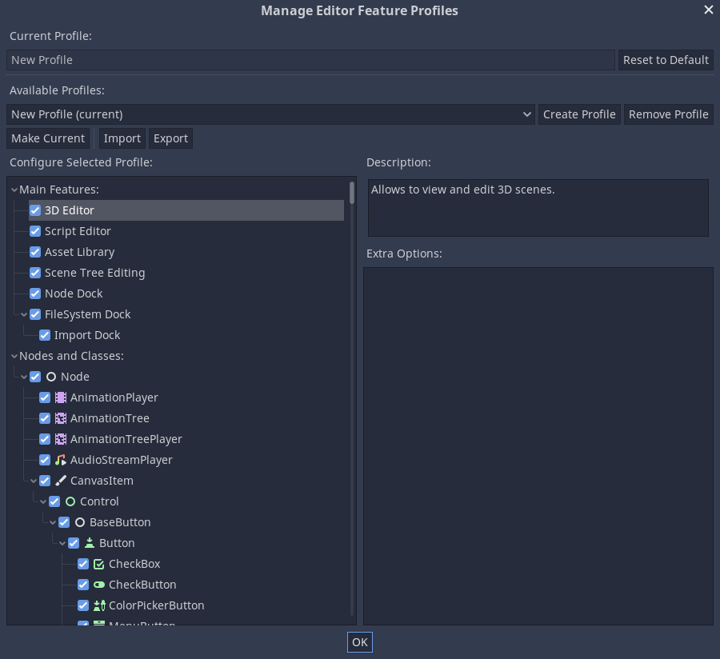
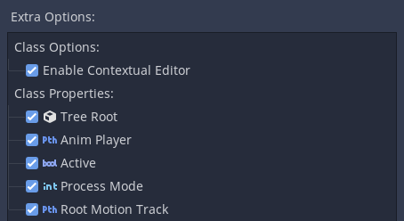

:article_outdated: True

.. _doc_managing_editor_features:

Managing editor features
========================

Introduction
------------

In certain situations, it may be desirable to limit what features can be used
in the Godot editor. For example, a UI designer on a team who doesn't need to
see 3D features, or an educator slowly introducing features to students. Godot
has a built in system called "feature profiles" to do this.

With feature profiles, major features and nodes can be hidden from the editor.
This only hides parts of the interface and does not actually remove support for
these features, so scenes and scripts relying on those features will still work fine.
This also means feature profiles are not an optimization technique. For
information on how to optimize Godot see :ref:`doc_performance`.

Creating a profile
------------------

To manage editor features go to **Editor > Manage Editor Features**. This
will open the **Manage Editor Feature Profiles** window. By default there
will be no profile. Click on **Create Profile** and give it a name. You will
then see a list of all the features in the Godot editor.

The first section allows major editor features to be removed, such as the 3D
editor or scripting editor. Below the main features is every class and node in
Godot, which can be disabled as well. Click on a node and all of its properties
and options will be listed in the **Extra Items** box, these can all be
individually disabled.

Sharing a profile
-----------------

To share profiles between editors click on the **Export** button. Save the custom
profile somewhere as a ``.profile`` file. To use this in another editor open that
editor's **Manage Editor Feature Profiles** window and click import, then select the
``.profile`` file.

This process is potentially cumbersome however if a large amount of computers need
custom profiles. As an alternative, you can enable self-contained mode for Godot,
which allows putting all editor configuration in the same folder as the editor binary.
See :ref:`doc_data_paths_self_contained_mode` for details.
