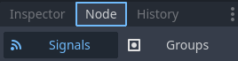
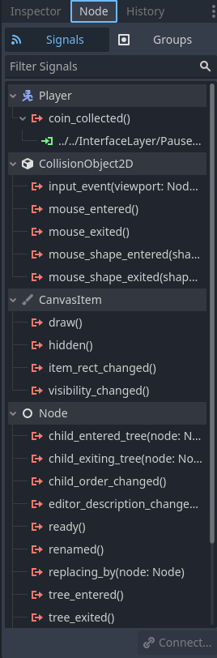
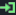
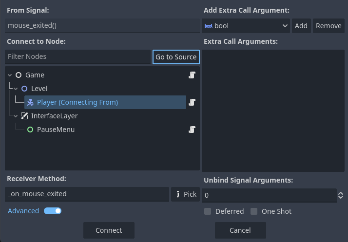

.. _doc_node_dock:

Node Dock
=========

The Node dock has two tabs:

**Signals** tab allows you work with node's signals and the behaviours when a specific
event happens. 
**Groups** in Godot are similar to tagging nodes to call a method on all nodes belonging
to a group.

Below, we will explain more about these two tabs.

.. seealso:: Refer to :ref:`doc_customizing_editor` for dock customization options.

Signals
-------

The **Signals** tab lists the signals of the selected node in the Scene dock which the node can emit.
The list contains all node's own and the inherited signals. For example, if the selected
node is a :ref:`Button <class_Button>`, it contains the signal list from 
:ref:`BaseButton <class_BaseButton>`, :ref:`Control <class_Control>`, 
:ref:`CanvasItem <class_CanvasItem>`, :ref:`Node <class_Node>`, and :ref:`Object <class_Object>`.

If a signal has one or more receivers, you'll see them just below the signal with the green
|receiver| icon.
If the signal is connected via this method, you will also see the same icon next to the receiver
function if you open the script in the text editor.

Hovering over a signal name displays a description with information on when this signal is emitted.
Double-click on a signal depicted with the |signal| icon or select it, then press 
the `Connect...` button to open the connection window.

In this window, `From Signal` is the signal selected to connect from.
`Connect to Node` is used to select an existing script from the list of nodes in the current scene 
to create the method with the value of the `Receiver Method` field, or use the existing one.
By default, this name will be **_on_node_name_signal_name** and can be changed to your liking.

.. note:: Note that this window does not create a new script file.
  You need to attach a script to a node in advance to use it in this window.
  You can identify the nodes with the script next to their names by the script icon.

If you want to create a new receiver method or use an existing in the same node which the emits the signal, 
you can press the "Go to Source" button to select that node.

If you have a high number of nodes in the scene, you can use the `Filter Nodes` bar to
limit the nodes being displayed as you type.

Selecting a node and pressing the `Pick` button opens another window and shows the list of 
methods defined in the node's attached script.
By default, only the "Script Methods" and "Compatible Methods" are visible. You can disable 
these options to get a list of all methods in the script or all methods of the 
selected node's class.

Pressing "Connect" button will create the method if it does not exist, and add the default 
arguments to the script.

.. seealso:: You can also connect signals via code. To see a comprehensive tutorial on signals, 
  refer to :ref:`doc_signals`.

You can right click on signals on the Signals tab to connect another 
method, disconnect all methods, copy its name, or to open its documentation using built-in
documentation viewer.
Similarly, you can right click on a receiving method to edit its parameters, go to the method,
or to disconnect. Pressing :kbd:`Delete` key after selecting a receiver method or using 
the "Disconnect" button on the bottom right also disconnects the method.

.. note:: Disconnected methods are not deleted from the script.

You can also enable "Advanced" mode by checking it next to the receiver method.
This mode lets you add extra arbitrary call arguments with the defined types.
You can also specify the default values for these arguments.

"Unbind Signal Arguments" field lets you select how many of the signal's `default`
arguments will be dropped by the emitter.
Default arguments of a signal can be seen inside brackets.
A value larger than zero (0) will start dropping the arguments from right.

"Deferred" option defers the signal only firing it at idle time.
"One Shot" option disconnects the signal after its first emission.

Groups
------

The `Groups` tab lists the groups which the node is a part of.
Groups are basically tags which you can call methods on multiple objects
which belong to a group.

Groups' behaviour is explained in :ref:`doc_groups`.
