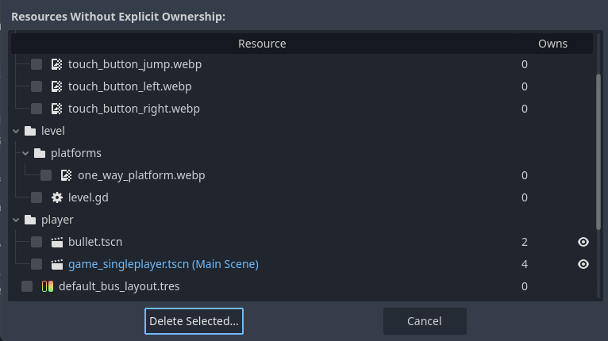
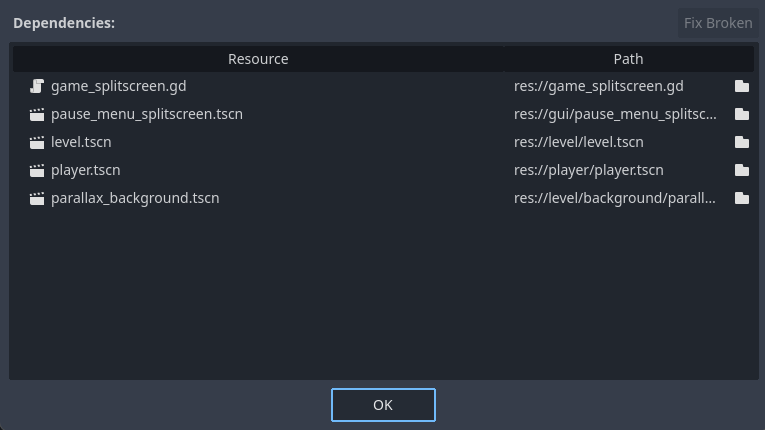

.. _doc_orphan_resource_explorer:

Orphan Resource Explorer
========================

The Orphan Resource Explorer is a tool designed to help optimize the size of your project 
by identifying resources that lack explicit ownership or are not being used.

Explicit ownership refers to a resource being utilized as a sub-resource or node within 
the project. For instance, a script file is not considered orphaned if it is attached 
to a node. Similarly, if a :ref:`Sprite2D <class_Sprite2D>` node uses an image 
from the project files as a texture, the image will have explicit ownership.
On the other hand, if a script is created using the FileSystem dock's context 
menu but not attached to a node, it will be classified as an orphan resource.

.. warning:: This tool will only search for ownerships set through the interface, 
  not through the code.

Usage
-----

To access the tool, navigate to `Project > Tools > Orphan Resource Explorer...`.
Depending on the project resources and their usage, the tool will display a window 
similar to the one shown below:

The "Resource" column presents the tree structure of your project, listing only 
the orphaned files. The "Owns" column indicates the number of files that 
a resource uses. If this number is greater than zero, you can click on the 
eye icon to view its dependencies.

.. note:: The tool will only search the files using their saved states 
  on the disk, ignoring any unsaved changes.

You can select and delete resources by marking them via checkbox and using the 
"Delete Selected..." button.

It's important to note that deleting a resource that owns items may render those 
files orphaned if they are not used elsewhere.
If you delete a file using the FileSystem dock that is dependent on another resource, 
a warning will be displayed, showing the list of resources using this file.

If you open the dependencies window, you will see a list of files that the selected
resource uses, including their relative paths. 
If you have broken dependencies, these will be listed in red.

Normally, renaming or changing the folders of resources is detected automatically 
by the Godot, and the dependencies are updated accordingly. 
However, if you made the changes outside of Godot while it is closed, the Godot will 
not be able to find them.
In this case, the "Fix Broken" button can help you automatically locate them if you 
just changed the folder structure.

Alternatively, in this window, you can click on the folder icon of any item to 
replace a file with another.
Note that if the scene is currently open in the workspace,  the changes will 
take effect only after you close and reopen it.

.. tip:: If you would like to view the owners or dependencies of a file in the project, 
  you can also right-click on a file in the FileSystem dock and choose "View Dependencies" or "View Owners".
