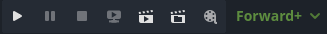

.. _doc_playtest_buttons_and_renderer:

Playtest buttons and renderer
-----------------------------

Playtest buttons allow you to run, pause, stop, and debug your project or scenes, 
with options for remote debugging and Movie Maker mode:

- **Run Project**: Runs the project using the main scene defined in Project 
  Settings > Application > Run. If you have not defined one yet, you will be asked to select 
  one, or use the current one as the main scene.
- **Pause Running Project**: Pauses the game if running. If the button is blue, the game 
  is paused. Clicking it again will unpause the game.
- **Stop Running Project**: Stops the game if running.
- **Run Remote Debug**: If you have remote debug configurations, this button starts one of the 
  available sessions.
- **Run Current Scene**: Runs the currently opened scene in the scene selector.
- **Run a Specific Scene**: Opens scene selector window to pick one from, and starts the game 
  with that scene.
- **Enable Movie Maker mode**: Runs the game in a fixed FPS and stores the visual and audio 
  output to a file. See :ref:`doc_creating_movies` for more details.

.. _doc_editor_interface_current_renderer:

Next to the playtest buttons, the current renderer dropdown is visible.
This allows you to change the current renderer for your project in the editor if you would 
like to change the one chosen while creating the project using the 
:ref:`Project Manager <doc_project_manager>`.

Currently there are three renderers to choose from:

- Forward+ is used for desktop platforms.
- Mobile is used for desktop and mobile platforms.
- Compatibility is used for desktop, mobile, and web platforms.

To read an in-depth manual on rendering methods, see :ref:`doc_internal_rendering_architecture`.
