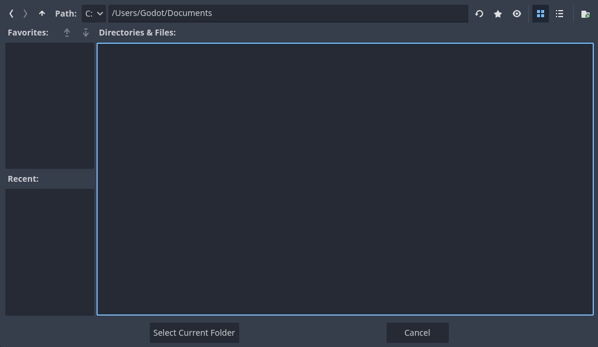

.. _doc_project_manager:

Using the Project Manager
=========================

When you launch Godot, the first window you see is the Project Manager. It lets
you create, remove, import, or play game projects.

.. image:: img/editor_ui_intro_project_manager_01.webp

In the window's top-right corner, a drop-down menu allows you to change the
editor's language.

.. image:: img/editor_ui_intro_project_manager_02.webp

.. _doc_creating_and_importing_projects:

Creating and importing projects
-------------------------------

To create a new project:

1. Click the **New** button on the top-left of the window.
2. Give the project a name, choose an empty folder on your computer to save the
   files, and select a rendering backend.
3. Click the **Create & Edit** button to create the project folder and open it in the editor.

.. image:: img/editor_ui_intro_project_manager_04.webp

Using the file browser
~~~~~~~~~~~~~~~~~~~~~~

Click the **Browse** button to open Godot's file browser and pick a location or type
the folder's path in the Project Path field.

When you see the green tick on the right, it means the engine detects an empty
folder. You can also click the **Create Folder** button to create an empty
folder based on your project's name.

Opening and importing projects
------------------------------

The next time you open the Project Manager, you'll see your new project in the
list. Double click on it to open it in the editor.

.. image:: img/editor_ui_intro_project_manager_06.webp

You can similarly import existing projects using the **Import** button. Locate the
folder that contains the project or the **project.godot** file to import and
edit it.

.. image:: img/editor_ui_intro_project_manager_08.webp

When the folder path is correct, you'll see a green checkmark.

.. image:: img/editor_ui_intro_project_manager_09.webp

Downloading demos and templates
-------------------------------

From the **Asset Library Projects** tab you can download open source project
templates and demos from the :ref:`Asset Library <doc_what_is_assetlib>` to help
you get started faster.

To download a demo or template:

1. Click on its title.
2. On the page that opens, click the download button.
3. Once it finished downloading, click install and choose where you want to save
   the project.

.. image:: img/editor_ui_intro_project_manager_03.webp
