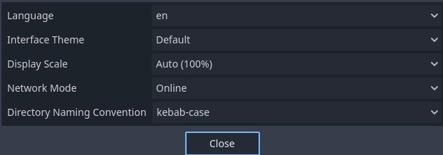
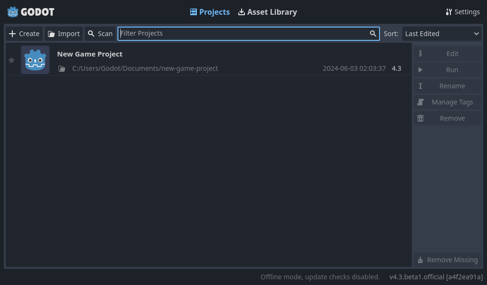
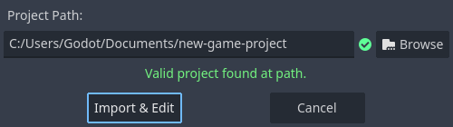
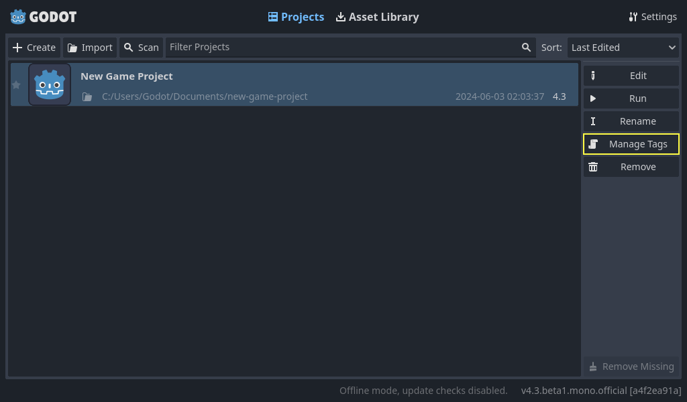

.. _doc_project_manager:

Using the Project Manager
=========================

When you launch Godot, the first window you see is the Project Manager. It lets
you create, remove, import, or play game projects:

.. image:: img/editor_ui_intro_project_manager_01.webp

To change the editors language click on the **Settings** Button in the top right
corner:

.. image:: img/editor_ui_intro_project_manager_02.webp

In Project Manager Settings, you can change the interface **language** from the language
dropdown menu, which is the system default language by default.

You can also change the **theme** of the editor, the **display scale** for different interface 
element sizes, and the availability of online functionality using **network mode**.
If network mode is online, Godot will also check and inform you about new versions of Godot.

The **directory naming convention** can also be changed to replace spaces according to the chosen format 
when creating folders automatically.

.. _doc_creating_and_importing_projects:

Creating and importing projects
-------------------------------

To create a new project:

1. Click the **Create** button on the top-left of the window.
2. Give the project a name, then open the file browser using the **Browse** button,
   and choose an empty folder on your computer to save the files. Alternatively,
   you can enable **Create Folder** option to automatically create a new sub-folder
   with the project name, following the directory naming convention set in the
   settings. An empty folder will show a green tick on the right.
3. Select one of the rendering backends (this can also be changed later).
4. Click the **Create & Edit** button to create the project folder and open it in the editor.

.. image:: img/editor_ui_intro_project_manager_04.webp

.. note:: You can optionally choose a version control system. Currently, only 
	`git <https://git-scm.com>`__ is supported and it needs the Godot Git Plugin to be installed, 
	either manually or using the :ref:`Asset Library <doc_using_assetlib>`. To learn more about the Godot Git Plugin, see its `wiki <https://github.com/godotengine/godot-git-plugin/wiki>`__.

Using the file browser
~~~~~~~~~~~~~~~~~~~~~~

From the **Create New Project** window, click the **Browse** button to open
Godot's file browser. You can pick a location or type the folder's path in the
**Path** field, after choosing a drive.

Left of the path field on the top row contains arrows to navigate backward and forward through the last
visited locations.
The up arrow navigates to parent folder.
On the right side of the path field, there are buttons to refresh the current folder's contents,
favorite/unfavorite the current folder, and show/hide hidden folders.

Next, the buttons to switch the display type of the folders and files between grid view and list view
are seen.

The last button on the right will create a new folder.

Favorited folders will be displayed on the left side under the **Favorites** section. You can sort the
favorites using the up and down buttons in this section.
Last chosen folders will be listed under the **Recent** list.

.. image:: img/editor_ui_intro_project_manager_05.webp

Opening and importing projects
------------------------------

The next time you open the Project Manager, you'll see your new project in the
list. Double click on it to open it in the editor.

You can similarly import existing projects using the **Import** button. Locate the
folder that contains the project or the **project.godot** file to import and
edit it.

Alternatively, it is possible to choose a zip file to be automatically extracted by Godot.

When the folder path is correct, you'll see a green checkmark.

.. _doc_project_manager_downloading_demos:

Downloading demos and templates
-------------------------------

From the **Asset Library** tab you can download open source project
templates and demos from the :ref:`Asset Library <toc-learn-features-assetlib>` to help
you get started faster.

The first time you open this tab you'll notice that it's asking you to go online.
For privacy reasons the project manager, and Godot editor, can't access the internet
by default. To enable accessing the internet click the **Go Online** button. This will
also allow project manager to notify you about updates. If you wish to turn this off
in the future go into project manager settings and change **Network Mode** to "Offline"

Now that Godot is connected to the internet you can download a demo or template, to
do this:

1. Click on its title.
2. On the page that opens, click the download button.
3. Once it finished downloading, click install and choose where you want to save
   the project.

Managing projects with tags
---------------------------

For users with a lot of projects on one PC it can be a lot to keep track of. To aid
in this Godot allows you to create project tags. To add a tag to a project click on the
project in the project manager, then click on the **Manage Tags** button

This will open up the manage project tags window. To add a tag click the plus button.

Type out the tag name, and click **OK**. Your project will now have a tag added to it.
These tags can be used for any other project in your project manager.

To show projects with a specific tag only, you can click on the tags or write ``tag:`` 
and type the tag you would like to search for in the filter bar. To limit the results 
using multiple tags, you can click on another tag or add ``tag:`` after 
a space and type another tag in the filter bar.

In addition, tags will stay with projects. So if you tag your project, send it to 
another machine, and import it into the project manager you will see the tags
you created.

To remove a tag from your project manager it must be removed from all the projects it's
used by. Once that's done close the project manager, open it up again, and the tag should
be gone.
