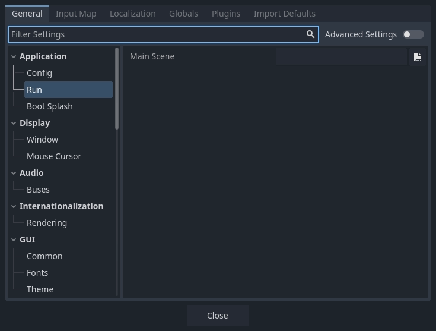
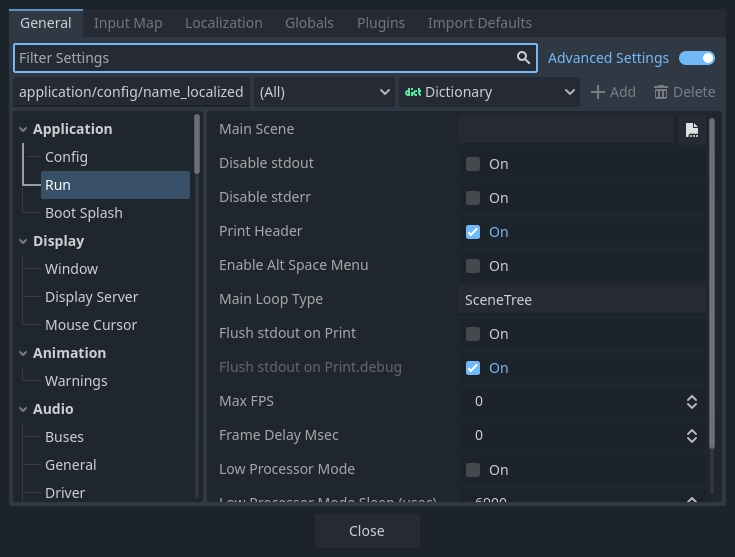

.. _doc_project_settings:

Project Settings
================

There are dozens of settings you can change to control a project's execution,
including physics, rendering, and windowing settings. These settings can be
changed from the **Project Settings** window, from code, or by manually editing
the ``project.godot`` file. You can see a full list of settings in the 
:ref:`ProjectSettings <class_ProjectSettings>` class.

Internally, Godot stores the settings for a project in a ``project.godot`` file,
a plain text file in INI format. While this is human-readable and version control
friendly, it's not the most convenient to edit. For that reason, the
**Project Settings** window is available to edit these settings. To open the
Project Settings, select **Project > Project Settings** from the main menu.

    The Project Settings window

The **Project Settings** window is mainly used to change settings in the
**General** tab. Additionally, there are tabs for the
:ref:`Input Map <doc_input_examples_input_map>`,
:ref:`Localization <doc_internationalizing_games>`,
:ref:`Globals <doc_singletons_autoload>`,
:ref:`Plugins <doc_installing_plugins_enabling_a_plugin>`, and
**Import Defaults**. Usage of these other tabs is documented elsewhere.

Changing project settings
-------------------------

The **General** tab of the project settings window works much like the inspector.
It displays a list of project settings which you can change, just like inspector
properties. There is a list of categories on the left, which you can use to select
related groups of settings. You can also search for a specific setting with the
**Filter Settings** field.

Each setting has a default value. Settings can be reset to their default values
by clicking the circular arrow **Reset** button next to each property.

Changing project settings from code
~~~~~~~~~~~~~~~~~~~~~~~~~~~~~~~~~~~

You can use :ref:`set_setting() <class_ProjectSettings_method_set_setting>` to
change a setting's value from code:

.. tabs::
    .. code-tab:: gdscript GDScript
        
        ProjectSettings.set_setting("application/run/max_fps", 60)
        ProjectSettings.set_setting("display/window/size/mode", DisplayServer.WINDOW_MODE_WINDOWED)

    .. code-tab:: csharp

        ProjectSettings.SetSetting("application/run/max_fps", 60);
        ProjectSettings.SetSetting("display/window/size/mode", (int)DisplayServer.WindowMode.Windowed);

However, many project settings are only read once when the game starts. After
that, changing the setting with ``set_setting()`` will have no effect. Instead, 
most settings have a corresponding property or method on a runtime class like
:ref:`Engine <class_Engine>` or :ref:`DisplayServer <class_DisplayServer>`:

.. tabs::
    .. code-tab:: gdscript GDScript
        
        Engine.max_fps = 60
        DisplayServer.window_set_mode(DisplayServer.WINDOW_MODE_WINDOWED)

    .. code-tab:: csharp

        Engine.MaxFps = 60;
        DisplayServer.WindowSetMode(DisplayServer.WindowMode.Windowed);

In general, project settings are duplicated at runtime in the
:ref:`Engine <class_Engine>`, :ref:`PhysicsServer2D <class_PhysicsServer2D>`,
:ref:`PhysicsServer3D <class_PhysicsServer3D>`,
:ref:`RenderingServer <class_RenderingServer>`, 
:ref:`Viewport <class_Viewport>`, or :ref:`Window <class_Window>` classes. In the
:ref:`ProjectSettings <class_ProjectSettings>` class reference, settings
links to their equivalent runtime property or method.

Reading project settings
------------------------

You can read project settings with
:ref:`get_setting() <class_ProjectSettings_method_get_setting>` or
:ref:`get_setting_with_override() <class_ProjectSettings_method_get_setting_with_override>`:

.. tabs::
    .. code-tab:: gdscript GDScript
        
        var max_fps = ProjectSettings.get_setting("application/run/max_fps")
        var window_mode = ProjectSettings.get_setting("display/window/size/mode")

    .. code-tab:: csharp

        int maxFps = (int)ProjectSettings.GetSetting("application/run/max_fps");
        var windowMode = (DisplayServer.WindowMode)(int)ProjectSettings.GetSetting("display/window/size/mode");

Since many project settings are only read once at startup, the value in the
project settings may no longer be accurate. In these cases, it's better to read
the value from the runtime equivalent property or method:

.. tabs::
    .. code-tab:: gdscript GDScript
        
        var max_fps = Engine.max_fps
        var window_mode = DisplayServer.window_get_mode()

    .. code-tab:: csharp

        int maxFps = Engine.MaxFps;
        DisplayServer.WindowMode windowMode = DisplayServer.WindowGetMode();

Manually editing project.godot
------------------------------

You can open the ``project.godot`` file using a text editor and manually
change project settings. Note that if the ``project.godot`` file does not have a
stored value for a particular setting, it is implicitly the default value of
that setting. This means that if you are manually editing the file, you may
have to write in both the setting name *and* the value.

In general, it is recommended to use the Project Settings window rather than
manually edit ``project.godot``.

Advanced project settings
-------------------------

    The advanced project settings

By default, only some project settings are shown. To see all the project
settings, enable the **Advanced Settings** toggle.
