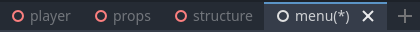

.. _doc_scene_switcher:

Scene switcher
--------------

Just below the workspace selector, if the 2D or 3D editor is open, the opened scenes will be
seen:

Left-clicking on an open tab changes the current scene. The selected scene updates the 
:ref:`scene tree dock <doc_scene_tree_dock>` to display only the nodes used in that scene. 
If a scene has unsaved changes, an asterisk (*) appears next to its name in the selector.

The tabs display the root node's icon and the scene's name. You can drag tabs to reorder 
them as desired. The plus (+) button next to the tabs adds a new scene to the project.
The cross (x) closes the currently opened scene. 

Right-clicking a tab will display the following options:

- **New Scene**: Adds a new tab with an empty scene if there are no empty scenes in the tabs.
- **Save Scene**: Saves the current scene into file. If no file is present, it will 
  first ask you to choose a name for it.
- **Save Scene As**: Saves the current scene into a different file and uses this file for further
  "Save Scene" action.
- **Save All Scenes**: Saves all scenes with unsaved changes.
- **Show in FileSystem**: Shows the scene's file in the FileSystem dock.
- **Play This Scene**: Runs the game using this scene as the starting scene.
- **Close Tab**: Closes this scene.
- **Undo Close Tab**: Reopens the last closed scene.
- **Close Other Tabs**: Closes other scenes, except the current one.
- **Close Tabs to the Right**: Closes all scenes to the right of the currently active scene. 
  Newly opened scenes are added to the right of the previous tabs, allowing you to, for 
  example, close scenes that were opened after the selected scene.
- **Close All Tabs**: Closes all open scenes.
