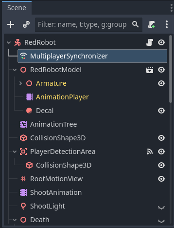
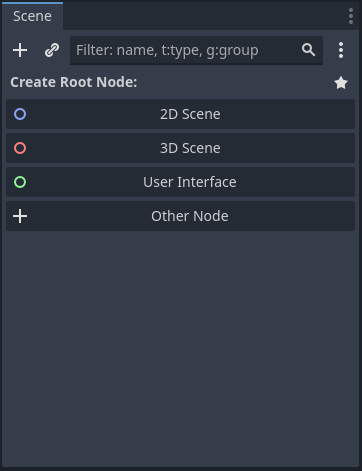
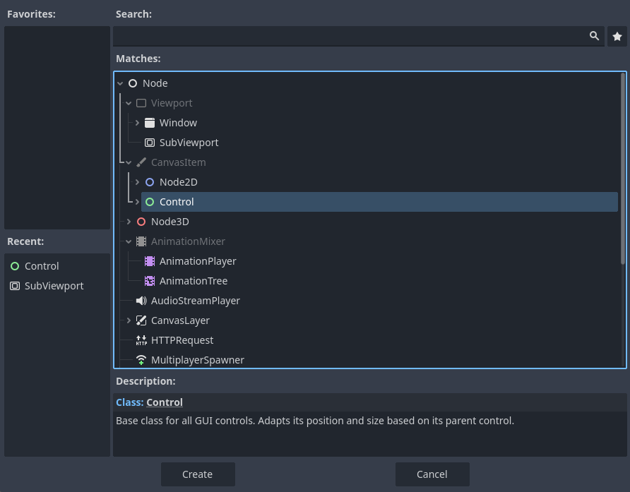
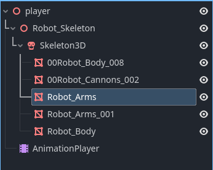
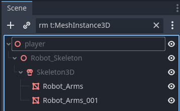
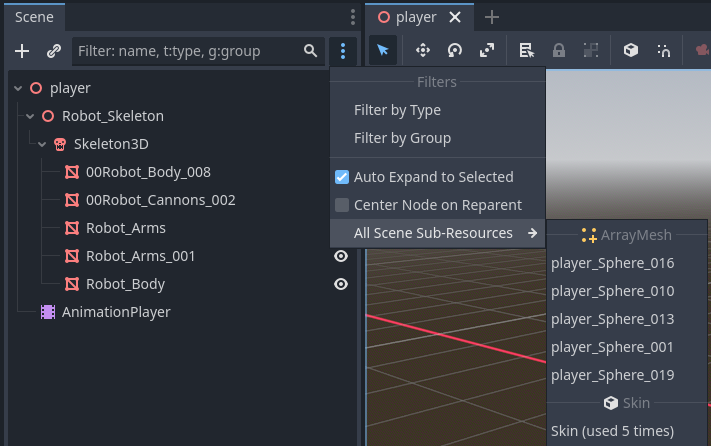
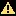
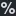

.. _doc_scene_tree_dock:

Scene Tree Dock
===============

The **Scene Tree Dock** in Godot is a crucial part of the Godot Engine's editor interface.
It provides a hierarchical view of all the nodes that make up the current scene. 
This dock allows users to manage the scene structure efficiently, enabling them to 
add, remove, and rearrange nodes.
It is located on the Editor's left by default.
In this document we will talk about the usage of this dock.

Similar to other docks in Godot, the Scene Tree dock also has a toolbar and a view beneath it. 
In this view, the nodes of the chosen scene (selected via the scene selector) are listed 
in a tree structure.
Each type of node will have its own unique icon next to its name to ease identification.

.. tip:: Many of the actions performed in this dock can be undone and redone with the shortcuts,
  :kbd:`Ctrl + Z` (undo) and :kbd:`Ctrl + Y` (redo), by default. Other shortcuts related 
  to the Scene Tree Dock can be found in 
  :ref:`Default editor shortcuts <doc_default_key_mapping_scene_tree>`.

.. note:: Here we will focus on the basic usage of the Scene Tree. To learn the basics on Nodes 
  or Scenes, you can consider reading :ref:`doc_key_concepts_overview`. To see a step-by-step 
  guide on Nodes and Scenes, including Scene Tree, see :ref:`doc_nodes_and_scenes`.
  
.. seealso:: To see the manual on how Scene Tree works, read :ref:`doc_scene_tree`.

 
  
Basic usage
-----------

If you create a new project, the scene tree will be empty:

You can use one of the buttons below to create a root scene. Use:

- **2D Scene** to create a :ref:`Node2D <class_Node2D>` root node
- **3D Scene** to create a :ref:`Node3D <class_Node3D>` root node
- **User Interface** to create a :ref:`Control <class_Control>` node
- **Other Node** to open the whole list of nodes.

.. tip:: "Other Node" can be used, for example, if you want to create 
  a separate scene for NPCs with :ref:`CharacterBody2D <class_CharacterBody2D>` as 
  their root node.

Clicking on "Other Node", will show the following window:

In this window, you can search for a node using the search field, add the highlighted node to the 
favorites using the star (or remove by clicking on the blue star), or pick one of the recently 
chosen nodes.
A chosen node will display a brief description below. Click "Create" to add the chosen node 
into the scene.

.. tip:: The term you enter will be searched letter by letter, meaning typing "btn" will also display
  "Button", as it contains all the letters of the search term. This helps you find what you are looking
  for when you do not exactly remember how a node is called.

.. tip:: If the scene tree is empty, you can show the favorited nodes using the star button 
  below the three-dot, for easier root node creation without a window.

Below the Scene Tree's toolbar, you can see the scene tree view. If you have hierarchical nodes, you 
can use the ``>`` buttons to expand a parent (or the root) node and click on the down arrows to collapse 
them. Child nodes are indented and have a line connected to them, which is drawn until their parent:

If you choose a parent node, its child nodes are highlighted with lines. Similarly, selecting a child 
node highlights the path from the parent to that specific child. In the example above, you can see the
thick lines, drawn from ``player`` to ``Robot_Arms`` following ``Robot_Skeleton/Skeleton3D`` path.
This can be used to e.g., verify if the node is correctly placed within its parent and aids in 
building access path. 
You can also retrieve a node's path by right-clicking it and choosing "Copy Path Node". If you prefer 
to access a node directly by calling its name, choose "Access as Unique Name" from the context menu.
See :ref:`doc_scene_unique_nodes` for more on unique naming.

If the game is running, there will be additional two buttons above the scene tree. **Local** will
be the default view you see in editing mode. To learn about **Remote** view, read 
:ref:`doc_overview_of_debugging_tools_remote`.

If you accidentally create a node in the wrong location or prefer to move it under another parent 
later, you can hold the node with the left mouse button and drag it to its new location. A visual 
hint will show how the node will be placed when released. A line indicates that it will become a 
sibling node between the upper and lower nodes on that line, whereas a rectangle indicates that 
it will be added as a child node of the hovered node. Changing the order of nodes can also be 
done using the context menu and choosing "Move Up" (or :kbd:`Ctrl + Up` by default) and "Move Down" 
(or :kbd:`Ctrl + Down` by default) to move them within the same parent. Changing a parent is called 
`reparenting`, which can be performed via the node's 
:ref:`context menu <doc_scene_tree_dock_context_menu>`.

Toolbar
-------

Scene Tree's toolbar provides some quick tools to perform some of node operations, or 
navigate easier:

Plus (+) button on the toolbar opens the entire list of all available nodes to choose from.
This button adds a child node to the chosen node if the scene tree is not empty. Otherwise, it 
performs the same action as if it were clicked on the "Other Node".
:kbd:`Ctrl + A` is the default shortcut for this button. 

The next button in the toolbar with the chain icon instantiates a previously saved scene from a file
as a child node. If you have at least one node in the scene, it opens a quick search window to find 
your scenes in the project folder. Otherwise, the file browser will open from **res://** folder and 
ask you to pick a scene from the project folder to instantiate it. :kbd:`Ctrl + Shift + A` 
is the default shortcut for this button. This action is the same as dragging a **.tscn** file from 
the FileSystem dock into the Scene Tree or right-clicking on a node and choosing "Instantiate Child 
Scene...".

If a node is selected in the scene tree, there will be a quick action button to attach script (shown with 
green plus) and detach script (shown with red cross mark).
You can achieve the same by right-clicking a node and choosing "Attach Script" or "Detach Script".
Note that, detaching a script will not delete it from the project folder.

For large projects, scrolling through a lengthy list of nodes can be overwhelming when searching for a 
specific node. To simplify this process, utilize the **Filter** bar. Entering terms in this field triggers 
an immediate, case-insensitive search. The Godot will then search for the term within the names of the nodes. 
For example, if you have a node called ``Robot_Arms``, typing "rm" will also display this node in 
the results:

To search for a specific type of nodes, e.g., ``MeshInstance3D``, add "t:" or "type:" as prefix. To search 
nodes which belong to a group, add "g:" or "group:". You can also combine these prefixes with your search 
term to have more precise results. If a node appears grayed out in the results, it indicates that a child
node has been found with the search term.
You can also use the three vertical dots next to the filter bar to add these prefixes:

This three-dot menu also provides the following options:

- **Auto Expand to Selected**: If this is enabled, selecting a node in the 2D or 3D screen will recursively 
  expand all parent nodes in the scene tree until the selected node is reached.
- **Center Node on Reparent**: If multiple nodes are selected and "Reparent to New Node" option is used from the 
  context menu, enabling this option will create the parent node at the center position of chosen nodes, if 
  possible. Otherwise, the node will be created at position ``x: 0``, ``y: 0``.
- **All Scene Sub-Resources**: If nodes in the current scene has sub-resources, e.g., ``SpriteFrames`` or 
  ``RectangleShapes``, this menu will group them by their node class and sort by the order of nodes in the 
  scene tree. You can click on the resources to open them in the :ref:`inspector dock <doc_editor_inspector_dock>`. 
  Note that this will not show sub-sub resources, which are the resources of the sub-resources. To name the 
  resources, you can use ``resource_name`` property in the inspector dock's "Resource" section. To list the 
  sub-resources of a single node, right click on a node and choose "Sub-Resources" from the context menu, instead.

If the scene tree is active, you can use :kbd:`Ctrl + F` to activate the filter bar.

Scene tree icons
----------------

If you create a new project and add a new node, you’ll notice an open eye icon next to 
its name. This and other quick buttons allow you to perform actions that would normally require 
navigating through  different sections of  the editor. Hover them to see their descriptions.
Clicking on these buttons also may perform actions.

Below, some of the most common icons are explained:

.. |scriptblue| image:: img/scene_tree_icons/ScriptBlue.webp

- |eyeopen|: This node is visible in the 2D or 3D editor. Clicking it toggles the visibility.
- |eyeclosed|: This node is invisible in the 2D or 3D editor. Clicking it toggles the visibility.
- |script|: This node has an attached script. Clicking it will open it in Script Editor.
- |scriptblue|: The attached script is also running in the editor, not only when the game 
  is running. See: :ref:`doc_running_code_in_the_editor`.
- |scene|: This node is instantiated as a scene. Clicking it will open it in the editor and switch to it.
- |groups|: This node is member of at least one group. Hovering over it will list its groups. 
  Clicking will open the **Groups** tab in the Node dock.
- |group|: This node is selected if any of its children are chosen in the 2D or 3D editor. This can be 
  used to prevent accidental selection of child nodes. Clicking it will remove grouping. It can be 
  regrouped using 2D or 3D editor's toolbar.
- |lock|: This node is locked and cannot be selected or moved in the 2D or 3D editor. 
  Clicking it unlocks the node again.
- |warning|: This node has some warnings. Hover your mouse, or click to get a hint. Depending on the warning 
  count, it may have multiple red indicators next to it.
- |unique|: The name of this node can be used within the scene to access it with a preceding ``%``, without 
  requiring the path. Clicking on it disables this.
- |signal|: This node emits at least one signal. Clicking it will open the Node dock's **Signals** tab.

.. _doc_scene_tree_dock_context_menu:

Context menu
------------

The context menu of a chosen node (or multiple nodes) also provides several functions to choose from.
Some of them are explained in the previous chapters. Below, the other items will be explained:

- **Rename**: Changes the name of a node. If you are using a path in your scripts to access this node, 
  it needs to be manually updated.
- **Change type...**: allows you to change the class of the chosen node(s) by using common property values 
  from the old one.
- **Duplicate**: Clones the chosen node(s). Same can be done using :kbd:`Ctrl + D` (default shortcut).
- **Reparent...**: Opens a window to move the selected node(s) under of another existing parent. 
  "Keep Global Transform" option will remember the transform values of the node which will be moved. 
- **Reparent to New Node...**: Creates a new parent node for the chosen node(s) while reparenting. Here 
  "Center Node on Reparent" option will be considered for positioning the nodes.
- **Make Scene Root**: Makes the current node as the root node of this scene. Previous root node becomes 
  the child of this node.
- **Save Branch as Scene**: Opens the file dialog to save the current node and its child nodes as a scene. 
  To open it later in the editor, you can right click and choose "Open in Editor" in the context menu, 
  double-click it in FileSystem dock, or use the |scene| quick button next to it. If you edit the 
  properties of this node without opening it in the editor, the values will only apply to this instance.
- **Editable Children**: This option is only visible if the node is instantiated as scene. It allows 
  changing the child nodes of this node `only` for this instance. In this case, the childrens' 
  name will have a different color to notice the difference (yellow, by default).
- **Load as Placeholder**: Loads the scene only as placeholder to delay a scene's loading until it is explicitly
  called. See :ref:`InstancePlaceholder <class_InstancePlaceholder>` for more details.
  This will disable the "Editable Children" option and revert the properties to their original values.
- **Make Local**: Converts the scene and its child nodes into a node. It will no longer be an instance of the scene.
  The scene file will not be touched, and it can be instantiated as a scene again.
- **Open Documentation**: Opens the class documentation of the selected node in the Script editor.
- **Delete Node**: Deletes the chosen node(s) from the scene tree. Default shortcut is :kbd:`Delete`.

.. seealso:: If you haven't already, you may want to see 
  :ref:`customizing docks <doc_customizing_editor_moving_resizing_docks>` to change dock positions, 
  or to make them floating.
