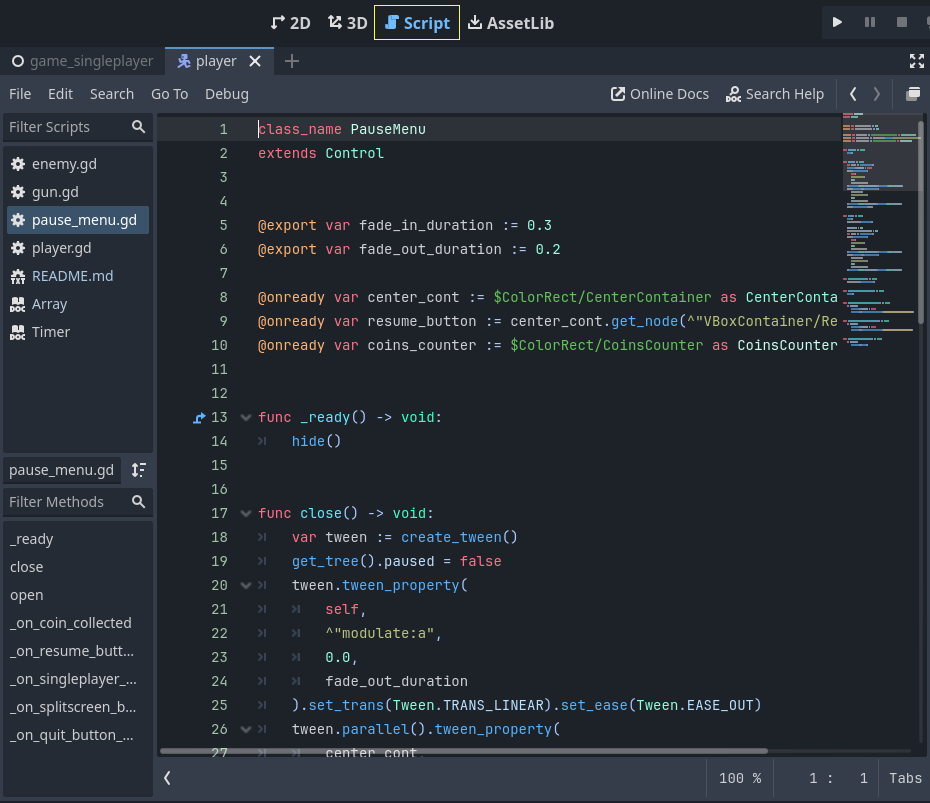
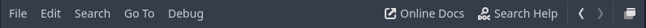
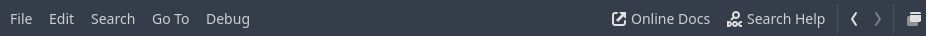
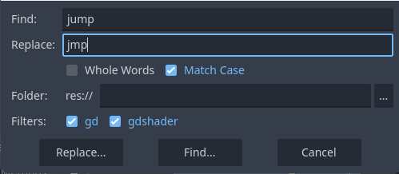
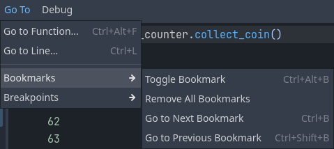
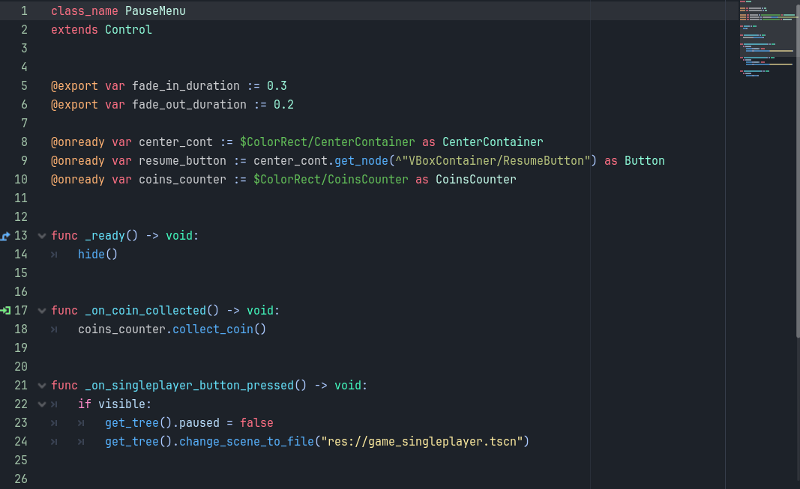

.. _doc_script_editor:

Script Editor
=============

.. _doc_script_editor_introduction:

Introduction
~~~~~~~~~~~~

Godot Engine's script editor is a powerful and fully-integrated text editor
that not only streamlines the process of writing and debugging code written in
GDScript but also allows for working with plain text files, providing
developers with a seamless environment for scripting game logic and behaviors.
It can highlight your code, automatically indent it, perform syntax checks,
and much more.
You can also create breakpoints to debug your project without switching to
another window.
The text editor also serves as an offline class reference viewer, which can
be accessed in several ways as described in the
:ref:`doc_intro_to_the_editor_interface_integrated_class_reference`.

.. _doc_script_editor_features:

Features
~~~~~~~~

Some of the key features of the text editor are listed below:

- Fully-integrated code editor for GDScript.
- Syntax highlighting support for GDScript and JSON files.
- Syntax checking for GDScript and JSON files.
- Bookmark and breakpoint support.
- Automatic indentation.
- Code folding.
- Customizable theme.
- Multiple carets, which can be enabled using :kbd:`Alt + Left Click`.
- Auto-completion of variables, functions, constants, etc.
- Inline refactoring of symbols by selecting them and using :kbd:`Ctrl + D`.
- Mass find and replace across project files.

.. _doc_script_editor_usage:

Usage
~~~~~

If you are using GDScript in your project, the built-in text editor in
Godot provides everything you need, serving as a one-stop location to
fully utilize the Godot Engine. Nearly all parameters that can be adjusted via
the user interface can also be modified directly through code.

.. note:: If you would like to use an external text editor or prefer to use C#
  in your project, see :ref:`doc_external_editor` and
  :ref:`doc_c_sharp_setup_external_editor`.

.. tip:: Similar to many parts of the Godot's interface, the text editor can
  also be customized by changing its settings to your liking. You can access
  these settings by opening **Editor > Editor Settings** and going to the **Text Editor**
  group.
  

You can open the Script Editor using the **Script** button in the workspace selector,
located at the top center of Godot's interface.
Alternatively, you can use the **Open Script** button next to a node in the
Scene Tree dock, or double-click on a ``.gd`` file or a recognized text file in 
the FileSystem dock to open it directly in the Script Editor.

Once it is open, you will see the text editor menus at the top, below the scene 
switcher. Next to the menus, you'll find buttons to open the online documentation 
or search within the built-in class reference. To the right of these buttons are 
two navigation arrows that allow you to navigate through your viewing history.
Finally, you can use the float button to 
separate the text editor from Godot's window, which is useful if you are working 
with multiple monitors.

Underneath the menus on the left, you will see the script panel. In the center, 
adjacent to the script panel, is the coding area. Beneath the coding area is the 
status bar, which displays the error and warning count in the code. 
Clicking on the error or warning icons will show the list of errors with 
the line numbers. Clicking on one will jump to that line.
You can also choose to ignore warnings by opening the list and 
clicking ``Ignore``.
The status bar also lets you change the zoom level of the code by clicking 
the percentage value. You can also use :kbd:`Ctrl + Mouse Wheel` 
(:kbd:`Cmd + Mouse Wheel` on Mac) to achieve the same effect.
The status bar also shows the current position of the caret in terms of line and
column, and whether the indentation is done using tabs, or spaces.

Many of the actions performed in the text editor can also be executed using
shortcuts. The actions show their corresponding shortcuts next to them.
For a complete shortcut list, see the :ref:`text editor shortcuts <doc_default_key_mapping_shortcuts_text_editor>`.

In the next sections, we will go through different aspects of the text editor.
You can also select a section below to jump to a specific topic:

.. contents::
   :local:
   :depth: 3
   :backlinks: none

.. _doc_script_editor_script_panel:

Script Panel
------------

	

Below the menus, on the left panel, you will see a list of opened files and documentation
pages. Depending on the file type, this list will have an icon next
to the file name. For example, the |script| icon means that it is a GDScript.
the |scriptcsharp| means it is a C# script. The |documentation| means that this is a 
built-in class reference. Finally, the |toolscript| means it is a currently running 
script (See :ref:`tool annotation <doc_running_code_in_the_editor>` for more on this). 
Hovering a file will show a tooltip with its relative location in the project folder.

On the status bar, clicking the left arrow hides the script panel, clicking
on the right arrow shows it.

If you did not change any settings, the file names may also have a different coloring.
This helps you identify the recently edited files by highlighting them. This behavior
can be changed in the **Editor > Editor Settings** by adjusting the **Script Temperature**
properties in the **Text Editor** section.

The filter bar above the file names introduces a handy case-insensitive search to
find a specific file. Even if you just type the letters of a file name into the
bar, files containing these letters in order will also appear. Assume that there
is a file named ``button.gd`` in the list. If you type ``btn`` into the filter bar, 
this file will appear in the results. To reset the filter, clear the filter bar.

An asterisk (*) next to a file name indicates that the file has unsaved changes.

.. tip:: If you just enter "*" in the filter bar, you can display all unsaved files.

You can drag a file to change the ordering. Middle-clicking on a file closes it.
Right-clicking on a file provides several options to save or close files, or to 
copy the relative path of the file. On this menu:

You can also use **Move Up** and **Move Down** to change the order of the file, or use **Sort**
to sort all files alphabetically. **Toggle Scripts Panel** hides the panel, which
can be displayed again using the right arrow on the status bar.
**Close Docs** closes all opened in-class reference documents leaving only
script files open. **Show in FileSystem** finds and highlights the file in the
FileSystem dock.

Below the file list, you'll see the name of the currently open file. The button
next to this switches the ordering of the methods defined in this file between
alphabetical and as they appear. Under this is the outline of the file. If this
is a script file, it will contain the list of defined methods. If, however, a
class reference page is open, this area will show the table of contents of this
document. Clicking on an item in this list will jump to the respective function
or section in the file. Similarly, the **Filter Methods** bar lets you search
for a specific function or section within the selected document with the same
behavior as filtering scripts.

.. _doc_script_editor_menus:

Menus
-----

The text editor's menus lie below the scene switcher and allow you to access a
variety of tools and options, such as file management, search and replace, debugging
controls, and code formatting features.

.. tip:: An asterisk (*) next to an action means that this operation is also available
  in the context menu, which can be opened by right-clicking in the code editor.

The **File** menu provides the following options:

- **New Script...**: Opens the new script dialog to create and add the script to
  the project. If creation is successful, it will directly open it in the
  text editor. Depending on the version of Godot (with C# support or not), you
  can choose ``.gd`` or ``.cs`` as the extension.
- **New Text File...**: Opens the file dialog to create a plain text file with
  one of the recognized formats. Godot can also highlight ``json`` files.
- **Open...**: Opens the file dialog to let you browse inside your computer and
  choose any recognized text file to open it.
- **Reopen Closed Script**: Reopens the last closed scripts. You can use this
  option multiple times to reopen other closed scripts if you closed more than one.
- **Open Recent**: Provides a list of last opened scripts. You can also clear the
  list using the provided option at the bottom of the list.
- **Save**: Saves the currently selected script.
- **Save As...**: Opens the file dialog to save the currently open script
  with a different name.
- **Save All**: Saves all unsaved open scripts in the text editor. Scripts with
  unsaved changes will have an asterisk (*) next to their names in the script list.
- **Soft Reload Tool Script**: If the selected script is a
  :ref:`tool <doc_running_code_in_the_editor>`, reloads the script to execute it again.
- **Copy Script Path**: Copies the currently selected script's relative path in
  the project using the ``res://`` prefix.
- **Show in FileSystem**: Finds and highlights the selected file in the FileSystem
  dock.
- **History Previous**: Changes the active script to the one that was previously
  opened. This is useful when you have multiple scripts open and want to quickly navigate
  back to the last script you were editing. If you also changed the caret position more than
  10 lines, you will first move it to its previous location in the same file.
- **History Next**: After using `History Previous` to go back to an earlier script,
  this feature allows you to move forward through the script history, switching to
  scripts that were previously accessed. Similar to above, if you also changed the 
  caret position more than 10 lines, you will first move it to its next location in 
  the same file.
- **Theme**: Provides options to import an existing theme, save, or reload it. Changing 
  theme settings is performed via `Editor Settings`.
- **Close**: Closes the active script.
- **Close All**: Closes all open scripts and prompts to save if there are unsaved changes.
- **Close Other Tabs**: Closes all open scripts except the selected one.
- **Close Docs**: Closes the class reference documentation pages, leaving only the
  scripts.
- **Run**: If the script extends :ref:`EditorScript <class_EditorScript>` and
  intended to be executed without running the project, this option runs the script.
  See :ref:`doc_running_code_in_the_editor_editorscript` for more.
- **Toggle Scripts Panel**: Shows or hides the script panel located on the left side
  of the text editor, allowing you to expand the available coding area. More on the
  `Scripts Panel` is explained :ref:`above <doc_script_editor_script_panel>`.

The **Edit** menu provides several options for line operations:

- **Undo***: Allows you to reverse the most recent action or series of actions, restoring
  document or code to its previous state before the changes were made.
- **Redo***: Allows you to reapply an action that was previously undone, effectively
  redoing the last action that was reversed by the Undo function.
- **Cut***: Cuts the selection to the clipboard.
- **Copy***: Copies the selection to the clipboard.
- **Paste***: Pastes the content of the clipboard if it contains text.
- **Select All***: Selects the all code in the text editor.
- **Duplicate Selection**: Copies the selection and appends it next to the selection.
- **Duplicate Lines**: Duplicates the current line and adds it as a new line below the
  current line.
- **Evaluate Selection***: Computes the values of the selected text if it contains `only`
  a mathematical expression, such as ``83 * 3`` or ``pow(2,3)``.
- **Toggle Word Wrap**: Disables the horizontal scrollbar by wrapping the long lines to
  the next line. Note that this is just a visual change and no new linebreaks are added.
- **Line**: Provides a set of line operations. Depending on the opened file, the options
  might also be directly in the Edit menu, instead of a submenu.

  - **Move Up**: Moves the current line or the selected line(s) one line up.
  - **Move Down**: Moves the current line or the selected line(s) one line down.
  - **Indent***: Indents the text from the caret or the selected line(s), following the
    indentation setting.
  - **Unindent***: Unindents the text from the caret or the selected line(s), following the
    indentation setting.
  - **Delete Line**: Deletes the current line or the selected line(s).
  - **Toggle Comment***: Comments and uncomments the current line or the selected line(s).
    You can perform the same action by selecting line(s) and choosing the same action
    after right-clicking on the selected text.

- **Folding**: Provides a set of folding options for the selected text. Depending on the
  opened file, the options might also be directly in the Edit menu, instead of a submenu.

  - **Fold/Unfold Line***: If the code in the current line has a code block or code region
    beneath it, it hides this block by collapsing the lines. You can then unfold it using
    this option again, using the ">" arrow next to the line number in the coding area,
    or clicking on the ellipsis "..." icon at the end of the folded line.
  - **Fold All Lines**: Folds all code blocks or code regions in the open document.
  - **Unfold All Lines**: Unfolds all code blocks and code regions in the open document.
  - **Create Code Region***: Wraps the selected text in a foldable code region to improve
    the readability of larger scripts. See :ref:`doc_gdscript_builtin_types` for more.

- **Completion Query**: Suggests from built-in or user created symbols to auto-complete the
  partially written code. :kbd:`Up` and :kbd:`Down` arrows navigate up and down, pressing
  :kbd:`Enter` or :kbd:`Tab` accepts and adds the highlighted symbol to the code. :kbd:`Tab` will also replace existing text to the right of the caret.
- **Trim Trailing Whitespaces**: Removes extra spacing at the end of each line in the file.
- **Trim Final Newlines**: Removes the extra new lines at the end of the file.
- **Indentation**: Provides options for the indentation of the open file. Depending
  on the opened file, the options might also be directly in the Edit menu, instead of a
  submenu.

  - **Convert Indent to Spaces**: Converts all indentation in the file to spaces.
  - **Convert Indent to Tabs**: Converts all indentation in the file to tabs.
  - **Auto Indent**: Converts the indentation of the selected lines (or the entire file) following the
    indentation setting.

- **Convert Case**: Changes the case of the selected text to `Upper Case*`, `Lower Case*`, or
  capitalizes each initial letter of the words.
- **Syntax Highlighter**: Allows you to choose the syntax highlighter.

  - **Plain Text**: Disables highlighting.
  - **Standard**: Default highlighting for C# scripts.
  - **JSON**: Syntax highlighting for JSON files.
  - **GDScript**: Syntax highlighting for GDScript files.

The **Search** menu provides the following options:

- **Find...**: Opens the quick-find bar under the status bar to search for text in the open
  file. You can navigate to the next match and previous match using the up and down arrows, respectively. Checking **Match Case** makes the search case-sensitive. Checking **Whole Words** means that the text must not have any letters or numbers next to it, only symbols and whitespace.
- **Find Next**: Similar to the down arrow, shows the next occurrence.
- **Find Previous**: Similar to the up arrow, shows the previous occurrence.

- **Replace...**: Opens the find and replace bar under the status bar to find text and replace it in the open file.  You can choose to replace them one 
  at a time or all at once. Additionally, you can limit the replacement to the selected 
  text by checking the **Selection Only** checkbox in the find and replace bar. You can also use :kbd:`Ctrl + D` to 
  additionally select the next instance of the currently selected text, allowing you to perform an in-line replacement on multiple occurrences.
- **Find in Files...**: Opens a window to search for text within the files in the project 
  folder. Selecting "Find..." starts with the chosen folder, and includes the file extensions 
  checked in the filters. The results are shown in the bottom panel with the number of matches 
  and total number of files found, in the **Search Results** tab. Clicking on a result opens 
  the file and jumps to the respective line.
- **Replace in Files...**: Opens a window to search and replace text with different text within the 
  found files in the project folder. After clicking **Replace...**, you can select in which files to 
  replace using the **Search Results** tab in the bottom panel by (un)checking them and using 
  **Replace All** button.
  

.. warning:: Note that "Replace in Files" operation cannot be undone!

.. tip:: Both the **Find in Files** and **Replace in Files** windows share the **Search...**
  and **Replace...** buttons. The only difference in the latter window is an additional text
  field that automatically fills in the search results panel when the **Replace...** button
  is clicked. The replacement operation is only executed if you click the **Replace All**
  button in this bottom panel, allowing you to also edit the word to replace later within
  this panel.

.. image:: img/editor_ui_script_editor_replace_all.webp

- **Contextual Help***: Opens the list of built-in class reference similar to pressing :kbd:`F1`
  on a symbol, or choosing **Lookup Symbol** from the context menu.

The **Go To** menu lets you navigate within the code at ease with these options:

- **Go to Function...**: Opens the function list to jump to. You can achieve the same result
  by typing in the filter methods bar in the script panel.
- **Go to Line...**: Jumps to the entered line number in the code editor.
- **Bookmarks**: Contains actions for the bookmark functionality, which you can use to find
  your way through your code easier, such as an incomplete section. Bookmarked lines will
  have a blue bookmark symbol left of the line number.

  - **Toggle Bookmark***: Adds or removes the bookmark on the line where the caret is. You can
    also right click on a line to achieve this.
  - **Remove All Bookmarks**: Removes all bookmarks in the open document.
  - **Go to Next Bookmark**: Jumps to the next bookmark in the open document.
  - **Go to Previous Bookmark**: Jumps to the previous bookmark in the open document.
  - **Bookmarks** menu will also contain the list of bookmarked lines, including their line
    number and displaying the partial content in that line.

- **Breakpoints**: Breakpoints are helpful while debugging your code. Similar to **Bookmarks**
  menu, this menu lets you add or remove breakpoints, navigate between them and directly
  jump to a specific breakpoint. An easy way to add a breakpoint is hovering over the blank area
  left of a line number. It will show a faded red circle. Clicking it will add a
  breakpoint and the circle will stay there. Clicking on a circle removes the breakpoint.

**Debug** menu offers actions which can be used while debugging. See
:ref:`doc_debugger_tools_and_options` for more.

.. _doc_script_editor_coding_area:

Coding area
-----------

.. note:: This section will only cover the basics of the coding area in terms of the user
  interface. To learn more about scripting in Godot, refer to the :ref:`doc_gdscript` or
  :ref:`Scripting <toc-learn-scripting>` documentation.

The coding area is where you will type your scripts if you are using the built-in text editor.
It offers highlighting and auto-completion features to help you while you code.

The coding area shows line numbers on the left side. Below the navigation arrows on the
right side, there is a clickable minimap that provides an overview of the entire script,
allowing you to scroll through it.

If a line of code is long enough (more than 80 characters, by default), the text editor
will display a vertical line that can be used as a soft guideline. For a hard guideline,
this value is set to 100 characters, by default. Both values can be changed, or the
display of the line can be toggled in the "Appearance" settings of the text editor.

In the script, to the left of function definitions, you might see additional icons. The |override|
icon indicates that this function is an :ref:`override <doc_overridable_functions>` of an existing 
function. Clicking it opens the documentation of the original function. The |receiver| icon means 
that it is a receiving method of a signal. Clicking it shows where the signal is coming 
from. A |foldable| icon to the left of the line denotes a foldable block. You can 
click to collapse or expand it. 
Alternatively, the ellipsis (...) icon can also be clicked to expand a folded block.

The example below summarizes the paragraph above. Lines 52, 56, and 58 are foldable blocks,
line 57 is a code region with the name "New Code Region," which you can also fold, and line
62 is a folded block.
Line 53 is a bookmark, which can quickly be jumped to using the **Go To > Bookmarks** menu.
Line 55 is a breakpoint that can be used in :ref:`debugging <doc_overview_of_debugging_tools>`.

Many of the colors of the text editor such as highlighting colors, or even breakpoint or
bookmark icon colors can be customized. You can experiment them by opening the text editor
settings navigating to **Editor > Editor Settings > Text Editor** section.
