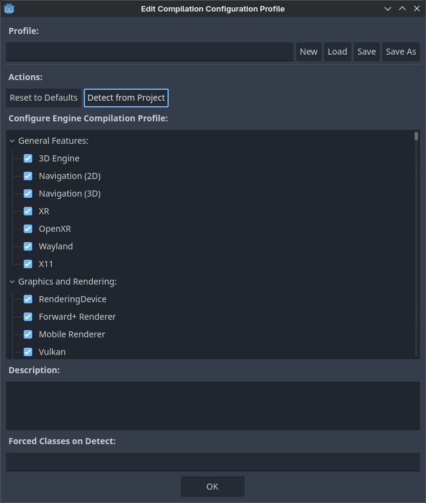
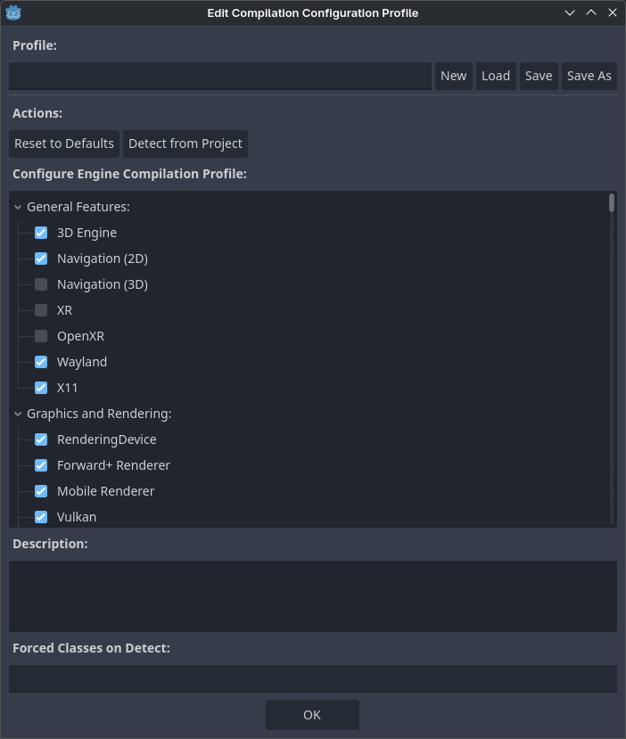

.. _doc_engine_compilation_configuration_editor:

Using the engine compilation configuration editor
=================================================

Godot comes with a large set of built-in features. While this is convenient,
this also means its binary size is larger than it could be, especially
for projects that only use a small portion of its feature set.

To help reduce binary size, it is possible to compile custom export templates
with certain features disabled. This is described in detail in :ref:`doc_optimizing_for_size`.
However, determining which features need to be disabled can be a tedious task.
The engine compilation configuration editor aims to address this
by providing an interface to view and manage these features easily,
while also being able to detect the features currently being used in the project.

The :menu:`Project > Tools > Engine Compilation Configuration Editor`
allows you to create and manage build profiles for your Godot project.

From now on, you have two possibilities:

- View the list and manually uncheck features that you don't need.
- Use the :button:`Detect from Project` button to automatically detect features
  currently used in the project and disable unused features. Note that this will
  override the existing list of features, so if you have manually unchecked some
  items, their state will be reset based on whether the project actually
  uses the feature.

   Opening the Engine Compilation Configuration Editor

Once you click :button:`Detect from Project`, the project detection step will run.
This can take from a few seconds up to several minutes depending on the project size.
Once detection is complete, you'll see an updated list of features with some features disabled:

   Updated features list after using feature detection (example from the 3D platformer demo)

.. warning::

    Unchecking features in this dialog will not reduce binary size directly on export.
    Since it is only possible to actually remove features from the binary at compile-time,
    you still need to compile custom export templates with the build profile specified
    to actually benefit from the engine compilation configuration editor.

You can now save the build profile by clicking **Save As** at the top.
The build profile can be saved in any location, but it's a good idea to
save it somewhere in your project folder and add it to version control to be able
to go back to it later when needed. This also allows using version control
to track changes to the build profile.

The build profile is a JSON file (and ``.gdbuild`` extension) that looks like this
after detection in the above example:

::

    {
        "disabled_build_options": {
            "disable_navigation_3d": true,
            "disable_xr": true,
            "module_godot_physics_3d_enabled": false,
            "module_msdfgen_enabled": false,
            "module_openxr_enabled": false
        },
        "disabled_classes": [
            "AESContext",
            ...
            "ZIPReader"
        ],
        "type": "build_profile"
    }

This file can be passed as a SCons option when :ref:`compiling <doc_compiling_index>`
export templates:

::

    scons target=template_release build_profile=/path/to/profile.gdbuild

The buildsystem will use this to disable unused classes and reduce binary size as a result.

Limitations
-----------

The :button:`Detect from Project` functionality relies on reading the project's scenes and scripts.
It will not be able to detect used features in the following scenarios:

- Features that are used in GDScripts that are procedurally created then run at runtime.
- Features that are used in :ref:`expressions <doc_evaluating_expressions>`.
- Features that are used in :ref:`GDExtensions <doc_gdextension>`, unless the language binding
  allows for defining used classes and the extension makes use of the functionality.
  See `GH-104129 <https://github.com/godotengine/godot/pull/104129>`__ for details.
- Features that are used in :ref:`external PCKs loaded at runtime <doc_exporting_pcks>`.
- Certain edge cases may exist. If unsure, please
  `open an issue on GitHub <https://github.com/godotengine/godot/issues>`__
  with a minimal reproduction project attached.

.. seealso::

    You can achieve further size reductions by passing other options that reduce binary size.
    See :ref:`doc_optimizing_for_size` for more information.
