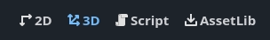

.. _doc_workspace_selector:

Workspace selector
------------------

Workspace buttons allow you to switch between the 2D, 3D, and Script editor.
Choosing a node from the Scene Tree dock will automatically switch to the 
appropriate screen.
The selector also provides a button to open the AssetLib:

- **2D** is used for 2D games and also for designing control scenes, such as main menu, or 
  user interface elements.
- **3D** is used to work with 3D nodes and create meshes. See :ref:`doc_introduction_to_3d` for more 
  details.
- **Script** opens the Script Editor. You can use it to edit Godot Script files, or text files
  in the project. 
- **AssetLib** allows you to download plugins and addons for your project. This requires Godot to 
  be in online mode. Unlike the Asset Library in the project manager, the results will not include 
  complete game demos. See :ref:`AssetLib <toc-learn-features-assetlib>` for more details.

.. tip:: By default, :kbd:`Ctrl + F1` opens the 2D editor, :kbd:`Ctrl + F2` opens the 3D editor, and
  :kbd:`Ctrl + F3` opens the Script editor. For macOS, the shortcuts are :kbd:`Opt + 1`, :kbd:`Opt + 1`,
  and :kbd:`Opt + 1`, respectively.
