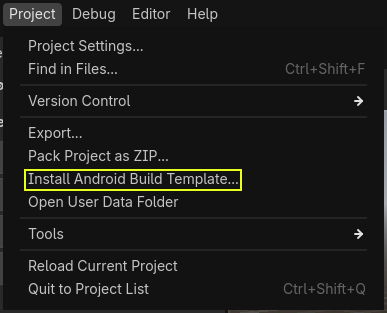
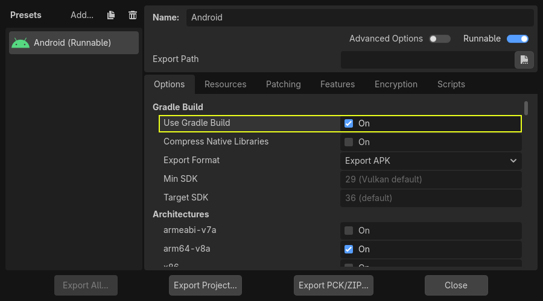

.. _doc_android_gradle_build:

Gradle builds for Android
=========================

Godot provides the option to build using the `Gradle <https://gradle.org/>`__ build system.
Instead of using the already pre-built template that ships with Godot, an Android
Java project gets installed into your project folder. Godot will then build it
and use it as an export template every time you export the project.

There are some reasons why you may want to do this:

- Export an AAB file for Google Play.
- Modify the project before it's built.
- Add external SDKs that build with your project.

The native portion of the template (the ``.so`` library included in the APK)
remains precompiled. This means that unlike
:ref:`compiling a custom Android export template <doc_compiling_for_android>`,
you don't need to install a C++ toolchain or clone the Godot source code.

Configuring the Gradle build is a fairly straightforward process. But first,
you need to follow the steps in :ref:`exporting for android <doc_exporting_for_android>`
up to **Setting it up in Godot**. After doing that, follow the steps below.

Set up the Gradle build environment
-----------------------------------

Go to the Project menu, and install the *Gradle Build* template:

Make sure export templates are downloaded. If not, this menu will help you
download them.

A Gradle-based Android project will be created under ``res://android/build``.
Editing these files is not needed unless you really need to modify the project.

Performing Gradle builds from the Android editor
------------------------------------------------

Since Godot 4.6, it is possible to perform Gradle builds from the Android editor.
This requires installing the
`Godot Android Build Environment (GABE) <https://godotengine.org/download/android/#gabe>`__
application on the same device the editor is running on.

.. note::

    This application is *not* required when exporting from the Android editor with
    pre-built APK templates, or when exporting to other platforms.

This application lets you install everything required to build Android projects with Gradle.
It is called by the editor to perform Gradle builds when exporting to Android.

To set up the build environment, open the app and follow these instructions:

- Ensure you have an active Internet connection.
- Open the :menu:`Rootfs` tab from the bottom navigation bar.
- Click :button:`Install Rootfs`.

After the installation completes, you can export projects using Gradle builds
from the Godot editor.

Enabling the Gradle build and exporting
---------------------------------------

When setting up the Android project in the **Project > Export** dialog,
**Gradle Build** needs to be enabled:

From now on, attempting to export the project or one-click deploy will call the
Gradle build system to generate fresh templates. The templates built will be
used automatically afterwards, so no further configuration is needed.

.. note::

    When using the Gradle Android build system, assets that are placed within a
    folder whose name begins with an underscore will not be included in the
    generated APK. This does not apply to assets whose *file* name begins with
    an underscore.

    For example, ``_example/image.png`` will **not** be included as an asset,
    but ``_image.png`` will.
