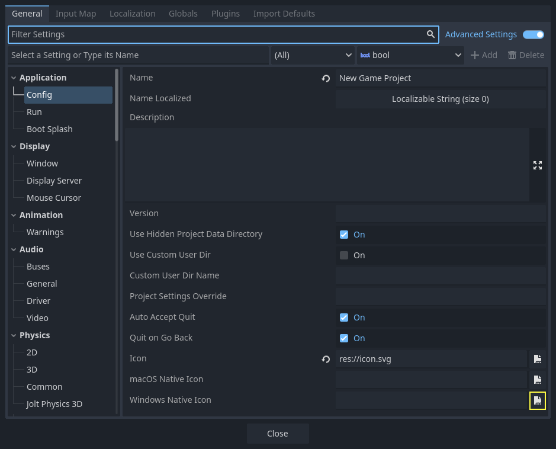
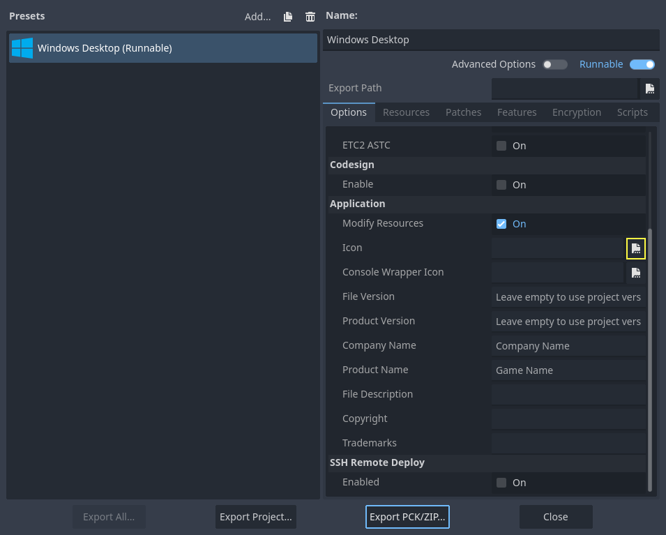

.. _doc_changing_application_icon_for_windows:

Manually changing application icon for Windows
==============================================

Windows applications use a Windows only format called ICO for their file icon and
taskbar icon. Since Godot 4.1, Godot can create an ICO file for you based on the
icon file defined in the Windows export preset. Supported formats are PNG, WebP,
and SVG. If no icon is defined in the Windows export preset, the
:ref:`application/config/icon <class_ProjectSettings_property_application/config/icon>`
project setting is used automatically instead.

This means you no longer need to follow the steps in this section to
manually create an ICO file, unless you wish to have control over the icon
design depending on its displayed size.

Creating a custom ICO file
--------------------------

You can create your application icon in any program but you will have to convert it
to an ICO file using a program such as GIMP.

`This video tutorial <https://www.youtube.com/watch?v=uqV3UfM-n5Y>`_ goes over how to
export an ICO file with GIMP.

It is also possible to convert a PNG image to an hiDPI-friendly ICO file
using this `ImageMagick <https://www.imagemagick.org/>`_ command:

.. code-block:: none

    magick convert icon.png -define icon:auto-resize=256,128,64,48,32,16 icon.ico

Depending on which version of ImageMagick you installed, you might need to leave out the ``magick`` and run this command instead:

.. code-block:: none

    convert icon.png -define icon:auto-resize=256,128,64,48,32,16 icon.ico

.. warning::

    For the ICO file to effectively replace the default Godot icon, it must
    contain *all* the sizes included in the default Godot icon: 16×16, 32×32,
    48×48, 64×64, 128×128, 256×256. If the ICO file does not contain all the sizes,
    the default Godot icon will be kept for the sizes that weren't overridden.

    The above ImageMagick command takes this into account.

Changing the taskbar icon
-------------------------

The taskbar icon is the icon that shows up on the taskbar when your project
is running.

.. image:: img/icon_taskbar_icon.png

To change the taskbar icon, go to
**Project > Project Settings > Application > Config**, make sure
**Advanced Settings** are enabled to see the setting, then go to
``Windows Native Icon``. Click on the folder icon and select your ICO file.

This setting only changes the icon for your exported game on Windows.
To set the icon for macOS, use ``Macos Native Icon``. And for any other platform,
use the ``Icon`` setting.

.. _doc_changing_application_icon_for_windows_changing_the_file_icon:

Changing the file icon
----------------------

The file icon is the icon of the executable that you click on to start
the project.

.. image:: img/icon_file_icon.png

To do that, you will need to specify the icon when exporting.
Go to **Project > Export**. Assuming you have already created
a Windows Desktop preset, select your icon in ICO format in
the **Application > Icon** field.

Testing the result
------------------

You can now export the project. If it worked correctly, you should see this:

.. image:: img/icon_result.png

.. note::

    If your icon isn't showing up properly try clearing the icon
    cache. To do so, open the **Run** dialog and enter ``ie4uinit.exe
    -ClearIconCache`` or ``ie4uinit.exe -show``.
